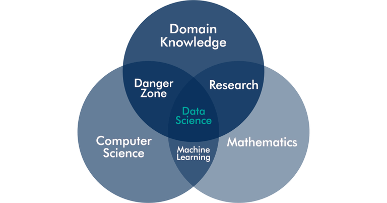
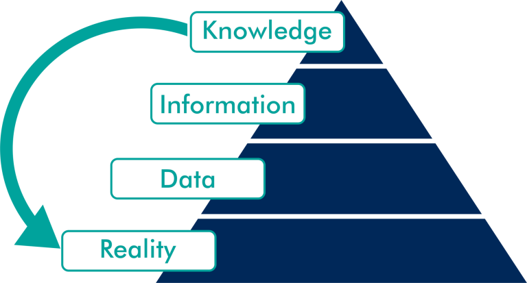
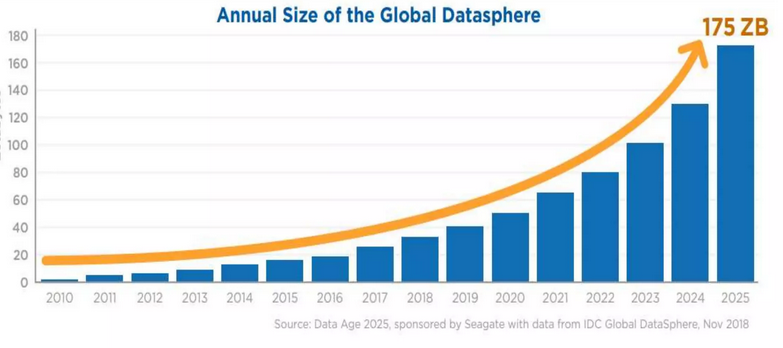
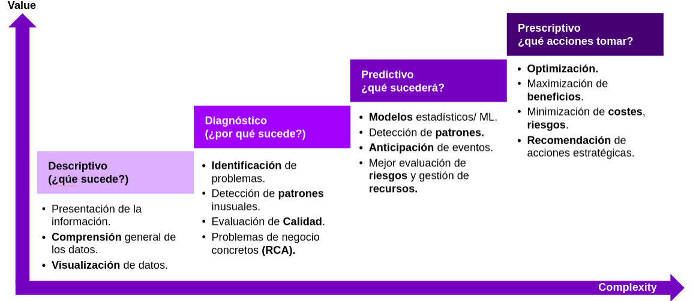
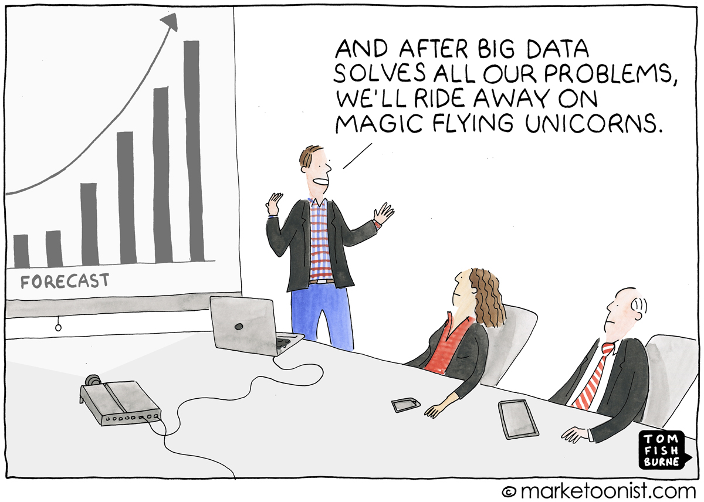
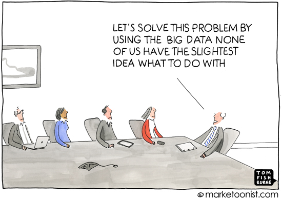
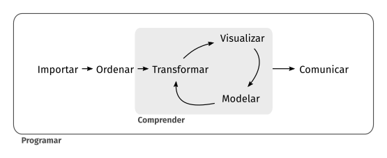

## Objetivos

- Aprender a **extraer información** de los datos usando técnicas computacionales y estadísticas

{width=50% fig-align="center"}

<!-- ALTERNATIVA (pirámide realidad->datos->información->conocimiento); elegir una u otra:
{width=45% fig-align="center"}
-->

- Enfoque práctico: usar la información para crear valor (**analítica de negocios**)

## La vida diaria se "datifica"

{ width=60% fig-align="center"}

- Y esos datos tienen mucho **Volumen** (escala), llegan con **Velocidad** (en tiempo real),
  con gran **Variedad** (números, texto, mapas, imágenes) y **Veracidad** dudosa (errores, sesgos)

- La V que importa: **Valor**. Y NO está en los datos: está en saber analizarlos

## Importancia de los datos

- Clive Humby (2006), el original de la frase famosa:

  > > "Data is the new oil. It's valuable, but if unrefined it cannot really be used."

<!--
-   Neelie Kroes (Comisaria Europea para la Agenda Digital, 2013):

  > > "Data is the oil of the new economy, [...], the new oil for the digital era"
-->

- Ahora el "refinado" importa más que nunca: la IA existe porque se analizaron
  cantidades masivas de datos

- Si caben en tu ordenador, NO es "Big Data". Las técnicas y la forma de pensar
  de lo que haremos son las mismas

## Tipos de análisis de datos

{width=90% fig-align="center"}

- Este es el mapa del curso: **descriptivo y diagnóstico** (datos, exploración, KPIs, el mundo
  del "Business Intelligence"), **predictivo** (modelos de aprendizaje) y **prescriptivo**
  (de la predicción a la DECISIÓN)

## Aprender a analizar datos

- Es una inversión de futuro en el trabajo: [El País, 08/2023](https://elpais.com/educacion/2023-08-08/el-forzoso-viraje-de-los-economistas-para-no-quedar-arrinconados-por-matematicos-e-ingenieros.html)

- Pero NO es magia, y requiere saber lo que se hace

{width=55% fig-align="center"}

- [Dan Ariely](https://es.wikipedia.org/wiki/Dan_Ariely) (2013): *"Big data is like teenage sex:
  everyone talks about it, nobody really knows how to do it, everyone thinks everyone else is
  doing it, so everyone claims they are doing it."*

<!-- viñeta alternativa: {width=60%} -->

## Proceso de Análisis de Datos

{ width=105% }

- Cada caja es parte del curso: importar y limpiar datos, explorarlos y visualizarlos,
  modelizar y COMUNICAR resultados

## Pensamiento algorítmico

* Se programa, pero lo importante NO es memorizar código: es saber

  1. especificar CON PRECISIÓN un problema

  2. descomponerlo en pasos que un ordenador pueda ejecutar

  3. pensar en los casos especiales (¿datos que faltan? ¿duplicados?)

* Una IA puede escribir código por ti: tu trabajo es saber QUÉ pedir, POR QUÉ
  y COMPROBAR el resultado. Eso se entrena aquí, y eso se evalúa

## Cómo funciona el curso

* Leed en la web de la asignatura:

  + [Evaluación](../Evaluacion.qmd): cómo funcionan las clases (venir con el material trabajado)
    y cómo se evalúa

  + [Puesta a punto](../PuestaAPunto.qmd): qué instalar LO ANTES POSIBLE (R y Positron)

  + [Contenidos](../Contenidos.qmd): el material de cada semana, siempre actualizado
