```{r}
#| label: setup
#| include: false
# se evalua pero no incluye output (mensajes, etc.)

# Elimino todo del Entorno (del documento)
rm(list = ls())

# Working directory
#setwd("/home/albarran/Dropbox/MAD/00.TEC")

# Cargo todas las bibliotecas necesarias
# (se podría hacer cuando cada una sea necesaria)
```

# Conceptos básicos

## Introducción

<!-- VERSIÓN DENSA anterior (por si Pedro quiere volver a ella):
-   Debéis tener instalados R y Positron: instrucciones paso a paso en la página
    [Puesta a punto](../PuestaAPunto.qmd) de la web (si no, hacedlo LO ANTES POSIBLE)
-   Nos familiarizaremos con los conceptos y comandos básicos de programación en R
-   R es un lenguaje interpretado: ejecuta las instrucciones directamente en la consola
-   Positron es un entorno de desarrollo integrado (IDE) que combina varias herramientas para facilitar el uso de R: consola, editor para escribir comandos, ayuda, etc.
-   Positron es un derivado ("fork") de VS Code, uno de los editores más usados: misma interfaz y manejo, con añadidos específicos para R y Python que facilitan el análisis de datos
    + Se puede usar VS Code "puro" de forma muy similar, aunque algunas cosas están menos adaptadas
-   Este tema ocupa las primeras sesiones del curso: de los primeros comandos hasta empezar a trabajar con datos
-   El material de cada sesión está en Contenidos: cuando se indique, traedlo trabajado de casa y en clase repaso corto y a IMPLEMENTAR
-->

-   **R** es el lenguaje: ejecuta instrucciones directamente en una consola (es *interpretado*)

-   **Positron** es el entorno de trabajo (IDE): derivado de VS Code, uno de los editores más
    usados

    + Misma interfaz y manejo, con añadidos específicos para el análisis de datos en R y Python

    + Se puede usar VS Code "puro" de forma muy similar


-   Instalación: página [Puesta a punto](../PuestaAPunto.qmd) de la web (si no lo tenéis, LO ANTES POSIBLE)

-   Este tema: de los primeros comandos hasta empezar a trabajar con datos; el material de cada
    sesión, siempre en [Contenidos](../Contenidos.qmd)

::: {.notes}
- VS Code "puro" también vale, muy similar, aunque algunas cosas están menos adaptadas.
- Cuando se indique en Contenidos, el material se trae trabajado de casa; en clase, repaso corto y a IMPLEMENTAR.
:::

<!-- REFERENCIA INTERNA (no prometer sesiones exactas a los alumnos por si no llego):
  Sesión 1 (hoy): Positron, primeros comandos, scripts, carpeta del curso, errores
  Sesión 2: objetos y vectores, tipos de datos, factores, "errores sin error"
  Sesión 3 (cierre, semana 2): data frames, bibliotecas e importación de datos
-->

<!--
    -   consola de R,
    -   un **editor** para escribir un archivo con comandos,
    -   ayuda,
    -   varias herramientas (como autocompletado, resaltado de sintaxis, etc.)
-->

::: {.notes}

+ Un editor de texto NO es un procesador de texto (como Word): solo importa el texto sin formato (negrita, etc.)

:::

## Positron

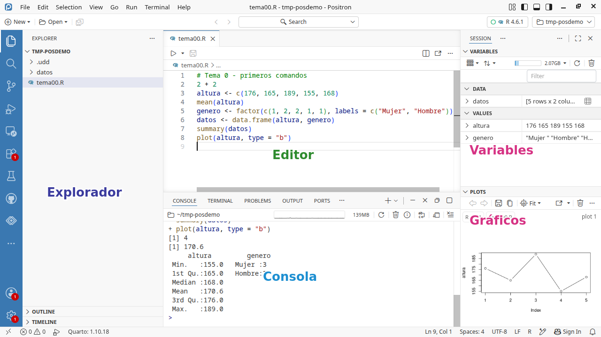{width="72%" fig-align="center"}

* **Editor** (scripts) y **Consola** (ejecutar comandos y ver resultados); a la derecha, **Variables** (objetos en memoria) y **Gráficos**; a la izquierda, el **Explorador** de archivos

::: {.notes}
Captura del blog oficial de Positron (posit.co); el ejemplo es con Python, pero con R el aspecto es idéntico.

La barra vertical de la izquierda (actividad) tiene más herramientas (extensiones, asistente de IA, control de versiones): son para más adelante.
:::


## Empezando: elegir el intérprete de R

-   Al abrir Positron aparece la zona de **consola** (panel inferior), PERO hay que **elegir el
    intérprete**: pulsad en el selector de la esquina superior derecha y elegid **R** (versión 4.6.x)

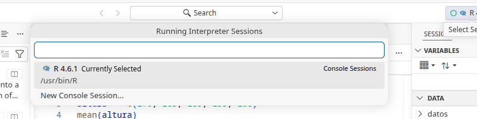{width="60%" fig-align="center"}

-   OJO: si aparece **Python**, NO es un error vuestro, pero NO es lo que usamos: cambiad a R
    en ese mismo selector (*New Console Session...*)


## La Consola

-   Escribimos *comandos* en la **consola**  y se ejecutan pulsando `Enter`:

    + La tecla de tabulador 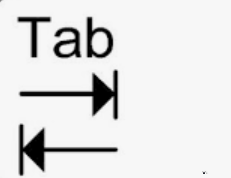{width="8%" .center} ofrece opciones de autocompletado

    + Ejecutar algo que no es un **comando de R** devuelve un error

```{r}
2 + 2
3 * (1 - 4)^2
sqrt(log(5/2))
pi
hola
```

::: {.notes}
-   Operadores aritméticos habituales: `+,-,*,/, %/%, %%`

-   Funciones o constantes incorporadas: `log, sqrt, abs, exp, round, pi`

```{r}
#| echo: false
abs(-5)
9 %/% 4
9 %% 4
```

`abs(-5)`

`9 %/% 4`

`9 %% 4`


* Si intentamos evaluar algo que NO es un comando de R o no está correctamente escrito, tendremos un ERROR

* Es **NORMAL** cometer errores

:::


## Archivos de guion ("scripts")

-  Es preferible incluir varios comandos en un archivo de texto para ejecutarlos

-  Se puede replicar el proceso <!--completo--> de cálculos paso a paso (no como Excel) <!--y ejecutar todo o solo parte -->

-   Creamos un nuevo archivo en el menú *File \> New File...* eligiendo *R File*

-   Guardamos el archivo en *File \> Save* (atajo `Ctrl + S`), eligiendo un directorio y nombre con extensión ".R" (por defecto) o ".r"

-   Desde el editor, `Ctrl+Enter` envía a la consola la línea actual o las líneas seleccionadas (en MacOS, la tecla `Command` en lugar de `Ctrl`)

* En un archivo de guion (guardado), Positron marca las líneas con error y muestra el mensaje de error al pasar el puntero

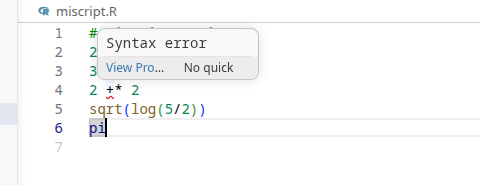{width="42%" fig-align="center"}


## Trabajar con ficheros de guion 

-   Cada comando es "una" línea  y se ejecutan secuencialmente

-   Un comando se puede extender visualmente más de una línea hasta completarse: p.e., hasta cerrar los paréntesis.

    + Escribimos `log(`, en otra línea `9` y ejecutamos: la consola cambia de `>` a `+`  <!--(indicando que no ha cambiado de línea)-->

    + No hace "nada" <!--(ni resultado ni error)--> esperando que completemos el comando.

::: {.notes}

* NO LO VEREMOS: se pueden incluir más de un comando por línea, separados por "`;`", pero el código es menos legible

* Podemos ejecutar **todo el archivo**:

    + seleccionando todas las líneas (`Ctrl + A`) y luego `Ctrl + Enter`

    + o con el botón de "play" (▶) en la esquina superior derecha del editor (ejecuta con `source()`)

* En ambos casos, se para la ejecución cuando encuentra error

    <!-- antes `Run` ejecutaba linea a linea y seguía tras error -->

:::


-   El carácter `#` marca el inicio de un **comentario**: lo que sigue se "ignora" (no se ejecuta) en R


```{r}
# Pueden ir al principio de la línea 
2 + 2 # o después de una instrucción
```

- Comentar es un buen hábito: ayuda a entender/recordar qué hacemos 
    
- Notad que Positron tiene *resaltado de sintaxis*: distinto color para comentarios, números, funciones, etc.


## Directorio de Trabajo. Proyectos.

-   Conviene **organizar los archivos** relacionados con un mismo tema en una estructura de (sub)directorios <!--y subdirectorios--> a partir de un **directorio de trabajo** principal <!--, que se puede fijar "manualmente"  con `setwd()` -->

:::: {.columns}

::: {.column width="63%"}

-   En la programación moderna (Positron, VS Code y la mayoría de editores actuales), un **proyecto** ES simplemente una **carpeta**

-  Cread una carpeta para el curso (p.e. `AnalisisDatos`) con subcarpetas para datos, código, etc., y abridla con *File \> Open Folder*

-  Sin carpeta abierta, el **Explorador** (barra izquierda) solo ofrece precisamente eso: *Open Folder*

:::

::: {.column width="35%"}
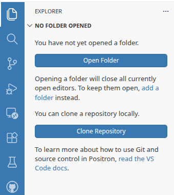{width="95%"}
:::

::::

<!--
* Organizar los directorio y archivos es habitual: ej., directorios diferentes para asignaturas, subdirectorios por temas, etc.


-   Cada "proyecto" tiene un **directorio de trabajo**, con subdirectorios para cada tipo de archivo: código, datos, resultados, etc.
-->

    
    
::: {.notes}

<!--
-   ¿Cómo trabajar con directorios y ficheros en R con comandos dado que no podemos navegar visualmente con un explorador de archivos?
-->

<!--

añadir qué un path visualmente como en 
https://qmd4sci.njtierney.com/workflow.html

y ver que las cosas que pongan se llegan por el navegador

-->


-   Para conocer el directorio de trabajo actual

```{r}
getwd()
```

- Inicialmente el directorio de trabajo es el directorio por defecto del usuario del SO ("\~"), donde "`/`" es el separador de directorios

    + en Windows: `C:/Users/nombre/Documents`
    + en MacOS: `/Users/nombre`
    + en Linux: `/home/nombre`

<!--
* Directorio actual en la Terminal: `pwd` (MacOS y Linux) o `cd` (Windows)
-->

* Windows usa la barra invertida "\\" ('backward slash' en lugar de 'forward slash') como **separador de directorio** en una ruta

<!--
    + (lo podemos ver si copiamos una ruta desde el Explorador de Archivos al Bloc de Notas)

    + (aunque también admite la barra "/" en la Terminal)
-->    

* PERO "\\" tiene una función "especial" para cadenas de caracteres en programación: denotar caracteres especiales ("escapar") 

<!--, especialmente en expresiones regulares.-->


* Si "insistimos" en usarla, será su versión "escapada": (`C:\\Usuarios\\nombre\\Mis Documentos`)

* En el explorador de archivos (de Windows y de MacOS) la ruta "\~"  está en castellano (p.e., `C:\Usuarios\nombre\Documentos`), pero internamente en inglés


:::

## La primera vez que abrís la carpeta

:::: {.columns}

::: {.column width="55%"}

* Al abrir una carpeta por primera vez, Positron pregunta si **confiáis** en sus archivos:
  pulsad **"Yes, I trust the authors"** (es vuestra carpeta: la acabáis de crear)

* Si contestáis que no, Positron queda en **modo restringido**: sin consola de R, sin
  resaltado, sin casi nada; se arregla pulsando en *Restricted Mode* (abajo a la izquierda)
  y confiando la carpeta

:::

::: {.column width="43%"}
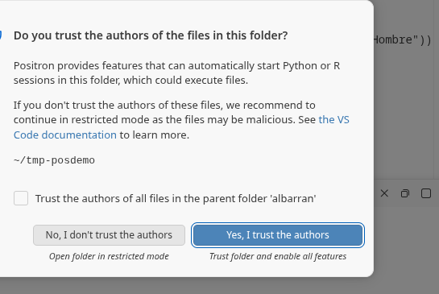{width="95%"}
:::

::::

-  Con la carpeta abierta, esa carpeta es vuestro **directorio de trabajo**: R busca y guarda
   los archivos ahí (usad rutas RELATIVAS, como veremos)

-  Al abrir Positron se recupera la última carpeta usada; con *File \> Open Recent* podéis
   cambiar entre carpetas (p.e., otra asignatura u otro proyecto)
    

 <!-- 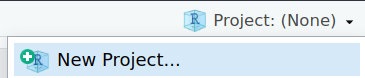{width="20%" .center} -->
 
  <!--  {width="20%" .center} -->


<!--
## Directorio de Trabajo (cont.)

-   Cuando proporcionamos un nombre de fichero a R, podemos incluir

    + la ruta completa: `/Users/nombre/proyecto/datos/ola1.rdata`

    + la ruta relativa al directorio de trabajo: `proyecto/datos/ola1.rdata`

::: {.notes}

* La ruta completa en MacOS (por ejemplo) también sería  `~/miproyecto/datos/ola1.rdata`

* En el menú *Tools \> Global Options*, aparece inicialmente "\~"

:::

-   Establecemos un directorio de trabajo propio de cada proyecto para acceder fácilmente mediante rutas relativas a los archivos

-   Para establecerlo una vez (en la sesión actual, en este momento)

    ```{r eval=FALSE}
    setwd("C:/Users/usuario/Documents/miproyecto")
    ```

-   Se puede establecer de forma permanente (por defecto, para cada nueva sesión de R) en el menú *Tools \> Global Options*: General

-->

## Proyectos (cont.) 

<!--
- Cuando cerramos y volvemos a abrir Positron, tendremos activo el último proyecto abierto: ej., 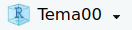{width="10%" .center}

- Tanto desde el menú como desde el icono de gestión de proyectos, podemos 

    + cerrar el proyecto actual, *File > Close Projects*, 
    
    + abrir otros proyectos guardados: *File > Open Project* o *File > Recent Projects*
-->

* Para trabajar <!--en  R--> con un archivo, usamos la **ruta relativa** al directorio de trabajo:

    + si están en el raíz del directorio: `codigo.R`, `misdatos.Rdata`

    + si están en un subdirectorio, indicamos la ruta separando directorios por `/`: `datos/ventas.Rdata`, `datos/ano2020/ingresos.Rdata`

* Las rutas relativas son otra idea general de la programación: el proyecto funciona igual en cualquier ordenador (la ruta completa `C:/Users/minombre/...` solo existe en el vuestro)


## El Explorador y la barra lateral

* El **Explorador** (icono de archivos en la barra lateral izquierda) ofrece una forma visual de abrir, crear, copiar, mover o eliminar archivos y carpetas

* El Explorador solo muestra **lo que está DENTRO de la carpeta abierta**: lo de fuera no se ve ni se puede tocar desde aquí

    + Por eso hay que pensar QUÉ pertenece al proyecto (datos, scripts...) y traerlo a la carpeta (arrastrándolo al Explorador, o copiándolo con el explorador del sistema)

* Esa barra lateral tiene mucho más (extensiones, asistente de IA, control de versiones, búsqueda): NO lo necesitáis por ahora; la ayuda y la IA integradas las iremos usando poco a poco

::: {.notes}
- (No decirlo así en clase) A diferencia de RStudio, aquí no hay un panel Files con el que navegar por TODO el disco: el ámbito es siempre la carpeta del proyecto. Es una restricción sana: obliga a decidir qué forma parte del proyecto.
:::

<!--
    - Navegar por directorios: p.e., *Files \> More*: *Go to Working Directory*
-->

<!--
* Nota: para navegar fuera del directorio por defecto del usuario, "\~", pulsar en los tres puntos


* Positron facilita el trabajo permitiendo realizar "gráficamente" algunas acciones equivalentes a comandos:

    + *Files \> More*: *Set as Working Directory*

* El comando equivalente aparece en la consola: debemos **acostumbrarnos a usar comandos**
-->

* Evitad caracteres "raros" (acentos, espacios, etc.) en directorios y ficheros

* NOTA. El Explorador de Archivos de Windows y Finder de MacOS no muestran por defecto las extensiones de los archivos.

  + Puede ser confuso para distinguir entre dos archivos con el mismo nombre y diferente extensión: `proyecto.R` y `proyecto.qmd`

  + Consultad cómo mostrarlas: p.e., para  [Windows](https://support.microsoft.com/es-es/windows/extensiones-de-nombre-de-archivo-comunes-en-windows-da4a4430-8e76-89c5-59f7-1cdbbc75cb01) y [MacOS](https://support.apple.com/es-es/guide/script-editor/scpedt1025/mac)

## Funciones en R 

-   Las expresiones que aceptan **argumentos** se denominan funciones.

```{r}
exp(2)
ceiling(5.2)
```

::: {.notes}
```{r}
#| echo: false

sin(pi/6)
floor(3.1)
```
:::

-   Algunos argumentos son obligatorios, otros tienen valores por defecto que se pueden omitir

-   Los argumentos se pueden especificar por nombre o por orden.

```{r}
log(2, base=2)
log(2, 10)
log(base = 10, x = 2)

```

-   ¿Cómo sabemos la manera de usar una función (ej. argumentos necesarios) o comando de R?

::: {.notes}

-   NO omitir los argumentos tiene ventajas

    1.  Claridad

    2.  Los argumentos no tienen que especificarse en orden (sin nombre del argumento debe seguirse el orden establecido)

:::


## Ayuda en R y Positron

-   Positron tiene autocompletado (tecla tabulador) y ayuda flotante para funciones y otros elementos de R

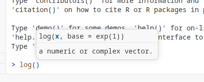{width="32%" fig-align="center"}

-   Positron también tiene un panel de **Ayuda** (Help): `F1` sobre una función, o `?min` / `help(min)` en la consola

<!--
-   Se puede obtener ayuda también en la consola: `help(min)` o `?min`

```{r}
#| echo: false

help(min)
?min
```

-->

## La IA como ayuda (usada con cabeza)

-   Positron incluye un **asistente de IA** (icono de chat en la barra lateral), que se conecta a
    proveedores como Copilot o Claude; también en VS Code, y siempre están las IAs externas
    (ChatGPT, Gemini...)

-   Usos LEGÍTIMOS que os harán mejores: pedir que os **explique** un mensaje de error, recordar
    la sintaxis de una función, entender un código ajeno

-   Uso que os hará PEORES: dejar que **reescriba vuestro código sin entenderlo**: no aprendéis,
    no detectáis sus errores... y en la evaluación se nota

-   La disciplina es la misma que el *pensamiento algorítmico* del primer día:

    1. especificar CON PRECISIÓN el problema (también al preguntar a una IA)
    2. descomponerlo en pasos
    3. COMPROBAR el resultado (¿hace lo que quería? ¿con qué casos falla?)

-   Ante un error: leer el mensaje, localizar la línea, formular una hipótesis, probar; la IA
    ayuda a *entender*, la solución tenéis que entenderla vosotros: copiar-pensar-adaptar

::: {.notes}

* Se puede usar `??` para buscar ayuda en la consola sobre algo de lo que se desconoce el nombre concreto de la función 

```{r}
#| echo: false

??minimize
```

<!--
-   Una buena fuente de ayuda online https://stackoverflow.com/
-->

1. NO siempre estará la solución exacta a nuestro problema

2. Las soluciones pueden utilizar enfoques que requieren conocer comandos de extensiones (bibliotecas) de R

:::


## El operador de asignación 

-   El operador `<-` almacena un contenido en un *objeto* con un nombre,^[También se puede asignar con `=`] que incluye letras, números y algunos carácteres especiales ("\.", "\_")

::: {.notes}

- `alt - = <- `

-   Un objeto es simplemente algo almacenado en la *memoria* de R

-  Importante: recordar almacenar nuestros cálculos y resultados en objetos para poder reutilizarlos. 

    - a menudo no es "recomendado", es una necesidad

:::

```{r}
x <- 2*3    # asignación, no muestra resultado
x           # ejecutamos mostrar la variable   
print(x)
(x <- 2)    # asignación e impresión a la vez
```

-   R es "case-sensitive": `x` y `X` son dos objetos distintos

-   Los objetos asignados pueden usarse posteriormente, p.e., para generar otros a partir de ellos

```{r}
y <- x + 5  # asignamos y a partir del VALOR de x
(x <- x*3)  # re-asignamos x a partir de ella misma
y           # NO cambia (en Excel, sí)
```


:::  {.notes}

* Se prefiere `<-` para diferenciar asignación de objetos (NO solo asignaremos números) del **concepto** de igualdad matemática

* Y se evita la confusión con `=` usado para dar valores a un argumento, `log(2, base=10)`, y con la igualdad en comparaciones (`==`) 

* También se puede mostrar con `print(x)` o con  `show(x)`

* Un error habitual: `object not found`. Porque hemos creado `x` y luego queremos usar `X`...

* Cuando se asigna a partir del objeto `x`, en la expresión aparece el contenido `x` en ese momento (no `x` propiamente dicho)

* En Excel, si cambia un valor en una celda, cambian aquellas que la referencian.

:::


## El Espacio de Trabajo en R <!-- y Positron --> 

-   El espacio de trabajo es el conjunto de objetos activos en memoria, resultado de todos los comandos ejecutados previamente

-   En Positron, el panel **Variables** muestra los objetos y su valor

-   Las funciones `ls()` y `rm()` muestran y eliminan respectivamente objetos del espacio de trabajo

::: {.notes}

```{r}

#| echo: false
ls()        # mostrar objetos
rm(y)       # eliminar el objeto "y"
rm(a,b,c)   # eliminar varios objetos (separados por comas)
```

:::

-   Borramos *todos* los objetos desde el panel Variables o con el comando

```{r}
rm( list=ls() )  # eliminar todos los objetos
rm(y, x)         # eliminar solo algunos objetos
```

-  Guardar el contenido del entorno de trabajo al cerrar es **innecesario**: ejecutando los comandos guardados en un archivo `.R` recuperamos los objetos

::: {.notes}

- El historial de comandos de la sesión se recupera en la consola con las flechas ↑/↓.

- Veremos cómo guardar datos en R con más detalle

:::


## Mensajes de "Error" y "Warning"  
<!--(Aviso/Advertencia)-->

* En programación, cometer **errores** es **normal**


* En muchos errores, R se "quejará" mostrando **mensajes** en rojo 

    -   *Aviso*: R ofrece un resultado (y continuará al siguiente comando), PERO indica que puede haber algo "no deseado"

    -   *Error*: para la ejecución, *sin resultado*, e "informa" de la razón    


- Algunos mensajes son claros, pero otros requieren más investigación: pegarlos a una IA y pedir
  que os los EXPLIQUE es un buen uso; que os reescriba el código sin entenderlo, no

```{r}
#| echo: false

log(-1)                         # warning
seq(from = 10, to = 2, by = 1)  # error
```

-   Peor que un mensaje de error: escribimos (copiamos) un código que funciona pero no hace lo que queremos...


-   El ordenador NO se equivoca: hace lo que le pedimos  según unas reglas bien definidas por R, que *debemos conocer*

    -   Sed cuidadosos<!--, sistemáticos-->, pensad y **entended** cada paso del código 
    <!-- -  P.e., la elección de nombres de los objetos: es mala idea tener un objeto con el mismo nombre que un argumento (`from`) -->
 

```{r}
#| echo: false

from <- 4
seq(from == 1, to = 5, by = 1)   # ¿por qué?
```

::: {.notes}

-   Algunos mensajes son intimidantes (en rojo!) ... e indescifrables

+ Aviso: "He hecho lo que he podido para entender lo que pides (log. de un número negativo!), pero a lo mejor no es lo que quieres"

+ Conocer las "reglas"  es saber programar (hablar) en ese lenguaje

+ Como toda  convención, algunas reglas de R pueden ser "arbitrarias" 

    + p.e., `log(-1)` podría ser error y `seq(from = 10, to = 2, by = 1)` interpretado como una cuenta atrás

- R ha ejecutado lo que le decimos, cumpliendo sus reglas: 

    - el argumento `from` se puede omitir
    - todo en R es un objeto: podemos pasar al argumento `from` un número o un objeto que contenga un número
    - pasamos un objeto lógico (`from == 1`) y lo convierte a la clase esperada, entero

- Por eso es importante la diferencia entre `<-`, `=` y `==`

:::


<!-- ===== SESIÓN 2 (referencia interna): objetos, vectores y tipos de datos ===== -->

# Objetos en R

## Un ejemplo para toda esta parte

* A partir de aquí nos acompaña un mini-caso: las **fichas de clientes** de un pequeño gimnasio: nombre, altura, peso, si es socio, gasto mensual, género, satisfacción

* Iremos como en un análisis real: de una variable suelta (un **vector**) a la información cualitativa (**factores**) y a la tabla completa (**data frame**)

* Habrá varias **PRÁCTICAS en clase** sobre este caso: implementar vosotros es donde se aprende

* NO hay que memorizar cada comando: hay que entender la IDEA de cada uno; los detalles se consultan (Ayuda, IA)

* Y aprenderemos a **leer los fallos**: los mensajes de error, y los casos peores en que no hay mensaje pero el resultado no es el que queríamos


## Tipos de Objetos en R

-  TODO en R es un objeto, cada uno con **distintas propiedades** y, por tanto, distintas formas de trabajar con él

::: {.notes}

- R es un lenguaje orientado a objetos

:::


* Además de las funciones, los principales objetos con los que trabajaremos son:

    1. vectores
    2. factores
    3. conjuntos de datos ("data frames")
    4. listas
    
* Estos objetos pueden contener varios tipos de datos o variables:


    + entero
    + numérico (números reales)
    + lógico (valores verdadero/falso)
    + caracteres


## Vectores

-   Un vector es una secuencia de datos elementales, creados con el operador "`c()`" (combinar)

-   Empezamos nuestras fichas: cada *variable* de los 5 clientes es un vector

```{r}
altura  <- c(176, 165, 189, 155, 168)                 # numérico
cliente <- c("Jose", "Maria", "Juan", "Elena", "Rosa") # caracteres
socio   <- c(TRUE, FALSE, TRUE, TRUE, FALSE)           # lógico
```

::: {.notes}

* Los caracteres puede ir entre comillas simples \` o dobles \"

*   `T` y `F` atajo para `TRUE` y `FALSE`

:::


-   Podemos crear vectores a partir de otros vectores o usando comandos

```{r}
z <- c(altura, 170)   # añadir un dato
x <- rep(1, times=4)
y <- seq(from = 10, to = 1, by = -1)
z <- 1:10             # equivale a z <- seq(1,10,1)
```

<!--
:::: {.columns}

::: {.column width="32%"}

```{r}
#| echo: false

y <- c(1,3,5,7,9)
z <- c(x, y)
```
::: 

::: {.column width="8%"}

::: 

::: {.column width="60%"}

```{r}
x <- rep(1, times=4)
y <- seq(from = 10, to = 1, by = -1)
```
::: 

::::

-   Para incrementos unitarios consecutivos se usa `:`

```{r}
#| echo: false

z <- 1:10       # equivale a z <- seq(1,10,1)
```

-->


* Un vector sólo puede contener objetos de un **único tipo** elemental, que podemos conocer con `str()` o `class()` (el panel Variables muestra los valores)


## Vectores (cont.)


- Si se mezclan tipos distintos, R busca una clase que "acomode" a todos

```{r}
vcr <- c("lunes", 2) 
```

-   Forzamos que un objeto sea tratado con una clase concreta, con
     `as.integer()`, `as.numeric()`, `as.character()` y `as.logical()`

    -   Si no se puede convertir a número, devuelve `NA` (con un "warning")

```{r}
#| echo: false
as.integer(c(TRUE, 3.2, -1, 4))
as.numeric( c("1", "2", "foo", "10", "bar") )
```


::: {.notes}

-   "lunes" no puede ser un número pero "2" sí se puede representar como carácter

    + el carácter "2" NO es lo mismo que el número 2: no se pueden hacer operaciones matemáticas


-   Las funciones `is.numeric()`, `is.numeric()`, `is.logical()` e `is.character()` comprueban si un objeto es del tipo indicado, devolviendo un valor lógico.


-   Debemos diferenciar entre la clase de un objeto y como se muestra (formatea): ver la función `format()` 
:::

-   NO se pueden realizar operaciones incompatibles entre clases

    -   Cuidado con las comillas: NO es lo mismo un objeto (su contenido) que el carácter de su nombre

```{r}
#| echo: false

2.5+"hola"
```
    
```{r}

a <- 4
c <- 'a' + 1
```


<!-- ## Clase de un vector -->

::: {.notes}

-   La clase de un objeto es *única* (solo un tipo de elementales) y puede conocerse con `str()` o `class()`

```{r}

str(y)
```


* con `class()`
* También se puede conocer la clase/modo con `is()` o `mode()`

```{r}
#| echo: false

is(x)
class(y)
mode(z)
```

*  `str()` sirve para cualquier tipo de objeto: p.e., funciones: `str(log)`

:::


<!--
## Clase de un vector (cont.)

-   NO se pueden realizar operaciones incompatibles entre clases

```{r}

2.5+"hola"
```
-   Cuidado con las comillas: NO es lo mismo un objeto (su contenido) que el carácter de su nombre
```{r}

a <- 4
c <- 'a' + 1
```

-   También suele pasar cuando pasamos un objeto vector (o escalar) como argumento a una función

```{r}

mibase <- 10
log(5, base="mibase")
```

-->


<!-- ## Atributos de un objecto Vector -->

-   Los vectores pueden tener *nombres* (una "etiqueta" única para cada elemento): un vector de caracteres de la misma longitud
asignado con `names()`

```{r}
names(altura) <- cliente   # etiquetamos cada altura con su cliente
altura
```

::: {.notes}
-   Los nombres de un vector son un vector de caracteres de la misma
    longitud

```{r}
names(altura)
```

```{r}
#| echo: false
altura2 <- c(186, 154, 168, 175, 158)
nombres2 <- c("Juan", "Miguel", "Susana", "Gema", "Arturo")
names(altura2) <- nombres2
altura2
```

:::

::: {.notes}

+ Obviamente podemos asignar el vector creándolo con `c()` o a partir de un vector existente

+ Notad cómo cambian las propiedades (cómo se ve el vector) tras aplicarle un nombre

:::

<!--
## Funciones para vectores

```{r}

numeric(n)      # crea un vector con n ceros

length(x)   # longitud: número de elementos
sort(x)     # ordenar
 
max(x)      # máximo
min(x)      # mínimos
sum(x)      # suma de los elementos
prod(x)     # producto de los elementos

mean(x)     # media de los ementos
var(x)      # varianza
table(x)    # tabla de frecuencias

summary(x)  # estadísticos descriptivos
```
-->

<!--
## Operaciones con Vectores de caracteres

* También podemos usar la función "paste" para crear un nuevo carácter a partir de otros
```{r}
a <- "Universidad"; b <- "de"; c <- "Alicante"
d <- paste(a,b,c)
```

* Podemos especificar que un carácter aparezca entre las cadenas con la opción `sep`; la opción por defecto en `paste` es espacio en blanco " "
```{r}
d <- paste(a,b,c,sep=".")
d <- paste(a,b,c,sep=",")
```

* La función `paste0` equivale a `paste` sin carácter de separación (`sep=""`)
--->


## Aritmética de vectores

-   La mayoría de los operadores se aplican *elemento-a-elemento*: p.e., el IMC de CADA cliente
    a partir de su peso y su altura

```{r}
peso <- c(75, 85, 70, 60, 80)
imc  <- peso / (altura/100)^2   # un cálculo, 5 resultados
```

-   Con diferentes longitudes, se repite el vector corto cuanto
    sea necesario

:::: {.columns}

::: {.column width="45%"}

```{r}
altura + c(1, 2, 3, 4, 5)
altura + 1   # se "recicla" el 1
```
:::

::: {.column width="5%"}

:::

::: {.column width="45%"}

```{r}
#| echo: false
altura * 2
```

<!--
- Si las dimensiones no son múltiplos exactos...
```{r}
b <- 1:12
altura + b   # Warning!
```
-->

:::

::::


* Algunas **funciones** relevantes

<p>

:::: {.columns}

::: {.column width="45%"}

```{r}
length(altura)   # longitud
sort(altura)     # ordenar
max(altura)      # máximo
min(altura)      # mínimo
sum(peso)        # suma
```
:::

::: {.column width="5%"}

:::

::: {.column width="45%"}

```{r}
mean(altura)     # media
var(altura)      # varianza
table(socio)     # frecuencias

summary(altura)  # estadísticos
```
:::

::::

::: {.notes}

* Es MUY CONVENIENTE revisar cuidadosamente las dimensiones de los vectores antes de una operación, aunque R va a proceder de una forma bien definida...

:::

## Vectores lógicos

-   Obtenemos  un objeto lógico  enunciando una relación<!--(con operadores lógicos básicos)--> que puede ser cierta <!--(`TRUE`)--> o falsa <!--(`FALSE`)-->, como comparaciones básicas de igualdad o desigualdad: p.e., ¿qué clientes miden más de 165 cm?

:::: {.columns}

::: {.column width="40%"}
```{r}
#| echo: false
1 == 1  # igualdad
1 != 3  # NO igual
1 > 2   # mayor que
```

```{r}
1 == 1  # TRUE
1 != 3  # TRUE
1 > 2   # FALSE
```
:::

::: {.column width="5%"}

:::

::: {.column width="45%"}
```{r}
a <- 3 
a >= 3       # TRUE
a + 1 <= 10  # FALSE
```

```{r}
#| echo: false
3 >= 2     # mayor o igual
2 + 2 < 4  # menor que
4 - 2 <= 4 # menor o igual
```
:::

:::: 

* Combinamos varios enunciados con operadores Y (`&`), O (`|`) y NO (`!`)

<!--
*  Combinamos valores lógicos con operadores booleanos 


```{r}
#| echo: false
TRUE & TRUE  # Operador AND: A & B = T si ambas T
TRUE | FALSE # Operador OR:  A | B = T si al menos una T
!TRUE        # Operador NOT: !A = T si A=F y !A=F si A=T
```
-->

-   Para conjuntos, `x %in% Y` es cierto cuando `x` es un elemento de  `Y`

<!--
- CUIDADO: los caracteres también se comparan (lexicográficamente): `'hola' > 'adios'` es cierto
-->

::: {.notes}

- Notad la doble igualdad `==` para el operador lógico de igualdad


- Nuevamente podemos confundir los objetos `hola` y `adios` con sus caracteres
```{r}
#| echo: false

'cadena' == "cadena"
'hola' > 'adios'   
```

:::

<!-- * En vectores las operaciones son elemento a elemento -->

<!--
:::: {.columns}

::: {.column width="40%"}
```{r}
altura >= c(175,165,195,165,168)
altura == 155
altura > 160 & altura <= 180
```

:::

::: {.column width="5%"}

:::

::: {.column width="40%"}
```{r}
altura < 160 | altura >= 180

condicion <- !(altura <= 170)
```
:::

::::

-->

```{r}
altura > 165                          # ¿qué clientes miden más de 165?
altura >= c(175, 165, 195, 165, 168)  # elemento a elemento
altura > 160 & altura <= 180
altura < 160 | altura >= 180
c(165,179) %in% altura
condicion <- !(altura <= 170)
```


::: {.notes}


- R ha ejecutado lo que le decimos, cumpliendo sus reglas: 

    - el argumento `from` se puede omitir
    - todo en R es un objeto: podemos pasar al argumento `from` un número o un objeto que contenga un número
    - pasamos un objeto lógico (`from == 1`) y lo convierte a la clase esperada, entero

- Por eso es importante la diferencia entre `<-`, `=` y `==`

* aprender lógico para selección: paro de hombre,paro de hombre jovenes

* condiciones compuesta: venta media de hombres de valencia y alicante en realidad es un enunciado formal  con OR

* (recordad que esto también pasaba en gretl y en general aprender lógica)

:::


<!--

## Vectores lógicos (cont.)

-   Por supuesto, todas las operaciones lógicas en vectores son elemento a elemento

:::: {.columns}

::: {.column width="40%"}
```{r}
x <- c(3,2,1,4,3)
y <- c(5,4,1,2,3)
```
::: 

::: {.column width="10%"}

::: 

::: {.column width="40%"}
```{r}
z <- x == y
!(x==1)
w <- (y == 4 | x == 4)
c(3,9) %in% x
```
::: 

::::

* Algunas funciones para vectores lógicos
```{r}

any(z)      # ¿algún elemento de "z" es T?          = max()
all(z)      # ¿todos los elementos de "z" son T?    = prod()
which(z)    # ¿qué elementos de "z" son Verdaderos?  
which(altura == 182)
which(altura > 180 | altura < 160)
```

::: {.notes}

+ `which(altura == c(182, 150) )`

+ Otras funciones relacionadas: 

    * `match(x , 4)`, `match(x , c(3,5))`

    * `which.min()`, `which.max()`
:::
-->

<!--
## Mensajes de "Error" y "Warning" (Aviso/Advertencia)

```{r}

log(-1)                         # warning
seq(from = 10, to = 2, by = 1)  # error
```

-   Aviso: R ofrece un resultado (y continuará al siguiente comando), PERO indica que puede haber algo "no deseado"

-   Error: para la ejecución, *sin resultado*, e "informa" de la razón

-   El ordenador NO se equivoca: hace lo que le pedimos  según unas reglas bien definidas por R, que debemos conocer

```{r}
from <- 4
seq(from == 1, to = 5, by = 1)   # ¿por qué?
```

-   Debemos ser cuidadosos, sistemáticos y pensar **cada paso** del código 
    -  P.e., la elección de nombres de los objetos: es mala idea tener un objeto con el mismo nombre que un argumento (`from`)

::: {.notes}

-   Algunos mensajes son intimidantes (en rojo!) ... e indescifrables

+ Aviso: "He hecho lo que he podido para entender lo que pides (log. de un número negativo!), pero a lo mejor no es lo que quieres"

+ Conocer las "reglas"  es saber programar (hablar) en ese lenguaje

+ Como toda  convención, algunas reglas de R pueden ser "arbitrarias" 

    + p.e., `log(-1)` podría ser error y `seq(from = 10, to = 2, by = 1)` interpretado como una cuenta atrás

- R ha ejecutado lo que le decimos, cumpliendo sus reglas: 

    - el argumento `from` se puede omitir
    - todo en R es un objeto: podemos pasar al argumento `from` un número o un objeto que contenga un número
    - pasamos un objeto lógico (`from == 1`) y lo convierte a la clase esperada, entero

- Por eso es importante la diferencia entre `<-`, `=` y `==`

:::

-->

## Acceso a los elementos de un vector

-   Se utiliza el operador `[]` (paréntesis cuadrado)^[También con `[[ ]]`] y

::: {.notes}
-   Con `[[ ]]` se enfatiza acceso a un elemento: esto es importante en otros objetos (listas, datos) pero no en vectores (ambas formas son equivalentes)
:::

1. **Posiciones** de los elementos, usando un vector de enteros
```{r}
#| echo: false 
altura[3]
altura[c(1,3,5)]
altura[2:4]

pos <- 2:4
altura[pos]
```

```{r}
altura[3]
altura[c(1,3,5)]
```

-   Con enteros negativos, indicamos posiciones que NO queremos
```{r}
altura[-c(2,4)] 
```

::: {.notes}

-   importa el orden de las posiciones: `altura[c(3,1)]` frente `altura[c(1,3)]`

:::

2. **Condición** que satisfacen los elementos, usando un vector lógico
```{r}
#| echo: false
altura[altura >= 165]

pos <- (altura > 180 | altura < 160)
altura[pos]
```

```{r}
altura[altura > 180 | altura < 160]
```


3. (Si lo tienen) **Nombres** de los elementos, usando un vector de caracteres

```{r}
#| echo: false
altura[ "Juan" ]
altura[ c("Jose", "Elena") ]

pos <- c("Jose", "Rosa")
altura[pos]
```

```{r}
#| echo: false
altura[ "Juan" ]
altura[ c("Jose", "Elena") ]
```


::: {.notes}

* error por comillas se puede hablar  diferencias de altura[pos] y altura["pos"] y altura["Juan"]: confusió de comillas y diferencia entre objeto y caracter de nombre de objeto

-   La función `which()` también puede ser útil para posiciones lógicas 

```{r}
#| echo: false

which(altura == 182)
pos <- which(altura > 180 | altura < 160)
altura[pos]
```

::: 


::: {.notes}

<!-- ## Acceso a los elementos de un vector (cont.) -->

-   Los vectores de selección pueden ser un objeto previamente asignado en los tres casos; p.e.,

```{r}
pos <- (altura > 180 | altura < 160)
altura[pos]
```

-   Podemos seleccionar un subconjunto del vector para trabajar con él

```{r}
alturaExtremo <- altura[pos]
mean(alturaExtremo)
```

-   Con la asignación se pueden cambiar elementos específicos de un
    vector (o añadir nuevos)

```{r}
altura[3] <- 196

altura[c("María", "Luis")] <- c(169, 175)

```

<!--
-   O añadir nuevos elementos

```{r}
#| echo: false
altura[length(altura)+1] <- 200     # altura <- c(altura,200)
```
-->

:::

<!--

## Recordatorio: Tipos de datos

1. Información cualitativa nominal: puede tomar un conjunto *no ordenado* de valores no numéricos

    + típicamente, un número finito de *categorías* (ej., género, región, tipo de producto, etc.)


2. Información cualitativa ordinal: puede tomar un conjunto ordenado de valores, como la valoración del cliente (positiva, neutra, negativa)

3. Información cuantitativa: toma valores en un *rango numérico* como altura, peso, renta, precios, etc.

    + tiene sentido hablar de diferencias (p.e., de un euro, siempre es lo mismo) y de ratios (doble renta, doble rico)

* La información cualitativa a veces se representa con valores numéricos (arbitrarios) PERO NO tiene interpretación numérica.

::: {.notes}

* En datos cualitativos nominales, también se podría tener un número arbitrario (potencialmente infinito): ej., nombres de personas

+ En datos cualitativos, incluso cuando existe orden, no tienen sentidos las diferencias ni los ratios de los valores:

    + pasar de valoración neutra a positiva NO tiene que significar lo mismo que de negativa a neutra
    
    + tener genero=2 NO significa ser el doble de genero=1

+ En los datos cuantitativos se consideran dos sub-tipos.

1. Escala de intervalo: elementos numéricos que pueden manipularse matemáticamente parcialmente como fechas, horas y temperatura

    * Las diferencias tienen sentido: 1º C más siempre es lo mismo
    
    * Pero no los ratios (ni existe un cero absoluto): 40º no es el doble de calor que 20º (no es el doble en otras escalas ºF o ºK)

 2. Escala de razón: tanto las diferencias como los ratios tienen sentido


:::
-->

<!--
## Errores sin error

```{r}
from <- 4
seq(from == 1, to = 5, by = 1)   # ¿por qué?
```

::: {.notes}

-   Algunos mensajes son intimidantes (en rojo!) ... e indescifrables

+ Aviso: "He hecho lo que he podido para entender lo que pides (log. de un número negativo!), pero a lo mejor no es lo que quieres"

+ Conocer las "reglas"  es saber programar (hablar) en ese lenguaje

+ Como toda  convención, algunas reglas de R pueden ser "arbitrarias" 

    + p.e., `log(-1)` podría ser error y `seq(from = 10, to = 2, by = 1)` interpretado como una cuenta atrás

- R ha ejecutado lo que le decimos, cumpliendo sus reglas: 

    - el argumento `from` se puede omitir
    - todo en R es un objeto: podemos pasar al argumento `from` un número o un objeto que contenga un número
    - pasamos un objeto lógico (`from == 1`) y lo convierte a la clase esperada, entero

- Por eso es importante la diferencia entre `<-`, `=` y `==`

:::
-->

## PRÁCTICA en clase: las fichas (1)

Con los vectores `cliente`, `altura`, `peso` y `socio` de nuestras fichas:

1. Cread el vector `gasto` con el gasto mensual de cada cliente: 45, 60, 30, 75, 50

2. Calculad el gasto medio mensual y el gasto TOTAL anual del negocio

3. Obtened el gasto de los clientes que NO son socios; ¿su media es mayor o menor que la de los socios?

4. ¿QUÉ clientes (sus nombres) gastan más de 40 al mes?

5. Elena se hace socia: corregid el dato

6. Llega un cliente nuevo (Luis, 172 cm, 68 kg, no socio, gasto 55): actualizad los vectores. ¿Qué puede salir mal si olvidáis uno?

* Primero SIN ayuda; luego comparad con lo que sugiere una IA: ¿entendéis las diferencias?

<!-- INTERNO (soluciones):
gasto <- c(45, 60, 30, 75, 50); mean(gasto); sum(gasto)*12
gasto[!socio]; mean(gasto[!socio]) vs mean(gasto[socio])
cliente[gasto > 40]
socio[cliente == "Elena"] <- TRUE  (o socio[4] <- TRUE)
cliente <- c(cliente,"Luis"); altura <- c(altura,172); peso <- c(peso,68);
socio <- c(socio,FALSE); gasto <- c(gasto,55)  # riesgo: vectores de distinta longitud
-->


## Factores

<!-- -   Los factores son un tipo de objeto de R específico para trabajar con **información cualitativa** -->

- En nuestras fichas, el género o la satisfacción son **información cualitativa**: se suele codificar como texto o números, pero NO tiene sentido numérico (ni de "texto"): *representan* clases o **categorías**
  
<!-- -   Los datos originales pueden estar codificados de forma poco clara para el análisis (género como número o abreviatura) -->

- Para destacar la naturaleza distinta de estos datos, existe un tipo de objeto específico en R: los **factores**

- Además de otras ventajas que veremos, permiten separar la representación original de las categorías (niveles) de cómo queremos mostrarlas (etiquetas) 

<!-- -   Se usa `factor()` para crear un vector de tipo factor,  con argumentos para los niveles y sus etiquetas -->

```{r}
genero   <- c(2, 1, 2, 2, 2)
genero_f <- factor(genero, levels = c(1, 2), 
                           labels = c("Mujer", "Hombre"))
```

* Se asocia nivel 1 con "Mujer", 2 con "Hombre", etc.

- Las operaciones con factores se realiza con las etiquetas, no con los niveles

```{r}
genero_f == 1       # NO existe valor 1
genero_f == "Mujer"
```


::: {.notes}

* Notar que el comando `factor()` se extiende en el editor en varias lineas (no es "una" línea por comando)

* En la consola, se indica que sigue siendo el mismo comando en múltiples líneas con `+` en lugar de `>`

:::


## Factores (cont.)

- También podemos usar `as.factor()` para convertir un vector <!--existente--> en un factor

- PERO es conveniente especificar niveles y etiquetas: si no, R usa como niveles los valores únicos **ordenados** (numérica o alfabéticamente) y como etiquetas esos mismos valores

```{r}
g <- factor(genero)  # as.factor(genero) hace lo mismo
g                    # niveles: "1" < "2"
```

* Las etiquetas resultantes ("1", "2") no son informativas: no sabemos cuál es "Mujer" y cuál "Hombre"


-   También podemos tener factores con orden con la opción `order = TRUE` y enumerando los niveles  en orden


```{r}
satisf   <- c("A", "B", "A", "B", "M")
satisf_f <- factor(satisf, order = TRUE, 
                    levels = c("B", "M", "A"),
                    labels = c("Bajo", "Medio", "Alto"))
```

::: {.notes}

* Si etiquetas y niveles coinciden, no es necesario especificarlos

```{r}
satisf   <- c("Alto", "Bajo", "Alto", "Bajo", "Medio")
satisf_f <- factor(satisf, order = TRUE,
                        levels = c("Bajo", "Medio", "Alto"))
```


:::


<!--
## Factores (cont.)


-   Podemos crear un factor con orden 

```{r}
satisf   <- c("Alto", "Bajo", "Alto", "Bajo", "Medio")
satisf_f <- factor(satisf, order = TRUE,
                        levels = c("Bajo", "Medio", "Alto"))
```

-   Si no se especifican, los niveles se asignan por orden, alfabético o numérico: puede no ser deseable

```{r}
genero   <- c(1, 2, 2, 1, 1)
genero_f <- factor(genero, labels= c("Hombre", "Mujer"))
satisf   <- c("Alto", "Bajo", "Alto", "Bajo", "Medio")
satisf_f <- factor(satisf, order = TRUE)
```

```{r}
#| echo: false

genero   <- c("H", "M", "M", "H", "H")
genero_f <- factor(genero, labels= c("Hombre", "Mujer"))
```

::: {.notes}
-   La función `levels()` permite ver y cambiar los niveles de un factor

-   Luego, el orden en que se (re)asignan los niveles es importante.

`levels(factor_genero) <- c("Femenino", "Masculino")`

:::

-   Sólo con factores ordinales tienen sentido las comparaciones

:::: {.columns}

::: {.column width="45%"}
```{r}
satisf_f[2] > satisf_f[5]
```
::: 

::: {.column width="5%"}

::: 

::: {.column width="45%"}
```{r}
genero_f[2] > genero_f[4]
```
::: 
:::: 

-->

## El tipo importa: `summary()` con vector y factor

-   La función `summary()` devuelve los principales estadísticos
    descriptivos de un vector numérico

```{r}
summary(altura)
```

::: {.notes}
* El "resultado" de `summary()` también es un objeto de R: se puede asignar y trabajar con él

`a <- summary(altura)`

`str(a)`

`a[1:2]`


::: 

-   Para información cualitativa, la media y otros estadísticos no tienen sentido

```{r}
summary(genero)
genero  <- c(1, 20, 20, 1, 1)  # dos categorías igualmente
summary(genero)
```

- La función `summary()` ofrece resultados diferentes según el tipo de objeto (porque tiene distintas propiedades)

```{r}
summary(genero_f)
```

```{r}
#| echo: false

satisf   <- c(3, 1, 1, 1, 1, 1, 1, 1, 1)
satisf_f <- factor(satisf, order = TRUE,
                    labels = c("Bajo", "Medio", "Alto"),
                    levels = c(1,2,3))
summary(satisf)
summary(satisf_f)

satisfaccion <- c(3000, 1, 1, 1, 1, 1, 1, 1, 1)
factor_satisfaccion <- factor(satisfaccion, order = TRUE,
                              labels = c("Bajo", "Medio", "Alto"),
                              levels = c(1,2,3000))
summary(satisfaccion)
summary(factor_satisfaccion)
```


:::: {.notes}

**Matrices**

-   Las matrices son una extensión de vectores a dos dimensiones. 

- Se pueden crear con `matrix(), a partir de un vector con todos los valores,  rellenando por columnas (argumento `byrow = FALSE`) y conocemos su dimensión con `dim()`

```{r}
#| echo: false
matrx <- matrix(data = c(100, 60, 55, 75, 110, 85), nrow = 2)
dim(matrx)
```
 
-  Se pueden crear con `matrix()` o <!--También se crear -->uniendo vectores filas o vectores []: # nas (de las mismas dimensiones) con `cbind()` y `rbind()`
 
:::: {.columns}
 
::: {.column width="40%"}
 
 
```{r}
r1 <- 1:4
r2 <- c(4, 8, 5, 10)
M1 <- rbind(r1, r2)
```
 
::: 
 
::: {.column width="5%"}
 
:::
 
::: {.column width="45%"}
 
```{r}
c1 <- 11:12
c2 <- 25:26
c3 <- c(14, 25)
M2 <- cbind(c1, c2, c3)
```
 
:::

::::
 
- Podemos usarlos para añadir nuevas filas, columnas u otra matriz
 
```{r}
#| echo: false

M1 <- cbind(matrx, c(90,95))          
M2 <- rbind(matrx, c(40, -20, 25))    

A <- cbind(c(40,30), c(70, 75))
cbind(M1, A)

B <- cbind(c(40, 2), c(-20, 1), c(25, 1))
rbind(matrx, B)
```
 
- Si no tienen dimensiones compatibles, R repetirá (como ya vimos en aritmética de vectores)
 
 `M1 <- cbind(matrx, c(90,95))`
 
 `M2 <- rbind(matrx, c(40, -20, 25))`
 
 
 `A <- cbind(c(40,30), c(70, 75))`
 
 `cbind(M1, A)`
 
 
 `B <- cbind(c(40, 2), c(-20, 1), c(25, 1))`
 
 `rbind(matrx, B)`
 
  -   Podemos dar nombres a columnas y filas 

```{r}
colnames(M2) <- c("ene", "feb", "mar")
rownames(M2) <- c("gast", "ingr")
```
 
 
**Podemos dar nombres a columnas y filas**
 
```{r}
#| echo: false
colnames(M2) <- c("ene", "feb", "mar")
rownames(M2) <- c("gast", "ingr")
```
 
-   Notad que NO podemos usar la función `names()` vista anteriormente
     porque solo aplica a vectores
 
-  También se puede especificar los nombres al crear con matrix con argumento `dimnames`
 
 `meses <- c("ene", "feb", "mar")`
 
 `matrx <- matrix(data = c(100, 60, 55, 75, 110, 85), `
 
 `           nrow = 2,dimnames=list(c("gast", "ingr"), meses))`

 -   Usamos los paréntesis cuadrados para acceder a los elementos (o una sub-matriz) por posición,  nombre o condición lógica
 
 
```{r}
#| echo: false
M2[4]   # posición total
M2[[4]] 
```
 
 
```{r}
#| echo: false
M2[1,3]                 
M2["ingr", "ene"]      
M2[c(1:2),c(1,3)]
```
 
 
:::: {.columns}
 
::: {.column width="40%"}
 
 
```{r}
M2[1,3]                 
M2["ingr", "ene"]      
M2[c(1:2),c(1,3)]
```
 
::: 
 
::: {.column width="5%"}
 
:::
 
::: {.column width="45%"}
 
```{r}
M2[2,]      # fila entera
M2[,"feb"]  # columna entera

```
 
:::
 
::::
 
 
+ Notad que en matrices tiene más sentido el doble paréntesis cuadrado `[[ ]]` (debería preferirse  para acceder a un elemento por su posición sobre el total)
 
-   También se pueden extraer filas o columnas enteras

 
```{r}
#| echo: false
M2[2,]      # por posición
M2[,"feb"]  # por nombre
```
 
**Aritmética de Matrices**
 
-   Las operaciones habituales son elemento a elemento: la matrices deben tener las mismas []: # siones (o R repetirá elementos)
 
 
:::: {.columns}

::: {.column width="40%"}
 
```{r}
matrx + M2
matrx * M2
```
 
::: 
 
::: {.column width="5%"}
 
:::
 
::: {.column width="45%"}
 
```{r}
#| echo: false
matrx - 3
matrx * 10 
matrx / 2
```
 
 
```{r}
matrx - 3
matrx * 10 
```
 
:::
 
::::
 
 
* Como en el caso de vectores, si las dimensiones no son iguales, se repiten elementos
 
* En las operaciones con escalares , realmente se han "expandido" los escalares a una matriz de []: ensiones equivalentes (una matriz con todos los elementos iguales al escalar)
 
 
-   Se pueden hacer todo tipo [operaciones matriciales con
     R](http://www.statmethods.net/advstats/matrix.html) como multiplicación matricial, `%*%`, []: # poner, `t(M1)`, invertir, `solve(A)`, etc.
 
-   También existen funciones para matrices: `diag()`, `rowSums()`, `colMeans()`, etc.
 

**Funciones para Matrices**
 
* Para crear la matriz identidad de dimensiones $n\times n$
```{r}

#| echo: false
diag(n)     
```
 
* Para crear un matriz con los elementos del vector `vec` en la diagonal
```{r}

#| echo: false
diag(vec)   
```
 
-   Se pueden calcular sumas o medias de las filas o columnas de una
     matriz
 
```{r}
#| echo: false
rowSums(M2)
colMeans(M2)
```
 
* Notar que `mean(matrx)` calcula la media de *todos* los elementos de la matriz (como si fuera un  vector)
 
-   También, se puede operar con un subconjunto de la matriz (que puede
     ser otra matriz o un vector)
 
```{r}
#| echo: false

colSums(M2[1:2,2:3])
mean(M2[3,2:3])
```
 

**"Arrays"**
 
* Un "Array" es un vector de "n" dimensiones. Se crea con la función `array`
```{r}
x <- array(c(1:8), dim =c(2,2,2) )
x
```
 
* Se puede acceder a los elementos con paréntesis cuadrados
```{r}
x[2,1,2]
x[,,1]
```
 
* Los nombres de todas las dimensiones de un "array" (includas matrices) se manejan con la función  `dimnames`, además de al crearlos.
 
     + Es un tipo de objetos nuevos conocidos como listas.

::::


## PRÁCTICA en clase: las fichas (2): el tipo importa

1. Cread `satisf <- c(2, 3, 2, 1, 3)` (la satisfacción de los 5 clientes: 1=Baja, 2=Media, 3=Alta)
   y pedid `summary(satisf)`: ¿tiene sentido "una satisfacción media de 2.2"?

2. Convertidlo en factor **ordenado** con esas etiquetas y repetid `summary()`: ¿qué cambia y por qué?

3. Probad `satisf_f >= "Media"` para localizar clientes satisfechos; ¿funcionaría con un factor
   SIN orden, como el género?

* Moraleja: el MISMO dato con tipo distinto se analiza distinto; elegir bien el tipo es parte
  del análisis

<!-- INTERNO (soluciones):
satisf <- c(2, 3, 2, 1, 3); summary(satisf)  # media sin sentido
satisf_f <- factor(satisf, order=TRUE, levels=c(1,2,3), labels=c("Baja","Media","Alta"))
summary(satisf_f)  # frecuencias
satisf_f >= "Media"  # TRUE FALSE...; con genero_f (sin orden) da NA + warning
-->


<!-- ===== SESIÓN 3, cierre (referencia interna): data frames, bibliotecas y datos ===== -->

## "Data Frames"

-   Es un tipo de objetos específico para facilitar el análisis de
    datos: una colección de variables por columnas y observaciones por
    filas.

- Cada columna es un vector con un **nombre** y tipos de datos (quizás) diferentes

- Nuestras fichas de clientes son EXACTAMENTE eso: las juntamos en una tabla

```{r}
datos <- data.frame(cliente, altura, peso, genero_f, gasto)
```

```{r}
#| echo: false
class(datos)
str(datos)
```


:::{.notes}

* Los "data frames" son una colección (técnicamente, una lista) de vectores que corresponde a cada variable.

* Por ser listas, pueden tener columnas de tipos de diferentes, a diferencia de las matrices


:::


<!--

## "Data Frames" (cont.)

* También se pueden crear  con `as.data.frame` a partir de matrices con columnas que tengan nombre

```{r}
#| echo: false
mat <- cbind(altura, peso, genero)  
colnames(mat) <- c("Altura", "Peso", "Genero")
datos <- as.data.frame(mat)
```

::: {.notes}

* Notar que el factor "genero" se convierte a numérico porque las matrices solo pueden ser un tipo: numérico


:::
-->

-   Se visualizan con `View(datos)` (abre el **Data Explorer** de Positron, con filtros y ordenación), desde el panel Variables, o una parte con `head()` <!--y `tail()`-->


<!--

-   Se puede visualizar con `View(datos)` o en "Enviroment" de Positron

```{r}
#| echo: false

View(datos)
```

-   O solo una parte de los datos con `head()` y `tail()`

```{r}
#| echo: false
head(datos)       # primeras 6 observaciones
tail(datos)       # últimas 6 observaciones
tail(datos, n=3)  # últimas 3 observaciones
```
-->

<!--
## Nombres y dimensiones de objetos en R

-   Funciones para conocer las dimensiones de distintos objetos en R

```{r}


length(x) # en matrices: total de elementos
          # en listas/data.frame: número de listas/variables
dim(data.frame)  #  solo objetos de dos dimensiones: 
nrow(data.frame) #     o data.frame o matrices
ncol(data.frame) #     pero no vectores o listas
```

-   Y también los nombres

```{r}


dimnames(data.frame)   # también matrices
colnames(data.frame)   # idem
rownames(data.frame)   # idem
names(vector)        # solo para vectores
```

::: {.notes}

* Solo para data.frame existe la función `row.names(datos)`

:::

-->

<!-- ## Acceso a los elementos del "Data Frames" -->

-   Seleccionamos columnas por nombre **con `$`** o por nombre o posición <!--de la columna--> **con \[\[ \]\]**


```{r}
vectAltura <- datos$altura    # objeto resultante = vector
datos[[3]] == datos[["peso"]]
```


## "Data Frames" (cont.)

<!--
- Un sub-componente de un "data frame" puede ser un objeto diferente
-->


<!-- -   Seleccionamos columnas por nombre **con `$`** o por nombre o posición <!--de la columna--> <!--**con \[\[ \]\]** -->

<!--
-   Manejamos cada variable como hemos visto con vectores
-->

```{r}
#| echo: false

vectAltura <- datos$altura    # objeto resultante = vector
datos[[3]] == datos[["peso"]]
```

::: {.notes}

* notar 

`altura_vect[1] == datos$altura[1]`

`datos[[2]][1] == datos[["peso"]][1]`

:::


<!-- -   También se puede usar **notación de matrices**. <!--OJO: el resultado puede ser un vector o un conunto de datos--> 

```{r}
#| echo: false
datos[,1]           # 1ª columna  = vector
datos[1,c("altura", "genero_f")]   # data frame
datos[1:3,1:2]                   # data frame
```

```{r}
#| echo: false
datos[,1]           # 1ª columna  = vector
datos[2,]           # 2ª fila    = vector
datos[3,"altura"]   # 3ª fila de variable "altura" = escalar
datos[1,c("altura", "genero_f")]   # data frame
datos[1:3,1:2]                   # data frame
```

```{r}
#| echo: false
datos[3,2]            # 3ª fila, 2ª columna = vector (escalar)
```

<!--
## Acceso a los elementos del "Data Frames" (cont.)
-->

<!-- -   Podemos usar todos los tipos de accesos y filtros basados en condiciones de sus elementos que ya hemos visto -->

<!-- -  También seleccionamos usando filtros basados en condiciones lógicas -->

* También podemos usar `[]` para seleccionar filas y columnas por posición, nombre y/o condición lógica


```{r}
#| echo: false
d1 <- datos[datos$altura > 165,]                    # data.frame
d2 <- datos[datos$altura %in% c(176,189), "altura"] # vector
d3 <- datos[datos$genero_f == "Hombre", 3]         
```

```{r}
datos1 <- datos[datos$genero_f == "Hombre", 2:3]  # altura y peso de hombres        
```


::: {.notes}

```{r}
#| echo: false

datos1 <- datos[datos$genero_f == "Hombre", 2:3]  # altura y peso de hombres        
datos1 <- datos[datos$genero_f == "Hombre", c("altura", "peso")] 

```

:::

<!-- -   Generar nueva variable -->

```{r}
#| echo: false
datos$altura_m <- datos$altura / 100
```

```{r}
#| echo: false

datos$imc <- datos$peso / datos$altura_m^2
```


<!-- ## Trabajando con "Data Frames" (cont.) -->

<!-- * La función `subset()` extrae parte de los datos, basado en una condición lógica; devuelve siempre un "data frame" -->

<!-- -  La función `subset()` extrae parte de los datos, basado en una condición lógica; devuelve siempre un "data frame" -->

- Suele ser mejor usar `subset()` que devuelve siempre un "data frame"


```{r}
D1 <- subset(datos, altura > 165)   
D2 <- subset(datos, subset = altura %in% c(176,189),
                    select = c(altura, peso)) 
```

-   Generamos nuevas variables con el vector de asignación

```{r}
datos$altura_m <- datos$altura / 100
```


<!-- * Con las funciomes `with()` y `within()` evitamos tener que repetir el nombre de un conjunto de datos cuando realizamos operaciones con él -->

```{r}
#| echo: false
with(datos, mean(peso / (altura/100)^2))
within(datos,  imc <- peso / (altura/100)^2 )
datos <- within(datos, {
                  peso2 <- peso^2
                  altura2 <- altura^2
                })
```

::: {.notes}

* También se puede usar (pero NO recomendable) `attach()`: carga un objeto en el "Global Environment" y no es necesario poner su nombre para acceder a las variables con `$`

```{r}
#| echo: false

search()           # (ver también en Positron)
head(age)          # no se encuentra
head(Affairs$age)
attach(Affairs)
search()
head(age)
```

* Útil con solo un conjunto de datos o si no hay lugar de confusión (no hay el mismo nombre de variable en diferentes conjuntos de datos)

* Se deja de vincular con `detach()`

```{r}
#| echo: false

detach(Affairs)
```

<!--
* Para generar varias variables, tambien `transform()` y, de la biblioteca `Hmisc`, la función `upData()` (que permite incluir metadata como unidades y etiquetas)
-->


* Para ordenar un conjunto de datos por una variable, `order()` crea un vector de posiciones de orden

```{r}
#| echo: false

pos <- order(datos$altura)
datos[pos,]
```

:::

<!-- * En general, no generaremos nuestros conjuntos de datos sino que los incorporaremos como objetos a R de varias formas. -->


<!-- * En general, incorporaremos los datos como objetos a R de varias formas.  -->

::: {.notes}

* Se pueden añadir filas y columnas a un *data frame* con `rbind()` y `cbind()`, respectivamente, a partir de vectores u otros *data frames* (no lo necesitaremos por ahora)

:::

## PRÁCTICA en clase: las fichas (y 3)

1. Reconstruid el *data frame* `datos` con `cliente`, `altura`, `peso`, `genero_f` y `gasto`, y añadid la columna `imc`

2. Extraed las fichas de los clientes con `imc > 25`: ¿data frame o vector?

3. ¿Gastan más los hombres o las mujeres? (media de `gasto` por grupo)

4. Abrid la tabla con `View(datos)` (Data Explorer) y comprobad los tipos con `str()`: ¿coincide cada columna con lo que esperabais?

5. Guardad las fichas en `datos/fichas.RData` (con `save()`); borrad TODO el espacio de trabajo y recuperadlas con `load()`: ¿está todo?

6. Exportad las fichas a `datos/fichas.csv` (con `export()` de `rio`), abridlo con doble clic en el Explorador (Data Explorer) y volved a importarlo con `import()` a un objeto nuevo; comparad con `str()` los dos objetos: ¿qué le ha pasado al factor?

<!-- INTERNO (soluciones):
datos <- data.frame(cliente, altura, peso, genero_f, gasto)
datos$imc <- datos$peso / (datos$altura/100)^2
datos[datos$imc > 25, ]           # data frame
mean(datos$gasto[datos$genero_f=="Hombre"]) vs "Mujer"  (o subset)
View(datos); str(datos)
save(datos, file="datos/fichas.RData"); rm(list=ls()); load("datos/fichas.RData")
export(datos, "datos/fichas.csv"); datos2 <- import("datos/fichas.csv"); str(datos2)
  # el factor vuelve como character: el csv no guarda tipos -> enlaza con "el tipo importa"
Puntos 5-6 = guardar/cargar/importar DENTRO del running example (antes solo estaba en el
ejercicio de reserva; anotado por Pedro 9-sep).
-->


## Listas

<!-- -   Una lista es una colección <!--genérica--> <!--de objetos de distinto tipo. Es *similar* a un vectores, pero los objetos pueden ser de distintos tipos -->

-   Una lista es una colección <!--genérica--> de objetos de distinto tipo (a diferencia de un vector)

-   Muchas funciones de R devuelven sus **resultados como una lista**: guardan cosas diversas
    (coeficientes, residuos, opciones...) en un único objeto

    + por eso importa entender cómo se ACCEDE a sus elementos: cuando ejecutemos un contraste
      o una regresión, extraeremos de ahí lo que necesitemos

```{r}
res <- t.test(altura)   # el resultado es una lista
names(res)              # qué contiene
res$p.value             # accedemos a un elemento
```

<!--
```{r}
#| echo: false
x <- 1:30
miLista <- list("hola", x, list(1:4, "X"))
miLista
```

-   La función `str` también se puede usar para listas

```{r}
str(miLista)
```

-->

::: {.notes}
-   Veremos que muchos objetos de R son listas

-   También vemos el objeto en el panel Variables
:::

<!-- -   Podemos añadir nombres a los elementos de una lista o dáreselos al generarla: -->

```{r}
#| echo: false
miLista <- list("hola", x, list(1:4, "X"))
names(miLista) <- c("saludo", "vec", "lista")
miLista <- list(saludo="hola", vec=x, lista=list(1:4, "X"))
```

* Los elementos de una lista suelen tener nombres

```{r}
miLista <- list(saludo="hola", vec=x, lista=list(1:4, "X"), 
                datos=datos)
```


<!-- ## Listas (cont.) -->

<!-- -   Con `[]` extraemos elementos por posición o por nombre, como listas -->

<!-- ```{r} -->
<!--  -->
<!-- class(miLista["vec"]) -->
<!-- miLista[2] + 2     # operación incompatible entre clases -->
<!-- ``` -->

-   Con `[[ ]]` (por posición o por nombre) o con `$`(solo por nombre) extraemos los elementos en su clase original


```{r}
miLista$vec
miLista[[2]] + 3
```


<!-- :::: {.columns} -->

<!-- ::: {.column width="40%"} -->

<!-- ```{r} -->
<!-- class(miLista$"vec") -->
<!-- ``` -->

<!-- ::: -->

<!-- ::: {.column width="10%"} -->


<!-- ::: -->

<!-- ::: {.column width="40%"} -->
<!-- ```{r} -->
<!-- class(miLista[[2]]) -->
<!-- miLista[["vec"]] + 2 -->
<!-- ``` -->
<!-- ::: -->

<!-- :::: -->

* También podemos usar `[]`, pero devuelve una lista

:::{.notes}

* Nota: el uso de `[ ]` y `[[ ]]` también se aplica a "data frames"

* Es importante entender el tipo de objeto de obtenemos con una forma de acceso u otra, por las operaciones que podemos realizar y por las transformaciones que se permiten

-   P.e., podemos acceder a elementos individuales de la (sub-)lista con `[[ ]]`, pero no con `[ ]`:

```{r}
#| echo: false

miLista[[2]][2]

miLista[2][2]   # lista de longitud 1
```

`miLista[[2]][2]`

`miLista[2][2]   # lista de longitud 1`


:::

-    `unlist()` convierte una lista en vector, usando la clase que pueda ajustarse a todos los objetos (elementales) <!-- típicamente, caracteres -->


# Extendiendo R

## Bibliotecas ("libraries")

:::: {.columns}

::: {.column width="60%"}

-   Una biblioteca contiene nuevos objetos de R: funciones, datos, etc.

-   Para instalar una nueva biblioteca (se hace **una vez**), con el comando

```{r}
install.packages("AER")
```

-   O visualmente en el panel **Packages** (icono en la barra de la izquierda): botón *Install Package*; ahí también se actualizan (filtro *Outdated*)

-   La biblioteca solo está disponible si se carga en la *sesión actual*

```{r}
library(AER)
```

- Nota: en adelante, la bibliotecas que carguemos se suponen instaladas

- El panel Packages muestra las instaladas y marca las cargadas ("attached")

:::

::: {.column width="38%"}
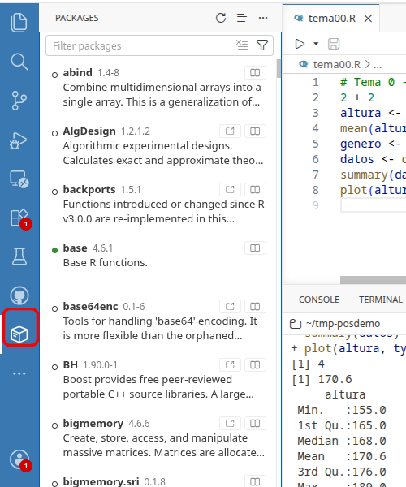{width="88%"}
:::

::::


::: {.notes}

* R puede extenderse con capacidades adicionales instalando paquetes con bibliotecas

* Se instala UNA VEZ, se carga en cada sesión que se usa

* Podemos ver las bibliotecas cargadas en el panel Packages (marcadas como "attached")

    + mirarlo antes y después de `library(AER)`
    + o por línea de comandos
    
```{r}
#| echo: false

search()
library(AER)
search()
```

-   La ayuda contiene información sobre las funciones de una biblioteca, incluyendo ejemplos de uso ("vignettes") en algunos casos

```{r}
#| echo: false
library(help=utils)      # Ayuda para una biblioteca concreta
```

`library(help=utils)`

+ Podemos descargar una biblioteca de memoria con `detach()`

+ La función `require()` es "similar" a `library()`

:::

## Bibliotecas (cont.)


-   El nombre completo de un objeto es `biblioteca::nombre`
  
    + La nombre de la biblioteca solo es necesaria si no se ha cargado o dos objetos diferentes tienen el mismo nombre en bibliotecas distintas

:::: {.columns}

::: {.column width="40%"}
```{r}
base::log(1)
log(1)
```

:::

::: {.column width="20%"}


:::

::: {.column width="40%"}
```{r}
library(Hmisc)
find("units")
```


:::

::::


::: {.notes}

* En la Ayuda, vemos la biblioteca a la que pertenece una función (entre llaves)

* El nombre completo es necesario si hay  conflicto entre bibliotecas: contienen objetos con el mismo nombre


```{r}
#| echo: false
find("units")
library(Hmisc)
find("units")
```

* También se usa nombre completo si no se ha cargado la biblioteca

:::


-   Para mostrar todos los datos de las bibliotecas cargadas

```{r}
data()
```

-  Los podemos cargar (aparecen en el panel Variables) y obtener información detallada en la ayuda (ej., nombre de variables)

```{r}
data("Affairs")
help("Affairs")
```


## Datos "nativos" en R

-   Guardamos objetos del espacio de trabajo con `save()` (en una ruta relativa al directorio de trabajo)

```{r}
x <- 1:20
y <- 2 * x ^ 2 + 1
save(x, file="x.RData")      # un objeto, o varios
save(x, y, file="data/xy.RData")  #   separados por comas
```

::: {.notes}

-   Extensiones .RData, .rda, .rds, ...

-   O todo el workspace con `save.image()` (no suele ser buena idea: mejor replicar con el script)
:::

-   Para cargar datos al espacio de trabajo, con `load()`

```{r}
#| echo: false
rm( list=ls() )
```

```{r}
load("data/xy.RData")
```

-  Nota: este tipo de archivo puede contener varios objetos, incluidas varios conjuntos de datos

::: {.notes}

+ Es posible cargar directamente desde internet:

`load(url("https://github.com/albarran/BigDataEcon/raw/main/data/altura.RData"))`

- También se eliminan archivos con la función  `unlink()`

```{r}
#| echo: false
unlink("xy.RData")
```
:::


## Datos en otros formatos externos a R

-   Varias bibliotecas permiten trabajar con distintos <!--tipos de archivos--> formatos de datos, p.e.:

    1. Texto, con delimitadores o de ancho fijo: `utils` (R base), `readr`
    2. Hojas de cálculo: `readxl`, `openxlsx` <!-- `gdata` (solo .xls), `XLConnect` (lectura y escritura, pero requiere Java)-->
    3. Formatos de software estadístico: `haven`, `foreign`
    
    <!--4. Google Sheets, bases de datos SQL, etc.-->

::: {.notes}

+ Dos bibliotecas a veces ofrecen comandos distintos que hacen lo mismo

+ Pero tienen distintas opciones y sus opciones por defecto son diferentes (p.e., cómo tratan los caracteres: ¿se convierten a factores?)

:::

-   Descargad estos ejemplos (UA cloud): [renta.txt](https://raw.githubusercontent.com/albarran/00datos/main/renta.txt), [sex_data.csv](https://raw.githubusercontent.com/albarran/00datos/main/sex_data.csv), [beauty.xls](https://raw.githubusercontent.com/albarran/00datos/main/beauty.xls), [nsw.dta](https://raw.githubusercontent.com/albarran/00datos/main/nsw.dta)

- Positron NO tiene menú visual de importación: los datos se cargan con **comandos** (mejor: quedan en el script y el proceso es replicable)

- PERO el **Data Explorer** de Positron permite *ver* un archivo de datos (p.e., un `.csv`) como tabla, con filtros y ordenación: doble clic en el Explorador

- `rio` es un meta-paquete (instala otras bibliotecas) para importar y exportar varios formatos de datos de forma sencilla

    + A partir de la extensión del archivo, detecta  el formato y, por tanto, la biblioteca necesaria

<!--
## Comentarios sobre los datos en el disco duro

-   Recordad haber fijado un directorio de trabajo y decidid donde tener vuestros datos

    - En estas transparencias asumo que en un sub-directorio llamado "data

-   Descargad los datos de la web
    ([aquí](https://github.com/albarran/BigDataEcon/raw/main/data.zip)) y descomprimidlos en ese lugar

-   Todos las direcciones son *relativas* al directorio de trabajo para no  escribir la dirección completa `"C:/Users/usuario/Documents/curso/data/misdatos.RData"`: solo `data/misdatos.RData`
-->

<!--
## Archivos de texto simple

-  Los archivos de texto son una forma sencilla de almacenar datos e intercambiarlos entre programas (y usuarios)

    -   Las extensiones habituales son `.txt`, `.csv`, `.raw`

    -   La primera línea puede contener el nombre de las variables
    
    -   En el resto del archivo, están los datos: una línea por caso

    -   Las variables de caracteres, con valores entre comillas

    -  Las columnas (variables) están separadas por un delimitador (ej., coma, espacio,...)  (espacio, tabulador, coma, punto y coma)  
    o tienen un ancho fijo 
    

-   Se pueden leer en un editor, por ejemplo, el de Positron: en 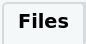{width="8%"} encontrar, p.e., `sex_data.csv`, hacer clic y elegir *View File* <!--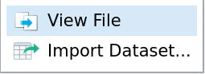{width="15%"}
-->

<!--
## Archivos de texto (cont.)

-   `read.table()` de `utils` carga el contenido de un archivo de texto en una *data frame*

```{r}
datos <- read.table("data/sex_data.csv", header=T, sep =",")
```

-   Con argumentos opcionales, controlamos (entre otras cosas) si el nombre de variables en la primera línea, el tipo de separador o si tenemos coma en lugar de punto decimal (`dec=","`)

::: {.notes}

-   Se puede especificar nombres de columnas (si no están en la primera fila), saltar filas, cuántas filas leer, etc.

```{r}
#| echo: false
sexdata <- read.table("data/sex_data.csv",
                      header=F, sep=",",
                      col.names = c("valor", "fecha", "otra", as.character(4:25)),
                      colClasses = c(rep("character",25)))
```

```{r}
#| echo: false
sexdata <- read.table("data/sex_data.csv", 
                      header=F, sep=",",   
                      col.names = c("valor", "fecha", "otra", as.character(4:25)), 
                      colClasses = c(rep("character",25))) 
```


:::

-   Otros comandos de `utils` importan datos de texto, con distintos argumentos por defecto: `read.csv()`, `read.delim()`, ...

-  En el formato de ancho fijo (`renta.txt`), cada variable ocupa un número fijo de columnas que debemos especificar 
en el comando `read.fwf()`


```{r}
x <- read.fwf(file="data/renta.txt", widths=c(3, 7, 10, 9))
```


## Archivos de texto (y 3)

-   La biblioteca `readr` tiene comandos similares (`read_table()`, `read_csv()`, `read_fwf()`, ...) con distintos argumentos, etc.


```{r}
library(readr)
datos <- read_csv(file = "data/sex_data.csv")
```

::: {.notes}


-   Funciones: `read_csv2()` (";" como separador), `read_tsv()`, `read_delim()`

-   Ayuda adicional en la "viñeta"
    ([vignette](https://cran.r-project.org/web/packages/readr/vignettes/readr.html))  de `readr`

-   Las funciones de `readr` devuelven un "tibble" (un tipo de *data frame* con propiedades diferentes)

```{r}
#| echo: false
nombres <- c("area", "temperatura", "tamaño", "almacenaje", "método",
                "textura", "sabor", "humedad")
arch <- "data/potatoes.csv"
patatas <- read_csv(arch, col_names = nombres, skip = 1,  n_max = 15)
```

```{r}
#| echo: false
arch <- file.path("data", "sex_data.csv")
```

-   También se puede especificar el tipo de datos de cada columna (ver Ayuda)

```{r}
#| echo: false
perritos <- read_delim("data/hotdogs.txt", delim = "\t",
                           col_names = c("tipo", "calorias", "sodio"),
                           col_types = "fii")
```
-->

<!--
ver ayuda: para tipo columnas también

fac <- col_factor(levels = c("Beef", "Meat", "Poultry"))
int <- col_integer()

list(fac, int, int)
-->

<!--
```{r}
#| echo: false
x <- read_fwf(file="data/renta.txt", skip = 1, 
              fwf_cols(edad = 3, genero = 7, renta = 10, educacion = 9 )
              )
```

:::

-   La Ayuda nos muestra los argumentos y sus valores por defecto para ambas bibliotecas

-   En 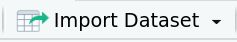{width="20%"}, podemos importar con ambas bibliotecas de forma visual

-   Se puede guardar un conjunto de datos como un archivo de datos de texto con los comandos `write.table()`, `write.csv()`, ... o `write_delim()`, `write_csv()`, etc.

::: {.notes}

-   Múltiples opciones: empezar a escribir `write` en la Ayuda

sink(file= , split=TRUE)

:::
-->

<!--
## Formato de hoja de cálculo

-   La biblioteca `readxl` trabaja con .xls y .xlsx; se usa para importar visualmente en {width="20%"}

-   Incluye funciones tanto para leer el archivo como para conocer información sobre él (ej., nombres de las hojas) y leerlos

```{r}
#| echo: false
library(readxl)
excel_sheets("data/urbanpop.xlsx")                   # nombres de las hojas
pop_1 <- read_excel("data/urbanpop.xlsx", sheet = 1)
pop_2 <- read_excel("data/urbanpop.xlsx", sheet = "1975-2011")
```

```{r}
library(readxl)
excel_sheets("data/beauty.xls")       # nombres de las hojas
dat_1 <- read_excel("data/beauty.xls", sheet = 1)
dat_2 <- read_excel("data/beauty.xls", sheet = "beauty")
```

-  Ver Ayuda para opciones adicionales

::: {.notes}

-   Se puede especificar varias opciones: elegir una selección, qué
    representa missing si no es celda en blanco, etc

```{r}
#| echo: false
urbanpop_sel <- read_excel("data/urbanpop.xlsx", sheet = 2, 
                           col_names = FALSE, skip = 21)
```

:::
-->

<!--
## Bibliotecas para otros formatos

* Tanto `haven` como `foreign` tienen comandos para importar datos de los formatos de sofware estadísticos Stata, SAS y SPSS

    + En la Ayuda tenemos información sobre sus argumentos y opciones por defecto

    + También importamos visualmente en {width="20%"} (usa `haven`)

-   [`googlesheets4`](https://github.com/tidyverse/googlesheets4) importa hojas de cálculo online de Google (p.e., de encuestas realizadas con Google Forms)

-   [`qualtRics`](https://cran.r-project.org/web/packages/qualtRics/vignettes/qualtRics.html) trabaja con software de encuestas `qualtrics`

-   `DBI` accede con Bases de Datos relaciones (SQL) 

 muy usado, en particular en el contexto empresarial:
    

- `jsonlite` se usa para leer datos en el formato JSON, de datos no relaciones (usado en páginas web) 
-->

## Importar y exportar con `rio`

<!--
* `rio` permite trabajar con varios formatos de forma **simple** y unificada (el mismo comando para todos) 

    + P.e., datos nativos de R, archivos de texto (también comprimidos), hojas de cálculo, formatos de software estadístico, Google Sheets, json
-->

* `rio` permite trabajar con el **mismo comando** para todos los formatos, pero las opciones por defecto pueden no ser adecuadas

    + En la Ayuda se incluye una presentación completa del paquete
  
    <!-- + Las opciones por defecto para un archivo pueden no ser adecuadas -->

* El comando `import()` se usa para leer los datos

```{r}
library(rio)
sex   <- import("data/sex_data.csv")
renta <- import("data/renta.txt")
beauty <- import("data/beauty.xls")
nsw    <- import("data/nsw.dta")    # formato Stata
```


<!--
## Importar y exportar con `rio` (cont.)

* Las opciones por defecto para un archivo pueden no ser adecuadas (p.e., el tipo de separador con .csv)

* La Ayuda describe los argumentos para cambiarlas

  + a veces, pasando argumentos del comando de la biblioteca original

-->

* Podemos exportar datos a un tipo de formato con `export()`


```{r}
export(nsw, "data/nsw.csv")
```

* O convertir un archivo del disco a otro formato con `convert()`

# Para terminar

## Valores ausentes ("missing values"): `NA`

-   Muchos conjuntos de datos tienen valores ausentes de ciertas observaciones para algunas variables: ej., descargad (UA Cloud) [earn.RData](https://raw.githubusercontent.com/albarran/00datos/main/earn.RData)

<!-- En R se representan con `NA` -->
-   Sabemos si una observación es `NA` y la frecuencia total: 

:::: {.columns}

::: {.column width="40%"}

```{r}
load("data/earn.RData")
x <- earn$earnings
```
:::

::: {.column width="10%"}

:::

::: {.column width="45%"}

```{r}
is.na(x)
table(is.na(x))
```
:::

::::

:::{.notes}
- Recordemos también `any(is.na(x))`  (hay algun NAs?) o `which(is.na(x))` (qué elementos son NA)
:::

-   Por defecto en R, un cálculo con `NA`s es `NA`: debemos decir que los elimine  explícitamente (y ser conscientes de lo que implica)

:::: {.columns}
::: {.column width="25%"}
```{r}
mean(x)
```
:::

::: {.column width="5%"}

:::


::: {.column width="60%"}

```{r}
mean(x, na.rm=TRUE)
```
:::
::::

:::{.notes}

- `sum()`, `quantile()` y otras tienen la opción de `na.rm=TRUE`
- en `cor()` la opción es diferente: `cor(x, earn$age, use="complete.obs")`

:::

-   `na.omit()` elimina observaciones con `NA`s de una o varias variables
```{r}
earn2 <- na.omit(earn)
```

-  ¿Cómo tratar los `NA`s? Eliminarlos implica selección muestral y la alternativa de imputar valores implica supuestos sobre éstos

::: {.notes}

-  También podemos filtrar `y <- x[!is.na(x)]` u otras formas

-  Otra función útil `complete.cases()`

`s <- complete.cases(x)`

`earnComplete <- earn[s,]`

-  Para reemplazar valores (si pensamos que tiene sentido): `y <- replace(x, which(is.na(x)), -1)`

- Los estadísticos con la muestra sin `NA` pueden no ser representativos de la población total: solo muestrear en barrio pobre es igual de poco representativo que haya menos respuestas en el barrio rico

- suponer que podemos imputar renta solo con edad, genero y educación es restrictivo...

:::

## Nota sobre programación "avanzada"

-   Como en todo lenguaje de programación R, tiene funciones para

    - Ejecución condicional `if()`: una parte del código se ejecuta solo si se cumple una condición
    
    - Bucles `for()`: se repite un mismo bloque de código mientras se itera por los valores de vector
    
    - Crear funciones propias con `function()`


-   Una variante de la ejecución condicional, solo para crear variables según una condición

```{r}
data("Affairs", package = "AER")
Affairs$univers <- ifelse(Affairs$education>15, 1, 0)
```


:::{.notes}
```{r}
#| echo: false
if (p<=0.05) {
  decision <- "Rechazar H0"
} else {
  decision <- "NO Rechazar H0"
}
```

- Tanto if-else como for pueden escribirse en una sola línea sin `\{` si solo incluye un comando en el bloque entre llaves:

`if (p<=0.05) decision <- "Rechazar H0" else decision <- "NO Rechazar H0"`

- Pueden anidarse `if-else`, `for` y ambos

- Otros comandos de bucles: `while`, `repeat`, `replicate`, `apply`, `lapply`, y otros (`map`) en bibliotecas adicionales 

:::


