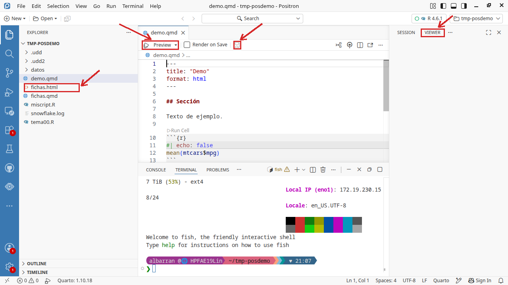
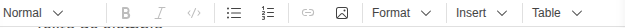
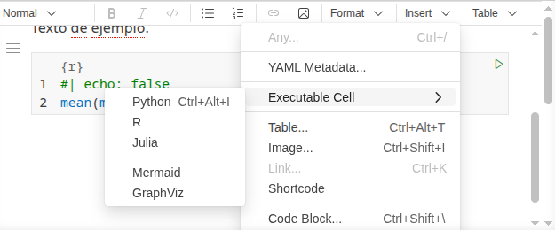

<!-- markdownlint-disable-file MD013 -->

```{r}
#| label: setup
#| include: false
# se evalua pero no incluye output (mensajes, etc.)

# Elimino todo del Entorno (del documento)
rm(list = ls())

# Working directory
#setwd("/home/albarran/Dropbox/ECMTII/ECMTII/Slides_2023")

# Cargo todas las bibliotecas necesarias
# (se podría hacer cuando cada una sea necesaria)
library(tidyverse)
library(rio)
library(kableExtra)
```

<!-- GUION DE SESIÓN (interno; 1 sesión, debe CERRAR):
  0-10'  cierre de la práctica anterior si quedó coja (¿merece solución publicada?) + repaso + mini-test si toca
  10-30' qué es Quarto + crear/guardar/Preview EN VIVO (fichas.qmd desde cero)
  30-50' Markdown básico + YAML (solo lo esencial; las 3 slides de opciones de celda son
         REFERENCIA, no recorrerlas: enseñar echo/eval/output y remitir al resto)
  50-90' PRÁCTICA "vuestro primer informe" (ellos implementan; errores típicos en vivo)
  90-... cierre: ejecución sin renderizar, espacio limpio, a dónde ir a por más
  Instalación de Quarto: decidir previa (Puesta a punto) o 5' al inicio. -->

## El sistema de publicaciones [Quarto](https://quarto.org/)

:::: {.columns}

::: {.column width="50%"}

- Orientado al análisis de datos **reproducible**: combina código, resultados y comentarios

- Útil como cuaderno de trabajo del código y para **comunicar** resultados en un documento final para tomar decisiones

:::

::: {.column width="50%"}

{fig-align="center"}

:::

::::

-   Instalar Quarto para vuestro sistema operativo desde [aquí](https://quarto.org/docs/get-started/)

    + la web pide después elegir un editor: **en Positron no hay que hacer nada más**, ya trae la extensión de Quarto incorporada

-   La [guía](https://quarto.org/docs/guide/) y [referencia](https://quarto.org/docs/reference/) completa de Quarto están en su Web

-   Un documento de Quarto se renderiza, procesando cada componente (código, resultado de ejecutarlo y texto) para producir documentos en varios formatos: html, PDF, Word, presentaciones, etc.

::: {.notes}
- Chuletas de Quarto y de Markdown en la web de Quarto (https://quarto.org/docs/guide/).

::::


## Documentos de Quarto: Crear y Guardar

* Como siempre en Positron, el proyecto es una **carpeta**: cread una carpeta para el informe (o una subcarpeta en la del curso) y abridla con *File > Open Folder*

* Creamos un nuevo documento en *File > New File...* eligiendo *Quarto Document*

* Lo guardamos con *File > Save* (o con el icono de la barra del editor, el segundo), poniéndole nombre **con extensión `.qmd`**

* Se renderiza con **Preview**: el resultado sale en el **visor** de la derecha, y el fichero `.html` aparece en el **Explorador** (doble clic para abrirlo)

{width="78%" fig-align="center"}

::: {style="font-size: 70%;"}
Atajos: `Ctrl+S` guarda, `Ctrl+Shift+K` renderiza. Y desde la **Terminal**, `quarto render informe.qmd`
:::

::: {.notes}
- Señalar las cuatro marcas de la imagen EN PANTALLA, sobre Positron, no sobre la slide.
- La casilla *Render on Save* renderiza cada vez que se guarda: cómoda, pero al principio despista porque parece que se renderiza solo.
:::

## Documentos de Quarto: formato de salida

* El renderizado crea un archivo en el mismo directorio donde está el archivo de Quarto .qmd

* En el caso de HTML, se crea tanto un archivo con extensión .html como un subdirectorio del mismo nombre con componentes necesarios (ej., imágenes, css)

  + solo podemos visualizar correctamente el archivo .html en cualquier navegador si copiamos a otro lugar tanto el .html como el subdirectorio

* Para crear **PDF** hay dos caminos:

  + `format: pdf` usa [LaTeX](https://es.wikipedia.org/wiki/LaTeX), que hay que instalar una vez (en la pestaña **Terminal**, a la derecha de la consola): `quarto install tool tinytex`

  + `format: typst` **no necesita instalar nada**: Quarto ya lo trae incorporado, y es mucho más rápido

* Para este curso, con `html` basta. Si alguien quiere PDF, **typst** es el camino corto

::: {.notes}
- Comprobado en la documentación de Quarto (15-sep-2026): "Quarto includes the Typst CLI so no separate installation of Typst is required".
- Señalar dónde está la pestaña Terminal antes de escribir nada ahí.
- LaTeX sigue siendo mejor si hacen falta ecuaciones complejas o una plantilla académica concreta; para un informe normal, typst sobra.
:::


::: {.callout-note}
**Ahora el ejercicio: apartado a)**, donde se crea la carpeta, el .qmd, la cabecera y se renderiza a dos formatos.
:::

## Documentos de Quarto: Texto con Markdown

* Los componentes de texto están escritos en Markdown: un conjunto ligero de convenciones para archivos de texto sin formato. Por ejemplo,

    - todo lo escrito entre dos \* como `**Hola**` se renderiza en negritas

    - se utiliza \# para indicar encabezados de secciones

* Una descripción completa, en [la web de Quarto](https://quarto.org/docs/authoring/markdown-basics.html) (Markdown Basics); también es útil este [libro online](https://bookdown.org/yihui/rmarkdown/).


:::::{.notes}
- Markdown está diseñado para ser fácil de leer y fácil de escribir. También es muy fácil de aprender. La siguiente guía muestra cómo usar el Markdown de Pandoc, una versión ligeramente extendida de Markdown que R Markdown entiende.


:::: {.columns}

::: {.column width=50%}

**Formato de texto**

    *cursiva*  o _cursiva_
    **negrita**   __negrita__
    `código`
    superíndice^2^ y subíndice~2~
    ~~tachado~~

**Encabezamientos**

    # Encabezado de 1er. nivel
    ## Encabezado de 2º nivel
    ### Encabezado de 3er. nivel
    #### Encabezado de 4º nivel

:::

::: {.column width=50%}

**Listas**

    *   Item (elemento) de la lista (no numeradas)
    *   Item 2
        - Sub-Item 2a (*, + y - son alternativas)
            + sub-sub-item
        - Sub-Item 2b

    1.  Item 1 de la lista numerada
    1.  Item 2. Los números se incrementan automáticamente.

    1)  Otra forma de crear listas numeradas.
    2)  También, se puede poner explícitamente el número.

:::

::::


:::: {.columns}

::: {.column width=50%}

**Bloques de citas literales**

    > Esto es parte de un bloque de cita.
    > Esto es parte del mismo bloque de cita.

    >
    > > Esto es otro bloque de cita anidado.
    > > Esto es parte del bloque anidado.
    >
    > Esto es parte del bloque de cita de primer nivel.
    Esto es una línea normal

**Notas a pie de página**

    Esto es un texto con nota al pie [^nota1]
    y esta es otra nota [^2]

    [^nota1]: Esto es una nota al pie de página.
    [^2]: Esto es la segunda nota al pie.

:::

::: {.column width=50%}

**Líneas de separación**

    ---
    ***


**Referencias**

    [Página de R][1]
    [1]: https://cran.r-project.org/

    #### Título 1 {#tit1}
    [Enlace a titulo1](#tit1)


:::

::::


**Imaǵenes y enlaces**

    
    <http://example.com>
    [frase con vínculo](http://example.com)
    [](https://cran.r-project.org/ )


:::: {.columns}

::: {.column width=50%}

**Tablas**

    Primer encabezado  | Segundo encabezado
    ------------------ | ------------------
    Celda              | Celda
    Celda              | Celda

:::


::: {.column width=50%}

Con alineación de columnas

    | Items    | Cantidad | Precio   |
    | :------- | :------: | -------: |
    | Item 1   | 15       | 9,050    |
    | Item 2   | 3250     | 239,99   |

:::

::::


* Se puede incluir código en HTML (útil para algunos formateos como centrar) y  en LaTeX (útil para [ecuaciones](https://www.latex4technics.com/))

    ; también se pueden incluir diagramas UML.

    - ecuación en texto entre `$ $` (en el editor visual: *Insert > Inline Math*)
    - ecuación aparte entre `$$ $$` (en el editor visual: *Insert > Displayed Math*)

* Los comentarios se escriben entre


* La barra \\ delante de un símbolo de formato o enlace: muestra el símbolo, no aplica el formato: ej.,\\\* muestra *, no empieza lista (idem para  \\\[ o \\\$ ), enlace o ecuación

  provoca que no tengan efecto a la hora de convertirse en negritas, cursivas, links, etc.: \\\*

:::::

* Positron incorpora un **editor visual** de documentos de Quarto, similar a un procesador de texto

  - un ventaja del modo no visual es el número de línea, para errores


## Editor Visual de Quarto en Positron

* Un `.qmd` se puede editar de dos formas: viendo el **texto** tal cual (modo *source*), que es lo que hemos hecho hasta ahora, o en **modo visual**, donde se ve ya con su formato, como en un procesador de textos

* Para pasar al modo visual: el menú **`...`** (*More Actions*) de la barra del editor, arriba a la derecha, y elegir **Edit in Visual Mode**

    + para volver, el mismo menú, que entonces dice *Edit in Source Mode*

* Solo **en modo visual** aparece esta **barra de herramientas**:

{width="85%" fig-align="center"}

* Desde ella se accede a

    + formatos de texto (negritas, cursivas, encabezamientos) y listas
    + insertar enlaces, imágenes, notas a pie de página, tablas
    + incluir ecuaciones (en [LaTeX](https://www.latex4technics.com/))
    + también insertar directamente código HTML, comentarios, etc.

* Lo que se escribe en modo visual **es el mismo fichero**: al volver a *source* se ve el Markdown que ha generado

::: {.notes}
- SEÑALAR en pantalla: el menú ..., dónde aparece la barra, y que al volver a source el texto está ahí escrito. Es lo que convence de que no son dos documentos distintos.
- Comprobado en Positron el 15-sep: el menú ... contiene "Edit in Source Mode / Visual Mode" con el atajo `Ctrl+Shift+F4`, y también "Preview" (`Ctrl+Shift+K`). En modo source NO hay barra de herramientas: aparece al entrar en visual.
- El atajo y la paleta existen, pero el menú es lo que van a usar; no conviene abrir la paleta aquí, que da para mucho más y despista.
- Corrección ortográfica: en Positron se instala una extensión aparte (p.e. "Code Spell Checker" con diccionario de español); no viene de serie como en RStudio.
:::

## Formato en la cabecera: el bloque `YAML`

* Al **principio del documento**, entre dos líneas con `---`, se pueden especificar varias opciones del documento: título, autor, fecha, formato de salida

    + en **modo visual** se inserta desde *Insert > YAML Metadata...*, sin escribir los `---`


* Los formatos de salida son `html`, `pdf`, `docx` (y otros en *Quarto Presentations*)

* También se especifican opciones globales del documento, algunas *específicas* de cada tipo de salida (ver la referencia para [`html`](https://quarto.org/docs/reference/formats/html.html) y  otros formatos)

        ---
        title: "Título"
        author: Autor
        date: 15-octubre-2025
        format:
          html:
            toc: true              # índice
            number-sections: true  # secciones numeradas
            embed-resources: true  # archivo html autocontenido
            theme: united          # más temas: https://bootswatch.com/3/
        ---

## Fragmentos o celdas de código

* El documento no solo lleva texto: lleva **código de R que Quarto ejecuta al renderizar** y cuyo resultado se incorpora al documento de salida. Hay dos formas, según dónde deba aparecer ese resultado

* Una **celda** (o fragmento): un bloque de código aparte, para un cálculo, una tabla o un gráfico; el resultado aparece **debajo** del bloque

    + en **modo visual**, menú **Insert**: *Executable Cell > R*

{width="55%" fig-align="center"}

* **Código en línea**: para que un valor calculado salga **en medio de una frase** (p.e., "la media es 20.09"), y así se actualice solo si cambian los datos

    + en **modo visual**, el icono `</>` de la barra, o *Insert > Any...* (`Ctrl+/`) y escribir `inline`

* En **modo source** ambas se escriben a mano: la celda, entre ```` ```{r} ```` y ```` ``` ````; el código en línea, con `` `r ` `` y dentro el código

::: {.notes}
- Hacerlo EN VIVO y en este orden: primero con el menú Insert en modo visual, que es lo que van a usar, y solo después enseñar cómo queda escrito en source.
- La distinción que hay que dejar clara es DONDE sale el resultado: debajo (celda) o dentro de la frase (en línea).
- El código en línea es el que más les sorprende: una frase con un número que se recalcula solo. Ejemplo para teclear: `La media es `r mean(mtcars$mpg)`.`
:::

## Opciones de una celda

* Van **dentro** de la celda, en sus primeras líneas, precedidas de `#|` (almohadilla y **barra vertical**; con `#` a secas es un comentario y la opción NO se aplica)

```{{r}}
#| echo: false
mean(mtcars$mpg)
```

* `echo` (¿se **ve** el código?) y `eval` (¿se **ejecuta**?) son independientes:

|                             | se ve el código | se ejecuta | se ve el resultado |
|-----------------------------|:---------------:|:----------:|:------------------:|
| `echo: true`  `eval: true`  | sí | sí | sí |
| `echo: false` `eval: true`  | **no** | sí | sí |
| `echo: true`  `eval: false` | sí | **no** | no |

::: {.callout-note}
**Ahora el ejercicio: apartado b)**, con estas tres combinaciones sobre `summary(mtcars)`.
:::

::: {.notes}
- El error de todos los años: escribir `#` en vez de `#|`. Provocarlo en vivo.
- Si un fragmento no se evalúa, lo que define tampoco existe para las celdas siguientes: es el apartado b.iii del ejercicio.
- Las opciones se escriben a mano también en modo visual; no hay menú para ellas en Positron (RStudio sí).
:::

## Otras opciones de celda

::: {.smaller-output}

* `output: false` oculta **solo el resultado**; `include: false` no muestra nada, pero **sí ejecuta**

* `message`, `warning` y `error`: si se muestra lo que R va contando por el camino

* `label`: una etiqueta para identificar la celda

* `code-fold: true` oculta el código pero da opción a mostrarlo

* *Cómo* mostrar resultados de texto y numéricos:
    - `results: hide` (no mostrar)
    - `results: hold` (mostrar todo, no el resultado de cada línea)

:::

::: {.notes}
- Ninguna hay que memorizarla: se consultan. Lo que sí conviene que retengan es que `include: false` ejecuta aunque no muestre nada, que es como se prepara el documento sin ensuciarlo.
:::

## Opciones de presentación

::: {.smaller-output}

* `fig-cap` y `tbl-cap` para los títulos de las figuras y tablas

* *Cómo* mostrar los gráficos: `fig-show`

  - `hide` y `hold` son como en `results`
  - `asis` muestra el gráfico como se generó
  - `animate` concatena varios gráficos en una animación

* `fig-width` y `fig-height`: dimensiones (reales, en pulgadas) de una figura

* `out-width` y `out-height`: ídem en el documento de salida (% de las reales)

* Lista completa de opciones [aquí](https://quarto.org/docs/reference/cells/cells-knitr.html)

:::

## Opciones para figuras

::: {.smaller-output}

* `fig-align`: mostrar la figura centrada o alineada a derecha o izquierda

* `layout-ncol`: en cuántas columnas se componen los resultados

```{r}
#| echo: true
#| eval: true
#| fig-show: hold
#| layout-ncol: 2
library(ggplot2)
ggplot(cars) + geom_histogram(aes(x = speed))
ggplot(cars) + geom_histogram(aes(x = dist))
```

:::


::: {.callout-note}
**Ahora el ejercicio: apartado c)**, los dos gráficos uno al lado del otro con `layout-ncol`.
:::

## Opciones globales para todas las celdas

* En la cabecera, especificamos opciones **por defecto** para las celdas de código

  * p.e., de ejecución como `echo`, `eval`, etc. en `execute` (ver [aquí](https://quarto.org/docs/reference/formats/html.html#execution) y [aquí](https://quarto.org/docs/computations/r.html))

        ---
        execute:
          echo: false
          warning: false
        ---

  * También otras opciones que ya hemos visto ([aquí listado completo para `html`](https://quarto.org/docs/reference/formats/html.html))

        ---
        format:
          html:
            code-fold: true
            cap-location: bottom
            fig-align: center
            df-print: paged      # cómo visualizar tablas
        ---

::: {.notes}
- También existen `enabled: false` y `freeze`. Sección de ejecución en
  <https://quarto.org/docs/computations/r.html>
:::

<!-- PRACTICA COMENTADA (15-sep, decision de Pedro): en este tema NO hace falta hacer
practicas en clase, porque el ejercicio del tema se va haciendo apartado a apartado
durante las sesiones. Se conserva aqui por si algun ano se quiere recuperar.

## PRÁCTICA en clase (1): leer opciones antes de escribirlas

Aquí no se escribe código: se **predice** lo que hace. Contestad en el cuaderno y lo comparamos.

**1.** Una celda lleva estas opciones. ¿Se ve el código? ¿Se ve el resultado? ¿Se ejecuta?

```
#| echo: false
#| eval: true
```

**2.** ¿Y estas otras?

```
#| echo: true
#| eval: false
```

**3.** En la cabecera del documento está `execute: echo: false`, pero una celda concreta lleva
`#| echo: true`. ¿Cuál gana?

**4.** Queréis un informe para un cliente que **no sabe R**: tiene que ver los gráficos y las
tablas, pero ningún trozo de código. ¿Qué ponéis en la cabecera?

**5.** Ahora queréis lo contrario, unos apuntes para vosotros donde se vea todo. ¿Y ahora?

**Para contestar en una frase**: ¿por qué conviene poner las opciones en la cabecera en lugar de
repetirlas celda a celda?

INTERNO (guion del profesor). Respuestas: (1) no se ve el código, sí el resultado, sí se
ejecuta: es el caso del informe para un cliente. (2) se ve el código, no se ejecuta y por tanto no
hay resultado: es el caso de enseñar una instrucción que no se quiere lanzar, como install.packages.
(3) gana la celda: lo específico manda sobre lo global, igual que en CSS. (4) execute: echo: false
en la cabecera. (5) echo: true, que además es el valor por defecto.
La confusión clásica, y hay que provocarla: echo controla si se VE el código, eval si se EJECUTA.
Muchos creen que echo: false también impide ejecutar, y entonces no entienden por qué sigue
saliendo el gráfico. Merece la pena preguntarlo en voz alta antes de dar la respuesta.
Esta práctica es de cinco minutos y va antes de la de montar el informe: cuando lleguen a la 2 ya
saben qué opciones poner y no se atascan ahí.
-->

## Ejecución de código en un documento .qmd

* Renderizar un .qmd crea un *espacio de trabajo* para ejecutar el código **distinto** del de nuestra consola (diferentes objetos, bibliotecas, etc.)

  - si no estamos en la carpeta correcta, el directorio de trabajo puede ser diferente

* Comprobamos los resultados del código del .qmd ejecutándolo **sin renderizar**: línea a línea (`Ctrl + Enter`), o con los enlaces que aparecen **sobre cada celda**: *Run Cell* (esa celda), *Run Above* (todas las anteriores) y *Run Next Cell*

  * así, el código pasa a la consola y *sí* forma parte del espacio de la sesión actual

  * nos aseguramos de que no hay errores (ej.,  objetos previos no definidos)

* Para garantizar que la sesión actual incluye sólo resultados de las celdas del .qmd, incluimos una celda inicial con `include: false` con

    - `rm(list = ls())`: al ejecutar todas las celdas previas, empezamos con una sesión sin objetos previos

    - Todas las **bibliotecas** que se usen en varias celdas (con `library()`, como en el Tema 00)

::: {.notes}
- Comprobado en Positron el 15-sep: los enlaces sobre las celdas son *Run Cell*, *Run Next Cell* y *Run Above* (esta última no aparece en la primera celda, porque no hay nada encima). *Run Above* NO ejecuta la celda actual.
- La demostración que convence: definir un objeto en la consola y usarlo en una celda del .qmd. Ejecutando la celda funciona; al renderizar, falla. De ahí sale casi todo el "a mí me funciona y no me renderiza".
:::

## Mejorar la salida de tablas

* La salida "en crudo" de R es correcta y poco presentable. `knitr::kable()` la convierte en una tabla con formato:

```{r}
#| echo: true
#| eval: true
knitr::kable(head(mtcars[, 1:5]))
```

* `kableExtra` añade estilos, anchos, cabeceras agrupadas... ([guía](https://cran.r-project.org/web/packages/kableExtra/vignettes/awesome_table_in_html.html))

* Primero que el **número** sea el correcto; después, que la tabla se vea bien

::: {.callout-note}
**Ahora el ejercicio: apartados d) y e)**: mostrar `mtcars` con `kbl()` y comparar con la salida cruda, y luego las opciones de cabecera (`df-print: paged`, `code-fold`, tema).
:::

::: {.notes}
- Para ir más lejos: `broom::tidy()` convierte resultados de modelos en tablas; `modelsummary` genera tablas de regresión y de descriptivos; también existen `printr`, `pander`, `stargazer` y `xtable`. La versión completa de esta lista está en el comentario de debajo.
- No nombrarlas en clase: son para cuando les hagan falta, y ahora solo distraen.
:::

<!-- CONSERVADO 15-sep-2026: contenido que esta slide tenia antes y que se retiro de la
transparencia (no del fichero) para que cupiera. Nada de esto se pide en el ejercicio del
tema, que solo usa kbl() / kableExtra (apartado d) y las opciones de cabecera (apartado e).
Si algun ano se quiere recuperar, esta aqui entero:

* Como las salidas de muchas funciones no son visualmente "profesionales", algunas
  bibliotecas las mejoran (`printr`) u ofrecen funciones para hacerlo

* Un enfoque "facil": crear *data frames* con resultados (usando `tidyverse`) y mostrarlo
  como una tabla con `knitr::kable()`

* `broom::tidy()` convierte muchos objetos de R (como listas con resultados de comandos)
  en *tibbles*

* La biblioteca `modelsummary` tiene funciones para
    + convertir modelos en tablas (`modelsummary()`) o graficos
    + crear tablas de estadisticos descriptivos con `datasummary()` o `datasummary_crosstab()`

Notas del profesor que acompanaban a la slide:
- `stargazer`: https://zief0002.github.io/book-8252/pretty-printing-tables-in-markdown.html
- `printr`
- `pander` (avanzado): la funcion `pandoc.table()` convierte objetos de R a tablas en codigo
  de Markdown, con muchas opciones; requiere `results = 'as.is'`
- `xtable`
-->

<!-- PRACTICA COMENTADA (15-sep, decision de Pedro): en este tema NO hace falta hacer
practicas en clase, porque el ejercicio del tema se va haciendo apartado a apartado
durante las sesiones. Se conserva aqui por si algun ano se quiere recuperar.

## PRÁCTICA en clase (2): vuestro primer informe

Convertid el análisis de las **fichas de clientes** del Tema 0 en un informe reproducible:

1. Cread la carpeta del informe, abrid en Positron y cread `fichas.qmd` (título, vuestro nombre, salida html con `toc` y `embed-resources`)

2. Primera celda (con `include: false`): `rm(list = ls())` y las bibliotecas

3. Una sección de texto que explique el caso (en Markdown: un encabezado, una lista, una negrita)

4. Una celda que construya el *data frame* y muestre la tabla con `knitr::kable()`

5. Una celda con el gasto medio por género, comentando UNA frase con lo que implica

6. Renderizad con Preview; comprobad que funciona de principio a fin en un espacio limpio

* El informe es el formato de los **ejercicios largos** y del **proyecto final**: lo que aprendéis hoy es el envoltorio de todo lo que viene

INTERNO (guion del profesor): errores típicos a provocar/mostrar: objeto usado antes de
definirse en el qmd (funciona en consola, falla al renderizar), biblioteca no cargada en el
documento, ruta absoluta que solo existe en un ordenador.
-->

## Comentarios finales

* **Dashboards** (tableros): son presentaciones visuales e **interactivas** de los resultados  claves de un análisis que permiten una comunicación más efectiva

    * Quarto permite crear [*dashboards*](https://quarto.org/docs/interactive/) con tablas, gráficos y otros elementos

    * Ejemplos de sus capacidades usando el paquete [shiny](https://shiny.rstudio.com/gallery/), [shinydashboards](https://rstudio.github.io/shinydashboard/) o [flexdashboard](https://pkgs.rstudio.com/flexdashboard/articles/examples.html)

* **Jupyter Notebook**: son otra forma de combinar texto, código y resultados en un documento. Desarrollados para `Python`, admiten varios lenguajes de programación (como Quarto)

  * se crean, visualizan y ejecutan en navegadores web, pero son fácilmente modificables, [localmente](https://jupyter.org/install) u online en [**JupyterLab**](https://jupyter.org/try) o con [Google Colab](https://colab.research.google.com/)

  * Quarto renderiza libros de Jupyter, creados en .qmd o en su propio formato

* Muchas herramientas están preparadas para `Python` y `R` porque se usan a menudo indistintamente o combinados
