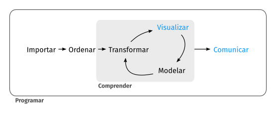
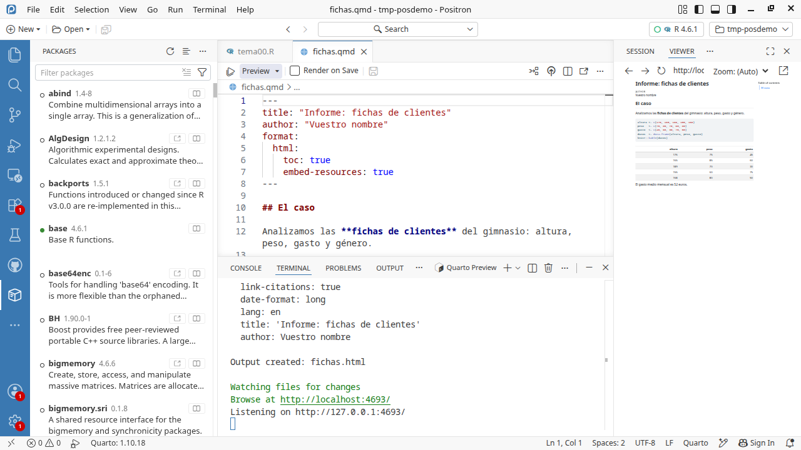

<!-- markdownlint-disable-file MD013 -->

```{r}
#| label: setup
#| include: false
# se evalua pero no incluye output (mensajes, etc.)

# Elimino todo del Entorno (del documento)
rm(list = ls())

# Working directory
#setwd("/home/albarran/Dropbox/ECMTII/ECMTII/Slides_2023")

# Cargo todas las bibliotecas necesarias
# (se podría hacer cuando cada una sea necesaria)
library(tidyverse)
library(rio)
library(kableExtra)
```

<!-- GUION DE SESIÓN (interno; 1 sesión, debe CERRAR):
  0-10'  cierre de la práctica anterior si quedó coja (¿merece solución publicada?) + repaso + mini-test si toca
  10-30' qué es Quarto + crear/guardar/Preview EN VIVO (fichas.qmd desde cero)
  30-50' Markdown básico + YAML (solo lo esencial; las 3 slides de opciones de celda son
         REFERENCIA, no recorrerlas: enseñar echo/eval/output y remitir al resto)
  50-90' PRÁCTICA "vuestro primer informe" (ellos implementan; errores típicos en vivo)
  90-... cierre: ejecución sin renderizar, espacio limpio, a dónde ir a por más
  Instalación de Quarto: decidir previa (Puesta a punto) o 5' al inicio. -->

## El sistema de publicaciones [Quarto](https://quarto.org/)

:::: {.columns}

::: {.column width="50%"}

- Orientado al análisis de datos **reproducible**: combina código, resultados y comentarios

- Útil como cuaderno de trabajo del código y para **comunicar** resultados en un documento final para tomar decisiones

:::

::: {.column width="50%"}

{fig-align="center"}

:::

::::

-   Instalar Quarto para vuestro sistema operativo desde [aquí](https://quarto.org/docs/get-started/)
    <!-- INTERNO: decidir con Luis/Pedro si la instalación de Quarto se pide ANTES (añadir a
         Puesta a punto y a Contenidos de la semana 2) o se hace juntos al empezar la clase.
         Es un instalador simple; 5 min de clase si se hace en vivo. -->

-   La [guía](https://quarto.org/docs/guide/) y [referencia](https://quarto.org/docs/reference/) completa de Quarto están en su Web

-   Un documento de Quarto se renderiza, procesando cada componente (código, resultado de ejecutarlo y texto) para producir documentos en varios formatos: html, PDF, Word, presentaciones, etc.

::::{.notes}
- Chuletas de Quarto y de Markdown en la web de Quarto (https://quarto.org/docs/guide/).

::::


## Documentos de Quarto: Crear y Guardar

* Como siempre en Positron, el proyecto es una **carpeta**: cread una carpeta para el informe (o una subcarpeta en la del curso) y abridla con *File > Open Folder*

* Creamos un nuevo documento en *File > New File...* eligiendo *Quarto Document*, y lo guardamos (`Ctrl + S`) con extensión `.qmd`

* Se renderiza con el botón **Preview** (arriba del editor, atajo `Ctrl + Shift + K`): el resultado aparece al lado, en el visor

{width="62%" fig-align="center"}

* También desde la **Terminal** (pestaña junto a la consola): `quarto render informe.qmd` o `quarto preview informe.qmd`

::: {.notes}
- La extensión de Quarto viene incluida en Positron: no hay que instalar nada aparte (Quarto sí: ver Puesta a punto / lo instalamos juntos en clase).
:::

## Documentos de Quarto: formato de salida

* El renderizado crea un archivo en el mismo directorio donde está el archivo de Quarto .qmd

* En el caso de HTML, se crea tanto un archivo con extensión .html como un subdirectorio del mismo nombre con componentes necesarios (ej., imágenes, css)

  + solo podemos visualizar correctamente el archivo .html en cualquier navegador si copiamos a otro lugar tanto el .html como el subdirectorio

* Para crear PDFs, se necesita una distribución de [LaTeX](https://es.wikipedia.org/wiki/LaTeX):  instala una escribiendo en la pestaña de "Terminal" (a la derecha de la consola):

```{r tinytex-Quarto, eval=FALSE}
quarto install tool tinytex
```


::: {.callout-note}
**Ahora el ejercicio: apartado a)**, donde se crea la carpeta, el .qmd, la cabecera y se renderiza a dos formatos.
:::

## Documentos de Quarto: Texto con Markdown

* Los componentes de texto están escritos en Markdown: un conjunto ligero de convenciones para archivos de texto sin formato. Por ejemplo,

    - todo lo escrito entre dos \* como `**Hola**` se renderiza en negritas

    - se utiliza \# para indicar encabezados de secciones

* Una descripción completa, en [la web de Quarto](https://quarto.org/docs/authoring/markdown-basics.html) (Markdown Basics); también es útil este [libro online](https://bookdown.org/yihui/rmarkdown/).


::::{.notes}
- Markdown está diseñado para ser fácil de leer y fácil de escribir. También es muy fácil de aprender. La siguiente guía muestra cómo usar el Markdown de Pandoc, una versión ligeramente extendida de Markdown que R Markdown entiende.


:::: {.columns}

::: {.column width=50%}

**Formato de texto**

    *cursiva*  o _cursiva_
    **negrita**   __negrita__
    `código`
    superíndice^2^ y subíndice~2~
    ~~tachado~~

**Encabezamientos**

    # Encabezado de 1er. nivel
    ## Encabezado de 2º nivel
    ### Encabezado de 3er. nivel
    #### Encabezado de 4º nivel

:::

::: {.column width=50%}

**Listas**

    *   Item (elemento) de la lista (no numeradas)
    *   Item 2
        - Sub-Item 2a (*, + y - son alternativas)
            + sub-sub-item
        - Sub-Item 2b

    1.  Item 1 de la lista numerada
    1.  Item 2. Los números se incrementan automáticamente.

    1)  Otra forma de crear listas numeradas.
    2)  También, se puede poner explícitamente el número.

:::

::::


:::: {.columns}

::: {.column width=50%}

**Bloques de citas literales**

    > Esto es parte de un bloque de cita.
    > Esto es parte del mismo bloque de cita.

    >
    > > Esto es otro bloque de cita anidado.
    > > Esto es parte del bloque anidado.
    >
    > Esto es parte del bloque de cita de primer nivel.
    Esto es una línea normal

**Notas a pie de página**

    Esto es un texto con nota al pie [^nota1]
    y esta es otra nota [^2]

    [^nota1]: Esto es una nota al pie de página.
    [^2]: Esto es la segunda nota al pie.

:::

::: {.column width=50%}

**Líneas de separación**

    ---
    ***


**Referencias**

    [Página de R][1]
    [1]: https://cran.r-project.org/

    #### Título 1 {#tit1}
    [Enlace a titulo1](#tit1)


:::

::::


**Imaǵenes y enlaces**

    
    <http://example.com>
    [frase con vínculo](http://example.com)
    [](https://cran.r-project.org/ )


:::: {.columns}

::: {.column width=50%}

**Tablas**

    Primer encabezado  | Segundo encabezado
    ------------------ | ------------------
    Celda              | Celda
    Celda              | Celda

:::


::: {.column width=50%}

Con alineación de columnas

    | Items    | Cantidad | Precio   |
    | :------- | :------: | -------: |
    | Item 1   | 15       | 9,050    |
    | Item 2   | 3250     | 239,99   |

:::

::::


* Se puede incluir código en HTML (útil para algunos formateos como centrar) y  en LaTeX (útil para [ecuaciones](https://www.latex4technics.com/))

    ; también se pueden incluir diagramas UML.

    - ecuación en texto entre `$ $` (en el editor visual: *Insert > Inline Math*)
    - ecuación aparte entre `$$ $$` (en el editor visual: *Insert > Displayed Math*)

* Los comentarios se escriben entre


* La barra \\ delante de un símbolo de formato o enlace: muestra el símbolo, no aplica el formato: ej.,\\\* muestra *, no empieza lista (idem para  \\\[ o \\\$ ), enlace o ecuación

  provoca que no tengan efecto a la hora de convertirse en negritas, cursivas, links, etc.: \\\*

::::

* Positron incorpora un **editor visual** de documentos de Quarto, similar a un procesador de texto

  - un ventaja del modo no visual es el número de línea, para errores


## Editor Visual de Quarto en Positron

* En documentos .qmd, se puede elegir entre editar la fuente (*source*) de Markdown, como texto sencillo, o editar de forma visual: comando *Quarto: Edit in Visual Mode* (paleta `Ctrl+Shift+P`, o atajo `Ctrl+Shift+F4`)

* En el modo visual, en esa misma **barra de herramientas** se tienen accesos a

    + formatos de texto (negritas, cursivas, encabezamientos) y listas
    + insertar enlaces, imágenes, notas a pie de página, tablas
    + incluir ecuaciones (en [LaTeX](https://www.latex4technics.com/))
    + también insertar directamente código HTML, comentarios, etc.

::: {.notes}
- Corrección ortográfica: en Positron/VS Code se instala una extensión (p.e. "Spell Right" o "Code Spell Checker" con diccionario de español); no viene de serie como en RStudio.
:::

## Formato en la cabecera: el bloque `YAML`

* Al **principio del documento**, entre dos líneas con `---`, se pueden especificar varias opciones del documento: título, autor, fecha, formato de salida

<!--
    - también se puede crear en *Insert* y elegir *YAML Block*
-->

* Los formatos de salida son `html`, `pdf`, `docx` (y otros en *Quarto Presentations*)

* También se especifican opciones globales del documento, algunas *específicas* de cada tipo de salida (ver la referencia para [`html`](https://quarto.org/docs/reference/formats/html.html) y  otros formatos)

        ---
        title: "Título"
        author: Autor
        date: 15-octubre-2025
        format:
          html:
            toc: true              # índice
            number-sections: true  # secciones numeradas
            embed-resources: true  # archivo html autocontenido
            theme: united          # más temas: https://bootswatch.com/3/
        ---

## Fragmentos o celdas de código

::::{.notes}
"code chunks"
::::
* Insertamos **código en medio del texto** escribiendo `` `r ` `` con el código dentro: el documento de salida incluirá el resultado de ejecutarlo

. . .

* Podemos incluir un **fragmento de código** (de varias líneas) con el botón *Insert Code Cell* (arriba del editor) o escribiendo la celda a mano (```` ```{r} ````  ...  ```` ``` ````)

    * Se puede personalizar cómo se muestran varios aspectos del código y de sus resultados

    + bien para una celda concreta de código, incluyendo [opciones de celda](https://quarto.org/docs/reference/cells/cells-knitr.html)

    + o para todo el documento en la cabecera: las opciones de `html` están en la sección de código de [su referencia](https://quarto.org/docs/reference/formats/html.html) (y similar para otros formatos)

## Cómo se escriben las opciones de una celda

* Van **dentro** de la celda, en sus primeras líneas, cada una precedida de `#|`

```{{r}}
#| echo: false
#| eval: true
mean(mtcars$mpg)
```

* Ojo al detalle: es `#|` (almohadilla y barra vertical), **no** un comentario normal `#`. Si se escribe `#` a secas, Quarto lo trata como código comentado y la opción NO se aplica

* Las dos que más se usan hacen cosas **independientes**:

|                        | ¿se ve el código? | ¿se ejecuta? | ¿se ve el resultado? |
|------------------------|:-----------------:|:------------:|:--------------------:|
| `echo: true`  `eval: true`  | sí | sí | sí |
| `echo: false` `eval: true`  | **no** | sí | sí |
| `echo: true`  `eval: false` | sí | **no** | no |

* `echo: false` con `eval: true` es el informe para quien no programa: ve los resultados, no el código

* `echo: true` con `eval: false` es enseñar una instrucción sin lanzarla (p.e. `install.packages()`)

* **¿Hay un menú para poner esto sin teclearlo?** En Positron, **no**: las opciones se escriben a mano. La documentación de Quarto lo dice explícitamente para el editor visual, donde el bloque se ve con su formato pero las opciones **siguen siendo texto** dentro de la celda

    + en RStudio sí hay una rueda dentada en cada celda, con un diálogo para unas pocas opciones; es una de las diferencias entre los dos entornos

    + tampoco pasa nada: son dos líneas y se escriben antes de darse cuenta

::: {.callout-note}
**Ahora el ejercicio: apartado b)**, donde se piden estas tres combinaciones sobre `summary(mtcars)`.
:::

<!-- INTERNO: slide añadida el 15-sep. Pedro: "no está claro en las slides del tema 01 cómo
poner echo false". Las tres slides siguientes DESCRIBEN las opciones en viñetas pero no
enseñaban la sintaxis; sin ver un `#|` escrito, muchos ponen `#` normal y no entienden por qué
no pasa nada. La tabla de combinaciones es literalmente lo que pide el apartado b.ii. -->


## Opciones para una celda de código

::: {.smaller-output}

* Esta slide y las dos siguientes son de REFERENCIA: en clase usaremos unas pocas opciones; el resto, para consultar cuando las necesitéis

* Las opciones se incluyen al principio de una celda precedidas por `#| `

* `echo: true` muestra el código en la salida (o no con `echo: false`)

* `eval: true` ejecuta el código (o no con `eval: false`)

    - Si un fragmento no se evalúa, sus resultados no se muestran y ni están para otras celdas posteriores (p.e., cargar datos o una biblioteca para usar luego)

* `output: true` incluye los resultados del código

* `include: false` no incluye ni el código ni su resultado, pero se evalúa

* Se muestran (o no) los mensajes, errores y avisos de ejecutar un código con las opciones `message`, `error` y `warning`, respectivamente.

* `label`: etiqueta para identificar la celda

* La lista completa de opciones [aquí](https://quarto.org/docs/computations/execution-options.html) y [aquí](https://quarto.org/docs/reference/cells/cells-knitr.html)

:::

## Opciones para una celda de código (cont.)

::: {.smaller-output}

* `code-fold: true` oculta el código pero da opción a mostrarlo

* *Cómo* mostrar resultados de texto y numéricos:
    - `results: hide` (no mostrar)
    - `results: hold` (mostrar todo, no el resultado de cada línea)

* `fig-cap` y `tbl-cap` para los títulos de las figuras y tablas

* *Cómo* mostrar los gráficos: `fig-show`

  - `hide` y `hold` son como en `results`
  - `asis` muestra el gráfico como se generó
  - `animate` concatena varios gráficos en una animación

* `fig-width` y `fig-height`: dimensiones (reales, en pulgadas) de una figura

* `out-width` y `out-height`: ídem en el documento de salida (% de las reales)

:::

## Opciones para una celda de código (y 3)

::: {.smaller-output}

* `fig-align`: mostrar la figura centrada o alineada a derecha o izquierda

* `layout-ncol`: en cuantas columnas se componen los resultados

```{{r}}
#| layout-ncol: 2
#| fig-show: hold
ggplot(data = cars) + geom_histogram(aes(x = speed))  # izquierda
ggplot(data = cars) + geom_histogram(aes(x = dist))   # derecha
```

```{r}
#| echo: false
#| eval: true
#| fig-show: hold
#| layout-ncol: 2
library(ggplot2)
ggplot(data = cars) + geom_histogram(aes(x = speed))
ggplot(data = cars) + geom_histogram(aes(x = dist))
```

:::


::: {.callout-note}
**Ahora el ejercicio: apartado c)**, los dos gráficos uno al lado del otro con `layout-ncol`.
:::

## Opciones globales para todas las celdas

* En la cabecera, especificamos opciones **por defecto** para las celdas de código

  * p.e., de ejecución como `echo`, `eval`, etc. en `execute` (ver [aquí](https://quarto.org/docs/reference/formats/html.html#execution) y [aquí](https://quarto.org/docs/computations/r.html))

        ---
        execute:
          echo: false
          warning: false
        ---

::::{.notes}
También enabled: false y freeze

Ver sección de ejecución en
https://quarto.org/docs/computations/r.html

::::

  * También otras opciones que ya hemos visto ([aquí listado completo para `html`](https://quarto.org/docs/reference/formats/html.html))

        ---
        format:
          html:
            code-fold: true
            cap-location: bottom
            fig-align: center
            df-print: paged      # cómo visualizar tablas
        ---

## PRÁCTICA en clase (1): leer opciones antes de escribirlas

Aquí no se escribe código: se **predice** lo que hace. Contestad en el cuaderno y lo comparamos.

**1.** Una celda lleva estas opciones. ¿Se ve el código? ¿Se ve el resultado? ¿Se ejecuta?

```
#| echo: false
#| eval: true
```

**2.** ¿Y estas otras?

```
#| echo: true
#| eval: false
```

**3.** En la cabecera del documento está `execute: echo: false`, pero una celda concreta lleva
`#| echo: true`. ¿Cuál gana?

**4.** Queréis un informe para un cliente que **no sabe R**: tiene que ver los gráficos y las
tablas, pero ningún trozo de código. ¿Qué ponéis en la cabecera?

**5.** Ahora queréis lo contrario, unos apuntes para vosotros donde se vea todo. ¿Y ahora?

**Para contestar en una frase**: ¿por qué conviene poner las opciones en la cabecera en lugar de
repetirlas celda a celda?

<!-- INTERNO (guion del profesor). Respuestas: (1) no se ve el código, sí el resultado, sí se
ejecuta: es el caso del informe para un cliente. (2) se ve el código, no se ejecuta y por tanto no
hay resultado: es el caso de enseñar una instrucción que no se quiere lanzar, como install.packages.
(3) gana la celda: lo específico manda sobre lo global, igual que en CSS. (4) execute: echo: false
en la cabecera. (5) echo: true, que además es el valor por defecto.
La confusión clásica, y hay que provocarla: echo controla si se VE el código, eval si se EJECUTA.
Muchos creen que echo: false también impide ejecutar, y entonces no entienden por qué sigue
saliendo el gráfico. Merece la pena preguntarlo en voz alta antes de dar la respuesta.
Esta práctica es de cinco minutos y va antes de la de montar el informe: cuando lleguen a la 2 ya
saben qué opciones poner y no se atascan ahí. -->


## Ejecución de código en un documento .qmd

* Renderizar un .qmd crea un *espacio de trabajo* para ejecutar el código **distinto** del de nuestra consola (diferentes objetos, bibliotecas, etc.)

  - si no estamos en la carpeta correcta, el directorio de trabajo puede ser diferente

* Comprobamos los resultados del código del .qmd ejecutándolo **sin renderizar**: línea a línea (`Ctrl + Enter`), con el enlace *Run Cell* que aparece sobre cada celda, o *Run All Cells Above*

  * así, el código pasa a la consola y *sí* forma parte del espacio de la sesión actual

  * nos aseguramos de que no hay errores (ej.,  objetos previos no definidos)

* Para garantizar que la sesión actual incluye sólo resultados de las celdas del .qmd, incluimos una celda inicial con `include: false` con

    - `rm(list = ls())`: al ejecutar todas las celdas previas, empezamos con una sesión sin objetos previos

    - Todas las bibliotecas (ej., `tidyverse`) que utilizaremos en varias celdas

## Mejorar la salida de tablas

* Como las salidas de muchas funciones no son visualmente "profesionales", algunas bibliotecas las mejoran (`printr`) u ofrecen funciones para hacerlo

* Un enfoque "fácil": crear *data frames* con resultados (usando `tidyverse`) y mostrarlo como una tabla con `knitr::kable()`

* La biblioteca `kableExtra` ofrece [más opciones](https://cran.r-project.org/web/packages/kableExtra/vignettes/awesome_table_in_html.html).

+ `broom::tidy()` convierte muchos objetos de R (como listas con resultados de comandos) en *tibbles*

+ La biblioteca `modelsummary()` tiene funciones para

    + convertir modelos en tablas (`modelsummary()`) o gráficos

    + crear tablas de estadísticos descriptivos con `datasummary()` o `datasummary_crosstab()`


::::{.notes}

- `stargazer`
<https://zief0002.github.io/book-8252/pretty-printing-tables-in-markdown.html>

- `printr`

- `pander` (avanzado):  la función `pandoc.table()` convierto objetos de R a tablas en código de Markdown, con muchas opciones

    - requiere `results = 'as.is'`

- `xtable`:

::::


::: {.callout-note}
**Ahora el ejercicio: apartado d)**, mostrar `mtcars` con `kbl()` y comparar con la salida cruda.
:::


::: {.callout-note}
**Ahora el ejercicio: apartado e)**, las opciones de cabecera: `df-print: paged`, `code-fold` y el tema.
:::
## PRÁCTICA en clase (2): vuestro primer informe

Convertid el análisis de las **fichas de clientes** del Tema 0 en un informe reproducible:

1. Cread la carpeta del informe, abrid en Positron y cread `fichas.qmd` (título, vuestro nombre, salida html con `toc` y `embed-resources`)

2. Primera celda (con `include: false`): `rm(list = ls())` y las bibliotecas

3. Una sección de texto que explique el caso (en Markdown: un encabezado, una lista, una negrita)

4. Una celda que construya el *data frame* y muestre la tabla con `knitr::kable()`

5. Una celda con el gasto medio por género, comentando UNA frase con lo que implica

6. Renderizad con Preview; comprobad que funciona de principio a fin en un espacio limpio

* El informe es el formato de los **ejercicios largos** y del **proyecto final**: lo que aprendéis hoy es el envoltorio de todo lo que viene

<!-- INTERNO (guion del profesor): errores típicos a provocar/mostrar: objeto usado antes de
definirse en el qmd (funciona en consola, falla al renderizar), biblioteca no cargada en el
documento, ruta absoluta que solo existe en un ordenador. -->


## Comentarios finales

* **Dashboards** (tableros): son presentaciones visuales e **interactivas** de los resultados  claves de un análisis que permiten una comunicación más efectiva

    * Quarto permite crear [*dashboards*](https://quarto.org/docs/interactive/) con tablas, gráficos y otros elementos

    * Ejemplos de sus capacidades usando el paquete [shiny](https://shiny.rstudio.com/gallery/), [shinydashboards](https://rstudio.github.io/shinydashboard/) o [flexdashboard](https://pkgs.rstudio.com/flexdashboard/articles/examples.html)

* **Jupyter Notebook**: son otra forma de combinar texto, código y resultados en un documento. Desarrollados para `Python`, admiten varios lenguajes de programación (como Quarto)

  * se crean, visualizan y ejecutan en navegadores web, pero son fácilmente modificables, [localmente](https://jupyter.org/install) u online en [**JupyterLab**](https://jupyter.org/try) o con [Google Colab](https://colab.research.google.com/)

  * Quarto renderiza libros de Jupyter, creados en .qmd o en su propio formato

* Muchas herramientas están preparadas para `Python` y `R` porque se usan a menudo indistintamente o combinados
