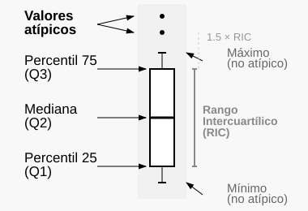

```{r}
#| label: setup
#| include: false
#| eval: true
# se evalua pero no incluye output (mensajes, etc.)

# Elimino todo del Entorno (del documento)
rm(list = ls())

# Working directory
#setwd("/home/albarran/Dropbox/MAD/00.TEC")

# Cargo todas las bibliotecas necesarias
# (se podría hacer cuando cada una sea necesaria)
library(tidyverse)
library(rio)
library(kableExtra)
library(ggrepel)
library(scales)
```

```{r generar-datos}
#| echo: false

library(tidyverse)

# Crear directorio para datos si no existe
if (!dir.exists("data")) dir.create("data")

set.seed(123)

# ========================================
# DATASET 1: VENTAS EMPRESARIALES
# ========================================
# Variables:
# - region: Norte, Sur, Este, Oeste (factor geográfico)
# - producto: Electrónicos, Ropa, Hogar, Deporte (líneas de producto) 
# - ventas: Ventas en miles de euros (variable continua)
# - marketing: Inversión en marketing en miles de euros
# - satisfaccion: Satisfacción del cliente (escala 1-5)
# - trimestre: Q1, Q2, Q3, Q4 (factor temporal)

ventas <- data.frame(
  region = rep(c("Norte", "Sur", "Este", "Oeste"), times = c(150, 75, 110, 65)),
  producto = rep(c("Electrónicos", "Ropa", "Hogar", "Deporte"), times = c(120, 60, 140, 80)),
  ventas = rnorm(400, mean = 50, sd = 15) ,
  marketing = rnorm(400, mean = 8, sd = 3),
    trimestre = sample(c("Q1", "Q2", "Q3", "Q4"), 400, replace = TRUE)
) |>
  mutate(
    ventas = ventas + 
           ifelse(region == "Norte", 20, ifelse(region == "Oeste", 40, 0)) +
           ifelse(producto == "Electrónicos", 20, ifelse(producto == "Deporte", 10, 0)),
    ventas = pmax(ventas, 10), # evitar valores negativos
    marketing = pmax(marketing, 1),
    satisfaccion = sample(1:5, 400, replace = TRUE), # entre 1-5
    # Añadir correlación realista entre marketing y ventas
    ventas = ventas + 2 * marketing + rnorm(400, 0, 5)
  ) |>
  mutate(across(c(region, producto, trimestre), as.factor))

# ========================================
# DATASET 2: INDICADORES MACROECONÓMICOS
# ========================================
# Variables:
# - pais: Nombre del país
# - pib: PIB per cápita en euros
# - desempleo: Tasa de desempleo en porcentaje
# - inflacion: Tasa de inflación anual en porcentaje  
# - deuda: Deuda pública como % del PIB
# - norte: Si pertenece al Norte de Europa (Sí/No)
# - tipo: Clasificación económica (Desarrollada)

macro <- data.frame(
  pais = c("España", "Francia", "Alemania", "Italia", "Portugal", "Grecia", 
           "Países Bajos", "Bélgica", "Austria", "Finlandia", "Irlanda", "Luxemburgo"),
  pib = c(27500, 49500, 66200, 32400, 23400, 17700, 
          58900, 52500, 55400, 54300, 79000, 120600),
  desempleo = c(13.8, 8.1, 3.6, 10.2, 6.6, 17.9, 4.9, 6.2, 4.8, 7.4, 5.1, 5.6),
  inflacion = c(3.1, 2.8, 3.2, 1.9, 1.3, 2.1, 2.9, 3.3, 3.0, 2.1, 2.4, 3.1),
  deuda = c(118, 112, 69, 150, 127, 193, 52, 108, 83, 73, 59, 24),
  norte = c("No", "Sí", "Sí", "No", "No", "No", 
            "Sí", "Sí", "Sí", "Sí", "Sí", "Sí"),
  poblacion = c(47, 68, 83, 60, 10, 11, 17, 12, 9, 5, 5, 0.6)
  ) |>
  mutate(norte = as.factor(norte))

# ========================================
# DATASET 3: COMPORTAMIENTO DEL CONSUMIDOR
# ========================================
# Variables:
# - edad: Edad en años
# - genero: Hombre, Mujer, Otro
# - ingresos: Ingresos anuales brutos en euros
# - gasto: Gasto anual en productos/servicios en euros
# - canal: Online, Tienda_fisica, Ambos (canal preferido)
# - segmento: Premium, Estándar, Económico (segmento de cliente)
# - frecuencia: Semanal, Mensual, Trimestral, Anual (frecuencia de compra)
# - ciudad: Grande, Mediana, Pequeña (tamaño de ciudad)

clientes <- data.frame(
  cliente = sprintf("C%03d", 1:300),   # identificador, para poder etiquetar fichas concretas
  edad = sample(18:70, 300, replace = TRUE),
  genero = sample(c("Hombre", "Mujer", "Otro"), 300, replace = TRUE, prob = c(0.48, 0.48, 0.04)),
  ingresos = rnorm(300, mean = 35000, sd = 12000),
  canal = sample(c("Online", "Tienda_fisica", "Ambos"), 300, replace = TRUE, 
                 prob = c(0.45, 0.35, 0.20)),
  segmento = sample(c("Premium", "Estándar", "Económico"), 300, replace = TRUE, 
                    prob = c(0.2, 0.5, 0.3)),
  frecuencia = sample(c("Semanal", "Mensual", "Trimestral", "Anual"), 300, replace = TRUE,
                      prob = c(0.1, 0.4, 0.3, 0.2)),
  ciudad = sample(c("Grande", "Mediana", "Pequeña"), 300, replace = TRUE,
                  prob = c(0.4, 0.35, 0.25))
) |>
  mutate(
    ingresos = pmax(ingresos, 15000), # salario mínimo
    # Gasto correlacionado con ingresos y segmento
    gasto = case_when(
      segmento == "Premium" ~ ingresos * 0.15 + rnorm(300, 0, 500),
      segmento == "Estándar" ~ ingresos * 0.08 + rnorm(300, 0, 300),
      segmento == "Económico" ~ ingresos * 0.05 + rnorm(300, 0, 200)
    ),
    gasto = pmax(gasto, 500) # gasto mínimo
  ) |>
  mutate(across(c(genero, canal, segmento, frecuencia, ciudad), as.factor))

# ========================================
# DATASET 4: SERIES TEMPORALES DE VENTAS
# ========================================
# Variables:
# - fecha: Fecha (mensual, desde 2020-01 hasta 2023-12)
# - region: Norte, Sur, Este, Oeste
# - ventas: Ventas mensuales en euros
# - estacion: Invierno, Primavera, Verano, Otoño (factor estacional)

fechas <- seq(as.Date("2020-01-01"), as.Date("2023-12-01"), by = "month")
ventas_tiempo <- expand.grid(
  fecha = fechas,
  region = c("Norte", "Sur", "Este", "Oeste")
) |>
  mutate(
    mes = as.numeric(format(fecha, "%m")),
    año = as.numeric(format(fecha, "%Y")),
    # Tendencia creciente + estacionalidad + ruido
    ventas = 50000 + 
             1000 * (año - 2020) + # tendencia
             5000 * sin(2 * pi * mes / 12) + # estacionalidad
             rnorm(n(), 0, 3000), # ruido: n() da el numero de filas dentro de mutate()
    estacion = case_when(
      mes %in% c(12, 1, 2) ~ "Invierno",
      mes %in% c(3, 4, 5) ~ "Primavera", 
      mes %in% c(6, 7, 8) ~ "Verano",
      mes %in% c(9, 10, 11) ~ "Otoño"
    )
  ) |>
  mutate(ventas = pmax(ventas, 20000)) |>
  mutate(across(c(region, estacion), as.factor)) |>
  select(fecha, region, ventas, estacion) # mantener solo las variables principales

# ========================================
# GUARDAR ARCHIVOS
# ========================================

# ========================================
# INFORMACIÓN DE VARIABLES (DATAFRAMES)
# ========================================

ventas_info <- data.frame(
  variable = c("region", "producto", "ventas", "marketing", "satisfaccion", "trimestre"),
  descripcion = c(
    "Región geográfica (Norte, Sur, Este, Oeste)",
    "Línea de producto (Electrónicos, Ropa, Hogar, Deporte)",
    "Ventas en miles de euros",
    "Inversión en marketing en miles de euros",
    "Puntuación de satisfacción del cliente (escala 1-5)",
    "Trimestre del año (Q1, Q2, Q3, Q4)"
  ),
  tipo = c("Factor", "Factor", "Numérica", "Numérica", "Numérica", "Factor")
)

macro_info <- data.frame(
  variable = c("pais", "pib", "desempleo", "inflacion", "deuda", "norte", "poblacion"),
  descripcion = c(
    "Nombre del país",
    "PIB per cápita en euros",
    "Tasa de desempleo en porcentaje",
    "Tasa de inflación anual en porcentaje",
    "Deuda pública como % del PIB",
    "Norte de Europa (Sí/No)",
    "Población (millones de personas)"
  ),
  tipo = c("Carácter", "Numérica", "Numérica", "Numérica", "Numérica", "Factor", "Numérica")
)

clientes_info <- data.frame(
  variable = c("cliente", "edad", "genero", "ingresos", "gasto", "canal", "segmento", "frecuencia", "ciudad"),
  descripcion = c(
    "Identificador del cliente (C001 a C300)",
    "Edad en años",
    "Género (Hombre, Mujer, Otro)",
    "Ingresos anuales brutos en euros",
    "Gasto anual en productos/servicios en euros",
    "Canal de compra preferido (Online, Tienda_fisica, Ambos)",
    "Segmento de cliente (Premium, Estándar, Económico)",
    "Frecuencia de compra (Semanal, Mensual, Trimestral, Anual)",
    "Tamaño de ciudad de residencia (Grande, Mediana, Pequeña)"
  ),
  tipo = c("Carácter", "Numérica", "Factor", "Numérica", "Numérica", "Factor", "Factor", "Factor", "Factor")
)

ventas_tiempo_info <- data.frame(
  variable = c("fecha", "region", "ventas", "estacion"),
  descripcion = c(
    "Fecha mensual (2020-01 a 2023-12)",
    "Región geográfica (Norte, Sur, Este, Oeste)",
    "Ventas mensuales en euros",
    "Estación del año (Invierno, Primavera, Verano, Otoño)"
  ),
  tipo = c("Fecha", "Factor", "Numérica", "Factor")
)

# Guardar todos los datasets e información en un solo archivo RData
save(ventas, macro, clientes, ventas_tiempo, 
     ventas_info, macro_info, clientes_info, ventas_tiempo_info, 
     file = "data/datosVisualizacion.RData")
```


## ¿Por qué visualizar datos?

<!-- ## ------------------------------------------------------------------- -->
:::: {.notes}

**Objetivos de Aprendizaje**

Al finalizar este tema, serás capaz de:

- Comprender los **principios fundamentales** de la visualización de datos
- Usar la **gramática de gráficos** implementada en ggplot2
- Crear **visualizaciones efectivas** para análisis exploratorio
- Aplicar **buenas prácticas** en la comunicación visual de datos

::::

<!-- ## ------------------------------------------------------------------- -->


- **Resumir información** <!--de manera intuitiva--> que no se vería en los datos en bruto (hoja de cálculo)

- **Identificar patrones** y relaciones entre variables

- **Comunicar hallazgos** de forma efectiva a diferentes audiencias  

. . .

- La visualización es esencial en:

  - *Empresas y consultoras*: presentaciones ejecutivas con las conclusiones que salen de los datos
  - *Bancos centrales y gobiernos*: paneles de indicadores macroeconómicos
  - *Medios*: The Economist, Financial Times
  - *Investigación económica*

- En un buen gráfico, la audiencia encuentra obvias las ideas a transmitir, sin *abrumar* con muchos hallazgos

## `ggplot2` y la Gramática de Gráficos

- Componentes básicos:

  - *Datos*

  - *Estéticas (aes)*: asocia variables a propiedades visuales (posición, longitud, área, color)

  - *Geometrías (geom)*: objetos para representar datos (líneas, círculos, barras)

  - *Escalas*, *Sistemas de coordenadas*, *Facetas* (subgráficos), *Contexto* (títulos, leyendas), etc.

- Construir gráficos como frases gramaticales

  - sujeto + verbo + objeto = oración

  - datos +  geometría + estética = gráfico de `ggplot2`

<!-- ## ------------------------------------------------------------------- -->

:::: {.notes}

**Elementos Básicos de un Gráfico**

1. Señales Visuales (Aesthetics)

  - **Posición**: ubicación en ejes x, y
  - **Color**: matiz para distinguir categorías o magnitudes
  - **Tamaño**: área/radio para representar magnitudes
  - **Forma**: símbolos diferentes para categorías
  - **Transparencia**: nivel alpha para densidad o solapamiento

2. Sistema de Coordenadas

  - Cartesiano (por defecto)
  - Polar: `coord_polar()`  
  - Geográfico: `coord_map()`

3. Escala

  - Numérica lineal, logarítmica
  - Categórica, temporal
  - ¿Cómo se traduce la distancia en algo con significado?

4. Contexto

- Títulos, leyendas, puntos/líneas de referencia

::::

<!-- ## ------------------------------------------------------------------- -->


**"Por encima de todo, mostrar los datos"**


## Los datos del tema

* Trabajaremos con una **cadena de gimnasios** y su entorno. Son tres conjuntos de datos, y cada uno responde a una pregunta distinta

```{r cargar}
#| eval: true
library(ggplot2)
load("data/datosVisualizacion.RData")
```

* **¿Quién es nuestra clientela y en qué se diferencia?** `clientes`, una ficha por persona: lo que ingresa, lo que gasta, su edad, por qué canal compra y en qué segmento está

* **¿Cómo va el negocio y de qué depende?** `ventas`: cuánto se vendió y cuánto se invirtió en marketing, en cada región, producto y trimestre

* **¿En qué entorno operamos?** `macro`, un país por fila: renta, población, paro, inflación y deuda

* De cada conjunto salen **muchas preguntas**, y cada una pide su propio gráfico

* La descripción de cada variable está en su diccionario: `clientes_info`, `ventas_info`, `macro_info`

* Los ficheros se descargan de la página **Datos** del curso, y van en un subdirectorio `data` dentro de vuestra carpeta del tema

::: {.notes}
- La idea es que no sean "tres ficheros" sino tres preguntas del mismo negocio: la clientela, la
  cuenta de resultados y el entorno. Asi entienden POR QUE cambiamos de conjunto mas adelante.
- No recorrer la ficha del final en clase: esta para consultar, y se llega por el enlace.
- `macro` se reserva para escalas: su poblacion va de 1 a 138 millones y es donde la escala
  logaritmica se ve. Con `clientes` no se veria: sus ingresos son casi simetricos.
- Los diccionarios (`clientes_info`, `ventas_info`, `macro_info`) vienen en el mismo `load()`.
:::

## Creando un "ggplot"

Un gráfico se construye en **tres pasos**. Cada pestaña añade uno:

::: {.panel-tabset}

### 1. Los datos

`ggplot()` con los datos solos da un lienzo **vacío**: todavía no hemos dicho qué variable va a cada sitio.

```{r ejemplo-basico0}
#| eval: true
#| output: true
#| fig-show: asis
#| fig-height: 3
ggplot(data = ventas)
```

### 2. La estética

La **estética** es la correspondencia entre una variable y una propiedad visual del gráfico. Se declara con `aes()`: aquí, qué variable va en cada eje. Ya hay ejes, pero aún no hay nada dibujado.

```{r ejemplo-basico1}
#| eval: true
#| output: true
#| fig-show: asis
#| fig-height: 3
ggplot(data = ventas, aes(x = marketing, y = ventas))
```

### 3. La geometría

El **objeto geométrico** es la forma que toman los datos: puntos, barras, líneas... Se añade como una capa más, con `+`.

```{r ejemplo-basico2}
#| eval: true
#| output: true
#| fig-show: asis
#| fig-height: 3
ggplot(data = ventas, aes(x = marketing, y = ventas)) + 
  geom_point()
```

:::

* La **estética** y la **geometría** son las dos piezas que vemos a continuación

::: {.notes}
- Las pestanas se recorren en clase de izquierda a derecha: es la construccion del grafico en
  vivo, sin tener que apilar tres graficos en una misma pantalla.
- Aqui solo se NOMBRAN estetica y geometria, con una linea cada una; el detalle viene en las dos
  slides siguientes. Antes se usaban `aes()` y `geom_point()` sin haberlos definido.
- La pestana 4 adelanta lo que se retoma en "Datos y esteticas especificas por capa".
:::

## ¿Dónde se pone la estética?

* Si `aes()` va en **`ggplot()`**, la estética vale para **todas las capas** que vengan detrás. Si va dentro de un **`geom_`**, vale **solo para esa capa**

* Con una sola capa, las dos formas dan **el mismo gráfico**:

:::: {.columns}
::: {.column width="50%"}
```{r aes-en-ggplot}
#| eval: true
#| output: true
#| fig-show: asis
#| fig-height: 2.8
ggplot(ventas,
       aes(marketing, ventas)) +
  geom_point()
```
:::
::: {.column width="50%"}
```{r aes-en-geom}
#| eval: true
#| output: true
#| fig-show: asis
#| fig-height: 2.8
ggplot(ventas) +
  geom_point(
    aes(marketing, ventas))
```
:::
::::

* La diferencia aparece **en cuanto hay más de una capa**: lo declarado en `ggplot()` lo heredan todas, y así no hay que repetirlo

::: {.notes}
- Aqui solo se constata que son equivalentes con una capa. El caso en que SI importa se ve en
  "Datos (y esteticas) especificas por capa", donde una capa de texto usa sus propios datos.
- Lo util de declararlo arriba: no repetir `x` e `y` en cada `geom_`. Lo util de declararlo en
  el geom: que una capa concreta se salga de la norma.
:::

## Objetos Geométricos

Cada `geom_*()` agrega un tipo diferente de capa: 


| Tipo | Función | Uso Habitual |
|------|---------|---------------|
| **Puntos** | `geom_point()` | Dispersión |
| **Líneas** | `geom_line()` | Evolución temporal |
| **Barras** | `geom_bar()` | Frecuencias categóricas |
| **Histograma** | `geom_histogram()` | Distribución continua |
| **Cajas** | `geom_boxplot()` | Estadísticos descriptivos |
| **Suavizado** | `geom_smooth()` | Tendencias |
| **Texto** | `geom_text()` | Etiquetas |

Para lista completa: buscar funciones que comienzan con `geom_` en Ayuda

## Asociación Estética, con `aes()`

:::: {.notes}

Elementos estéticos son "algo que se puede ver" (información)

::::

- Cada `aes()` es una asociación entre una **señal visual** y una **variable**:

  |                           |        |                                       |
  |---------------------------|--------|---------------------------------------|
  | **posición**: `x`, `y`    | &#124; | **forma**: `shape`                    |
  | **color**: color exterior | &#124; | **relleno**: `fill` (color interior)  |
  | **tamaño**: `size`        | &#124; | **tipo de línea**: `linetype`         |

:::: {.notes}
  - **posición**: `x`, `y`  
  - **color**: color exterior
  - **relleno**: `fill` (color interior)
  - **forma**: `shape` (de los puntos)
  - **tipo de línea**: `linetype`
  - **tamaño**: `size`
::::

- Algunas estéticas son solo adecuadas para variables cuantitativas o para cualitativas
- Cada `geom` acepta solo un subconjunto de estéticas (ver ayuda)

- **Regla de oro**: Si quieres que algo varíe con los datos, ponlo en `aes()`

```{r ejemplo-esteticas}
ggplot(ventas, aes(x = marketing, y = ventas)) +
  geom_point(aes(color = region))
```


## Asociación Estética vs. Opción Fija

:::: {.columns}

::: {.column width="50%"}
**Dentro** de `aes()`: una **variable** se traduce en una señal visual, y aparece su leyenda

```{r mapeo-estetico}
#| eval: true
#| output: true
#| fig-show: asis
#| fig-height: 3.2
ggplot(ventas,
       aes(marketing, ventas)) +
  geom_point(
    aes(color = region))
```
:::

::: {.column width="50%"}
**Fuera** de `aes()`: un **valor fijo**, igual para todos los puntos, sin leyenda

```{r opcion-fija}
#| eval: true
#| output: true
#| fig-show: asis
#| fig-height: 3.2
ggplot(ventas,
       aes(marketing, ventas)) +
  geom_point(
    color = "red")
```
:::

::::

. . .

* **Principio**: cada señal visual debe representar **información**, no "embellecer". Y no saturar: tres o cuatro variables a la vez no se leen

```{r mapeo-estetico3}
ggplot(macro, aes(y = desempleo, x = pib)) +        # demasiado
  geom_point(aes(size = inflacion, color = deuda))
```

:::: {.notes}
- El contraste izquierda/derecha es el que hay que proyectar: misma orden, un parentesis de
  diferencia, y el resultado cambia por completo.
- CUIDADO, esto estaba mal hasta el 22-sep: el ejemplo de "valor fijo" tenia el color DENTRO de
  `aes()`, que es justo el error contrario. Ahora la derecha es `color = "red"` de verdad.
- La practica que viene a continuacion vive de esa distincion: alli veran que `aes(color="red")`
  ni siquiera pinta de rojo.
- `norte` (caracter) se convierte automaticamente a factor: escala categorica.
::::

## PRÁCTICA en clase (1): ¿rojo o "rojo"?

Con el data frame `clientes` (300 fichas de la clientela de nuestra cadena de gimnasios):

1. Dibujad la relación entre `ingresos` y `gasto` con `geom_point()`

2. Pintad TODOS los puntos de rojo, de verdad (que no aparezca ninguna leyenda)

3. Ahora ejecutad esto y describid qué veis: ¿de qué color salen los puntos? ¿qué dice la leyenda? ¿por qué?

    `ggplot(clientes, aes(x = ingresos, y = gasto)) + geom_point(aes(color = "red"))`

4. Distinguid el `segmento` por color y el `canal` por forma. Y ahora añadid además `size = edad`. ¿Se lee el gráfico con tres variables encima? ¿Cuántas cosas a la vez puede leer quien lo mira?

5. Añadid `size = 4` dentro de `aes()` y luego fuera. Una de las dos no tiene sentido: ¿cuál y por qué? En una frase, ¿qué regla os sirve para decidirlo?

::: {.callout-note}
**Esta práctica es el apartado a) del ejercicio 1**: id haciéndola ahí, en vuestro `.qmd`.
:::

<!-- INTERNO (solución y guion del profesor): 25 min (15 de teclado, 5 de puesta en común
con el punto 3 proyectado, 5 de cierre).

1) ggplot(clientes, aes(x = ingresos, y = gasto)) + geom_point()
   Nube creciente: la correlación entre ingresos y gasto es 0,595 (cifra verificada).
2) geom_point(color = "red")   -> FUERA de aes(). Sin leyenda.
3) Los puntos NO salen rojos: salen salmón (#F8766D, el primer color de la paleta hue por
   defecto de ggplot2 cuando la escala discreta tiene un solo nivel) y aparece una leyenda
   titulada "colour" con una única categoría llamada "red". Explicación: dentro de aes()
   ggplot entiende que "red" es una VARIABLE constante con un solo valor, le asigna una
   escala de color discreta y le pone leyenda. El valor "red" es la etiqueta, no el color.
4) geom_point(aes(color = segmento, shape = canal)): 3 x 3 = 9 combinaciones, dos leyendas.
   Se lee mal. Conteos reales: segmento Económico 84, Estándar 149, Premium 67;
   canal Ambos 47, Online 141, Tienda_fisica 112. Conviene rematarlo con facetas
   (facet_wrap(~ canal)), que es la slide de facetas, para que vean la alternativa.
5) size = 4 DENTRO de aes() vuelve a inventarse una variable constante: aparece una leyenda
   titulada "size" con un único valor, 4, y además el tamaño DIBUJADO no es 4 sino 4,54
   (verificado), porque la escala de tamaño mapea la constante al centro de su rango. Es la
   versión sin sentido. Fuera de aes() es lo correcto: fija el tamaño en 4.
Regla esperada: dentro de aes() va lo que VARÍA con los datos; fuera, lo que es un valor fijo.
Error que quiero provocar: que en el punto 2 escriban aes(color = "red") y se queden
tan tranquilos porque "sale un color". El punto 3 es el que lo destapa.
-->

<!-- ## ------------------------------------------------------------------- -->

:::: {.notes}

**`esquisse`: Interfaz Gráfica**

`esquisse` implementa visualmente la lógica de `ggplot2`:

- Similar a Tableau, PowerBI, Gapminder
- "Arrastrar y soltar" variables a estéticas

```{r esquisse-demo}
#install.packages("esquisse")
library(esquisse)
esquisser()                         
data("mpg")
esquisser(mpg, viewer = "browser")   
```

**Características:**
- Elegir tipo de gráfico, estéticas, títulos, apariencia
- Genera código R para crear el gráfico  
- Descargar gráfico creado
- Ayuda para aprender cómo hacer las cosas

::::

<!-- ## ------------------------------------------------------------------- -->


## Gráficos como Objetos

- Un gráfico también es un objeto de R

```{r objetos-graficos}
#| eval: true
graf_base <- ggplot(macro, aes(y = desempleo, x = pib)) +
                geom_point()
```

- Se pueden agregar capas a este objeto:

```{r capas-objetos}
graf_base + geom_line()
graf_base + geom_point(aes(shape = norte)) 
graf_base + geom_point(aes(size = inflacion, color = deuda))
```


## Datos (y estéticas) específicas por capa

:::: {.notes}
- Recordad: cada capa puede usar **datos** o **estéticas** distintas
::::

#### Ejemplo práctico:

- `geom_text()`: acepta estéticas de etiquetas (variables con texto):
```{r texto}
graf_base + geom_text(aes(label = pais), size = 3)

library(ggrepel)  # Evita solapamiento
graf_base + geom_text_repel(aes(label = pais), size = 3)
```

- Ahora con datos específicos por capa si solo queremos señalar algunos puntos
```{r subconjuntos}
graf_base + 
  geom_text_repel(
    data = subset(macro, 
                  pais %in% c("España","Francia","Alemania")), 
    aes(label = pais), size = 3)
```

- Esta idea se puede **generalizar**: usar distintos datos o estéticas en cada capa según las necesidades del gráfico

::: {.callout-note}
**Ahora el ejercicio 1, apartado b)**: etiquetar a quienes más gastan, con su propia capa de datos.
:::

## Gráficos que muestran datos transformados

* Un gráfico de dispersión dibuja **los datos tal cual**. Otros **calculan algo antes de dibujar**, y conviene saber qué

::: {.panel-tabset}

### Cajas

`geom_boxplot()` no dibuja las observaciones: dibuja sus **cuartiles y su mediana**

:::: {.columns}
::: {.column width="45%"}
```{r boxplot-ejemplo}
#| eval: true
#| output: true
#| fig-show: asis
#| fig-height: 3.2
ggplot(clientes,
       aes(y = gasto/1000)) +
  geom_boxplot()
```
:::
::: {.column width="55%"}
{width=75% fig-align="center"}
:::
::::

### Tendencia

`geom_smooth()` **estima una regresión** y dibuja la línea predicha, con su intervalo de confianza

```{r smoothers}
#| eval: true
#| output: true
#| fig-show: asis
#| fig-height: 3
#| layout-ncol: 2
graf_base + geom_smooth()
graf_base + geom_smooth(method = lm, se = FALSE)
```

:::

:::: {.notes}

* Podríamos agregar la línea de regresión "manualmente"

```{r}
res <- lm(gasto ~ ingreso, data = clientes)
clientes$ingreso_pred <- res[["fitted.values"]]
# graf_base +  geom_line(aes(y = ingreso_pred))  # ERROR: pred.SC no estaba en graf_base

graf_base <- ggplot(clientes, aes(y = gasto, x = ingreso)) + geom_point()
graf_base + geom_line(aes(y = ingreso_pred))
```

* NO necesitamos repetir la estetica de posición `x` para `geom_line()` porque ya está definida en `graf_base`

::::

## Gráficos que muestran datos transformados (cont.)

* `geom_bar()` y `geom_histogram()` convierten los datos en **frecuencias**

::: {.panel-tabset}

### Recuento

`geom_bar()` **cuenta** los casos de cada categoría: no hay que calcular nada antes. En Excel habría que haber contado primero

```{r barras}
#| eval: true
#| output: true
#| fig-show: asis
#| fig-height: 3
ggplot(ventas, aes(x = region)) + geom_bar()
```

### Intervalos

En una variable continua **no hay categorías naturales**: los intervalos los elegimos nosotros, y esa elección cambia lo que se ve

```{r histograma-parametros}
#| eval: true
#| output: true
#| fig-show: asis
#| fig-height: 2.4
#| layout-ncol: 3
graf <- ggplot(clientes, aes(x = ingresos/1000))
graf + geom_histogram(bins = 20)
graf + geom_histogram(binwidth = 3)
graf + geom_histogram(breaks = seq(10,90,5))
```

### Densidad

La misma información sin elegir intervalos, en frecuencia relativa

```{r histograma-densidad}
#| eval: true
#| output: true
#| fig-show: asis
#| fig-height: 2.6
#| layout-ncol: 2
graf + geom_histogram(aes(y = after_stat(density)))
graf + geom_density()
```

:::

:::: {.notes}

- Con datos ya transformados, usar `stat = "identity"`:

```{r barras-identity}
#| eval: true
#| output: true
#| fig-show: asis
# Frecuencias automáticas
ggplot(ventas, aes(x = region)) + geom_bar()

# Valores ya calculados - ventas promedio por región
ventas_promedio <- ventas |> 
  group_by(region) |> 
  summarise(venta_media_miles = mean(ventas))

ggplot(ventas_promedio, aes(x = region, y = venta_media_miles)) + 
  geom_bar(stat = "identity")
```

::::


## PRÁCTICA en clase (2): el gráfico calcula por ti

Venís de Excel, donde para hacer un gráfico de barras hay que contar antes. Aquí no. Con `clientes`:

1. Número de clientes de cada `segmento`, con `geom_bar()`. ¿Dónde está la tabla de frecuencias que habéis usado?

2. Lo mismo, pero con la PROPORCIÓN que representa cada segmento, sin calcular nada aparte: el `geom` ya ha contado, y `after_stat()` deja usar lo que ha calculado

```{r practica2-patron}
#| eval: false
ggplot(clientes, aes(x = segmento, y = after_stat(prop), group = 1)) +
  geom_bar()
```

3. En una frase: ¿qué significa que un `geom` "tiene una estadística por defecto"?

::: {.callout-note}
**Esta práctica es el apartado c) del ejercicio 1.**
:::

## PRÁCTICA en clase (3): distribuciones

1. Distribución de los `ingresos` con `geom_histogram()`, probando `bins = 10`, `bins = 40` y `binwidth = 3`. ¿Cuál de las tres le enseñaríais a dirección y por qué?

2. Con una de las tres se ve un grupo de clientes de ingresos muy bajos y con las otras no. ¿Con cuál, y qué os dice eso sobre elegir los intervalos?

3. Añadid un `geom_boxplot()` del `gasto` por `segmento`

::: {.callout-note}
**Esta práctica es el apartado d) del ejercicio 1.**
:::

<!-- INTERNO (solución y guion del profesor): 25 min.

1) ggplot(clientes, aes(x = segmento)) + geom_bar()
   No hay tabla: la calcula stat_count(), la estadística por defecto de geom_bar().
   Conteos reales: Económico 84, Estándar 149, Premium 67 (n = 300).
2) Proporciones reales: Económico 0,280, Estándar 0,497, Premium 0,223 (verificado en R).
   `prop` es una de las variables que calcula stat_count(), y `after_stat()` es la forma de
   pedirle a la capa que use algo que ella misma ha calculado, en vez de una columna de datos.
   El `group = 1` se explica EN VOZ ALTA y NO se pregunta ni en la practica ni en el ejercicio
   (decision de Pedro, 23-sep): sin el, cada barra es su PROPIO grupo y la
   proporcion se calcula dentro de cada una, asi que las tres salen valiendo 1 (comprobado).
   Con group = 1 se declara que las tres pertenecen al mismo total, que es lo que queremos.
   Alternativa equivalente, mas larga, por si alguien la propone:
     after_stat(count) / sum(after_stat(count)), que da exactamente lo mismo.
   Si alguien trae los datos ya contados desde fuera, lo suyo es geom_col().
3) gasto va de 500 a 9737 euros, media 3095. Con bins = 10 se ve una distribución unimodal
   con cola a la derecha (conteos por tramo de 1000 euros: 12, 82, 76, 65, 21, 15, 12, 14, 2, 1).
   Con bins = 40 y con binwidth = 250 aparece ruido: barras que suben y bajan sin patrón.
   Para dirección, bins = 10.
4) Aquí SÍ hay un grupo separado, y es un artefacto del generador: ingresos se truncó por
   abajo en 15.000 euros (salario mínimo), así que hay 17 clientes con EXACTAMENTE 15.000
   y 20 en el primer tramo de mil euros. Con bins = 10 ese pico queda diluido dentro de la
   primera barra; con binwidth estrecho (o bins = 40) salta a la vista. Moraleja: la elección
   de intervalos es una decisión del analista y puede esconder un grupo entero.
5) Los cinco números son el mínimo (sin contar atípicos), el primer cuartil, la mediana, el
   tercer cuartil y el máximo (sin atípicos); los bigotes llegan como mucho a 1,5 veces el
   rango intercuartílico. Cifras reales de `fivenum()` por segmento, en euros:
     Económico: 502 / 1395 / 1784 / 2218 / 3420
     Estándar:  500 / 2009 / 2769 / 3390 / 7008
     Premium:  1246 / 4429 / 5462 / 6934 / 9737
   Ojo: Económico y Premium se solapan (máx. Económico 3420, mín. Premium 1246); el segmento
   no separa limpiamente el gasto.
Respuesta esperada al cierre: que el geom transforma los datos antes de dibujar, y que si ya
traemos el dato calculado hay que decírselo (stat = "identity" o geom_col()).
-->


## Escalas: Control de Asociación Estética

- `aes()` establece **qué** variable asignar, la escala **cómo** representarla

- Funciones de escala: `scale_<estética>_<tipo>`. Ejemplos,


<div style="font-size: 0.65em;">

| **Escala**        | **Tipos**    | **Ejemplos**              |
|-------------------|--------------|---------------------------|
|                   |              |                           |
| scale_color_      | identity     | scale_fill_continuous     |
| scale_fill_       | manual       | scale_color_discrete      |
| scale_size_       | continuous   | scale_color_manual        |
|                   | discrete     | scale_size_discrete       |
|                   |              |                           |
| scale_shape_      | discrete     | scale_shape_discrete      |
| scale_linetype_   | manual       | scale_shape_manual        |
|                   | identity     | scale_linetype_discrete   |
|                   |              |                           |
| scale_x_          | continuous   | scale_x_continuous        |
| scale_y_          | discrete     | scale_y_discrete          |
|                   | reverse      | scale_y_reverse           |
|                   | log10        | scale_x_log10             |
|                   | date         | scale_x_date              |
|                   | datetime     | scale_y_datetime          |

</div>

## Escalas (cont.)

- Algunos argumentos son habituales en casi todas las escalas (`name`, `breaks`, `labels`)

- Otros argumentos son específicos según el tipo de variables (continua, discreta) o la escala concreta

```{r escalas-ejemplos}
ggplot(macro, aes(y = pais, x = pib)) + 
  geom_point(aes(color = desempleo))  +
  scale_color_continuous(breaks = c(5, 10, 15),
                         labels = c("Bajo", "Medio", "Alto"), 
                         low = "green", high = "red")

ggplot(macro, aes(y = desempleo, x = pib/1000)) + 
  geom_point(aes(color = norte, size = deuda, shape = norte)) + 
  scale_y_continuous(breaks = seq(0, 20, 5), limits = c(-5, 25)) +
  scale_shape_discrete(labels = c("Norte", "Sur"), 
                       name = "Zona de Europa")

```

```{r escalas-ejemplos2}
#| echo: false
#| eval: false
# OJO: `g2` no está definido en ningún sitio del tema. Este bloque nunca se ha ejecutado
# (el tema va con eval: false global) y fallaría si se activase. Se deja desactivado
# explícitamente hasta decidir si se rehace sobre el gráfico anterior.
g2 + scale_color_gradient2(breaks = c(5, 10, 15),
                           labels = c("Bajo", "Medio", "Alto"), 
                           low = "blue", high = "red", mid = "gray60", 
                            midpoint = 10)
```

:::: {.notes}
- Argumentos Habituales
  - `limits`: mínimo y máximo
  - `breaks`: valores donde aparecen etiquetas  
  - `labels`: etiquetas en cada break
  - `name`: título de la escala
::::

- Nota: este ejemplo tiene elementos redundantes a efectos ilustrativos

:::: {.notes}
- Ej., dos estéticas para una variables
- `limits` que no concuerdan con `breaks`
::::

## Escala Logarítmica

- En muchos contextos, las variables tienen un **rango de valores amplio**
  
  - PIB, población (Lux 0.6M vs ALE 83M), clientes (pyme 500 vs Inditex 200M)
  
  
- Escala lineal vs logarítmica:

  - Lineal: misma distancia visual = mismo aumento absoluto → los valores pequeños quedan "aplastados" para mostrar los grandes

  - Logarítmica: misma distancia visual = mismo incremento relativo (%)


* Aquí cambiamos a `macro`, un país por fila: la `poblacion` va de 1 a 138 millones, y es
donde la escala logarítmica se nota. Con los `ingresos` de `clientes` no se vería nada, porque
están todos en el mismo orden de magnitud

```{r escala-log}
ggplot(macro, aes(y = desempleo, x = poblacion)) + 
  scale_x_log10(breaks = seq(0,100,20)) + geom_point()
```


- Mejor que `x = log(pib)` porque los ejes se muestran en unidades originales

:::: {.notes}

- En escala lineal: misma distancia entre 20 y 40 que entre 40 y 60 -> incremento de 20 millones de personas en ambos casos

- En escala logarítmica: misma distancia entre  20 y 40 que entre 40 y 80 -> incremento del 100% en ambos casos


- qué es un logaritmo de euros o de personas

::::

- Usar logs **cambia la interpretación** de diferencias absolutas a porcentuales

  - Más relevante +10% <!--clientes--> o +500 clientes (mucho en pyme, nada en Inditex)

  - **NO** para "evitar" valores extremos o distribución asimétrica <!-- no normal -->

## PRÁCTICA en clase (4): la misma pregunta en dos escalas

Una consultora de inversión compara el perfil de ingresos de cinco grandes corporaciones y cinco startups. Los datos están en la página **Datos** del curso:

```{r practica3-datos}
#| eval: false
load("data/empresas.RData")
empresas_info      # qué es cada variable
```

1. Diagrama de cajas de `ingresos_millones` por `tipo`, en escala normal

2. El mismo gráfico con `scale_y_log10()`

3. Comparando los dos: ¿qué diferencias hay en la posición central y en la variabilidad dentro de cada grupo? ¿Cuál de los dos gráficos es más informativo, y por qué?

4. Si esa variabilidad mide el riesgo de una inversión, ¿dónde es más arriesgado invertir?

::: {.callout-note}
**Esta práctica es el ejercicio 2**, el de corporaciones y startups.
:::

<!-- INTERNO (solución y guion del profesor): 25 min.

1) ggplot(empresas, aes(x = tipo, y = ingresos_millones, fill = tipo)) + geom_boxplot()
   En escala normal la caja de las startups se aplasta contra el cero: no se distingue nada
   dentro de ese grupo.
2) + scale_y_log10()
3) Cifras reales (millones de euros):
     Corporaciones: mín 1187,6 / Q1 1751,7 / mediana 2414,0 / Q3 2831,9 / máx 3522,9
                    media 2341,6  desviación típica 911,2
     Startups:      mín 8,5 / Q1 15,8 / mediana 37,2 / Q3 62,8 / máx 81,4
                    media 41,1    desviación típica 30,9
   En ABSOLUTO las corporaciones varían mucho más (911 frente a 31). En RELATIVO es al revés:
   coeficiente de variación 0,389 frente a 0,751, y razón máximo/mínimo 2,97 frente a 9,63.
   La escala logarítmica es la que deja ver esto: la caja de las startups es visiblemente más
   ancha que la de las corporaciones.
4) Más volátil invertir en startups: lo que importa para una inversión es la variación
   PORCENTUAL, no la diferencia en millones. El gráfico en escala normal daría la respuesta
   contraria. Esta es la pregunta que quiero que se lleven.
5) NO está bien dicho. La escala logarítmica no quita ningún dato: los deja todos y cambia la
   MÉTRICA del eje, de diferencias absolutas a diferencias relativas. Los valores extremos
   siguen ahí, lo que pasa es que dejan de dominar el espacio del gráfico. Quitar extremos
   sería filtrar filas, que es otra cosa y hay que justificarla.
Cierre: pedir labs(title=, y="Ingresos (millones de euros, escala logarítmica)", x=) y
señalar que este mismo par de gráficos es el apartado 2 del ejercicio del tema en años
anteriores: ya está hecho en clase, así que en el ejercicio va el caso de The Economist.
-->

## Facetas (sub-gráficos)

- Los sub-gráficos por variables *categóricas* son una alternativa a `aes()` para añadir variables

- Facilitan comparaciones, evitando la saturación visual (ej., demasiadas líneas en un solo gráfico)

```{r facetas-problema}
graf_tiempo <- ggplot(ventas_tiempo, aes(x = fecha, y = ventas))
graf_tiempo + geom_line(aes(color = region))
```


- `facet_wrap()`: facetas por una variable (usando "fórmula" `~`)

```{r facet-wrap}
graf_tiempo + geom_line() + facet_wrap(~region, ncol = 2)
```

- `facet_grid()`: facetas en dos dimensiones

```{r facet-grid}
g3 <- ggplot(data = clientes) + geom_histogram(aes(x = gasto))
g3 + facet_grid(segmento ~ canal)  # Filas y columnas
g3 + facet_grid(segmento ~ .)      # Solo por filas 
g3 + facet_grid(. ~ canal)         # Solo por columnas
```

## Contexto con `labs()`

- Una **buena práctica** de legibilidad es dar título al gráfico, nombrar los ejes, incluir leyendas

  - Descripciones claras de variables y sus unidades

```{r etiquetas-completas}
ggplot(macro, aes(y = desempleo, x = pib/1000)) + 
  geom_point(aes(color = norte, size = deuda)) + 
  geom_smooth(method = "lm", se = FALSE) +
  labs(
    title = "Relación entre PIB per cápita y tasa de desempleo",
    subtitle = "Países de la Unión Europea (2023)",
    caption = "Fuente: Eurostat",
    x = "PIB per cápita (miles de €)",
    y = "Tasa de desempleo (%)",
    color = "Norte",
    size = "Deuda pública (% PIB)") +
  scale_y_continuous(breaks = seq(0, 20, 5))
```


## Otros Elementos de Contexto

- **`annotate()`**: añade objetos geométricos NO asociados a variables:

```{r anotaciones}
ggplot(macro, aes(y = desempleo, x = pib/1000)) +
  geom_point(aes(color = norte)) + 
  geom_smooth(method = "lm", se = FALSE) +
  annotate("text", x = 60, y = 11, 
           label = "La doble división Norte-Sur") +
  annotate("text", x = 85, y = 6, label = "R ^ 2 == 0.45", 
           parse = TRUE)
```    

- **Líneas de Referencia**
```{r lineas-referencia}
ggplot(clientes, aes(x = canal, y = gasto/1000)) +
  geom_boxplot() +
  geom_hline(yintercept = 3.0, linetype = "dashed", 
             color = "red") +
  annotate("text", x = 3, y = 3.3, 
           label = "Objetivo mínimo", color = "red")
```

## Personalizar el aspecto general


:::: {.notes}

- Se puede personalizar el aspecto general de la visualización del gráfico de dos formas: color y temas

**COLOR**

- Cambiamos colores manualmente usando nombres o [códigos hexadecimales](https://html-color-codes.info/codigos-de-colores-hexadecimales/) 

```{r colores-manuales}
graf <- ggplot(ventas, aes(x = region, y = ventas, 
                           fill = region)) + 
          geom_boxplot()

graf + scale_fill_manual(values = c("red", "green", "blue", "orange"))
graf + scale_fill_manual(values = c("#1f77b4", "#ff7f0e", 
                                    "#2ca02c", "#d62728"))
```

- **Precaución**: los elementos decorativos deben ayudar a nuestro objetivo de transmitir *información*

::::

- Se pueden cambiar manualmente **colores** (p.e.,  `scale_fill_manual()`) o la forma (ej., `scale_shape_manual()`)

- PERO es preferible usar *paletas predefinidas* con criterios de diseño y visualización de *información*:

```{r paletas-predefinidas}
graf <- ggplot(ventas, aes(x = region, y = ventas, fill = region)) + 
          geom_boxplot()
library(RColorBrewer)
display.brewer.all()
graf + scale_fill_brewer(palette = "Set2")
```


```{r paletas-predefinidas2}
#| echo: false
graf + scale_fill_brewer(palette = "Dark2")
```

:::: {.notes}

- [`RColorBrewer`](http://www.colorbrewer2.org) <!--de Cynthia Brewer--> o 
[`viridis`](https://cran.r-project.org/web/packages/viridis/vignettes/intro-to-viridis.html) <!--(replica `matplotlib` de Python)-->

- También se puede cambiar la [forma](https://ggplot2.tidyverse.org/reference/scale_shape.html) con `scale_shape_manual()` 
::::


. . .

:::: {.notes}

**TEMAS**

- Se puede añadir una capa para definir el tema, es decir, estilo general de todos los componentes del gráfico:

::::

- Se puede añadir una capa de **tema** (estilo general de todos los componentes)

```{r temas-predefinidos0}
#| echo: false
graf + theme_gray()       # predeterminado
graf + theme_linedraw()
graf + theme_light()
graf + theme_minimal()
graf + theme_dark()
graf + theme_classic()
```

:::: {.columns}

::: {.column}

```{r temas-predefinidos1}
graf + theme_gray()      
```
:::

::: {.column}

```{r temas-predefinidos2}
graf + theme_minimal()
```
:::

::::

- También existen **temas profesionales** predefinidos en bibliotecas
```{r temas-profesionales}
library(ggthemes)
graf + theme_economist() + scale_fill_economist()     
```

::: {.callout-note}
**Ahora el ejercicio 1, apartado e)**: tendencia, facetas, línea de referencia, `labs()` y temas.
:::


:::: {.notes}
- Nota: es posible, pero *no recomendable* personalizar elementos concretos del tema (o definir un tema nuevo propio) 

```{r personalizacion}
tema_empresa <- theme_minimal() + 
  theme(text = element_text(color = "darkblue", family = "Arial"))
graf + tema_empresa
```
::::

<!-- ## ------------------------------------------------------------------- -->
:::: {.notes}
**Mejores Prácticas**

- Principios de Diseño
  - **Claridad** sobre ornamentación
  - **Datos prominentes**, diseño sutil  
  - **Proporciones adecuadas** (ratio de aspecto)
  - **Colores accesibles** (daltonismo)

- Elementos Contextuales
  - **Títulos descriptivos** e informativos
  - **Etiquetas de ejes** con unidades
  - **Leyendas claras** y bien posicionadas
  - **Fuentes de datos** y notas metodológicas

- Errores Comunes a Evitar
  - Ejes que no empiezan en cero (cuando corresponde)
  - Demasiados colores o patrones
  - Texto ilegible por tamaño o contraste  
  - Gráficos 3D innecesarios
  - Sobrecarga de información

::::

<!-- ## ------------------------------------------------------------------- -->

::: {.content-hidden}
RETIRADOS DE LA TRANSPARENCIA (22-sep-2026), no borrados: los dos ejemplos de abajo no anaden
nada que no se haya hecho ya. El 1 es geom_point + color + geom_smooth + labs + tema, o sea
exactamente lo que acaban de hacer en el apartado c) del ejercicio; el 2 es geom_bar + facetas,
lo de la practica 2. El cierre natural del tema es el grafico que han hecho ELLOS, no uno
nuestro. Si algun anyo se quieren recuperar, estan enteros aqui.

(Se oculta con .content-hidden y NO con un comentario HTML a proposito: dentro de esta zona ya
hay comentarios `<!-- ... -->`, y los comentarios HTML NO SE ANIDAN, asi que el cierre del
interior cerraria el exterior y todo lo de despues saldria PUBLICADO. Paso el 21-sep-2026.)

1. Relación Gasto Marketing - Ventas

    ggplot(ventas, aes(x = marketing, y = ventas)) +
      geom_point(aes(color = region)) +
      geom_smooth(method = "lm", se = TRUE) +
      labs(title = "ROI del Gasto en Marketing por Región",
           x = "Inversión en Marketing (miles €)",
           y = "Ventas (miles €)",
           color = "Región") +
      theme_minimal()

2. Distribución de Satisfacción del Cliente

    ggplot(ventas, aes(x = satisfaccion)) +
      geom_bar(fill = "steelblue") +
      facet_wrap(~producto) +
      labs(title = "Distribución de Satisfacción del Cliente por Producto",
           x = "Puntuación de Satisfacción (1-5)",
           y = "Número de Clientes") +
      theme_light()
:::

::: {.content-hidden}
TAMBIEN RETIRADO (Pedro, 23-sep): con los dos de arriba fuera, este quedaba colgando y encima
numerado como "3" sin haber 1 ni 2. Los tres ejemplos aplicados salen de la transparencia; el
cierre del tema son las buenas practicas y el grafico que han hecho ELLOS.

3. Indicadores macroeconómicos: cuatro variables a la vez

    ggplot(macro, aes(x = desempleo, y = inflacion)) +
      geom_point(aes(size = deuda, color = norte)) +
      geom_text_repel(aes(label = pais), size = 3) +
      labs(title = "Relación Desempleo-Inflación por País",
           x = "Tasa de Desempleo (%)", y = "Tasa de Inflación (%)",
           size = "Deuda Pública (% PIB)", color = "Norte de Europa")

(La saturacion que ilustraba este ejemplo ya se pregunta en la PRACTICA 1, punto 4, donde
anyaden `size = edad` sobre color y forma y ven que no se lee.)
:::

## Cierre: buenas prácticas

- **Buenas prácticas**: visualizar no es decorar datos, es comunicar *insights*

  - Una idea por gráfico
  
  - *Claridad* sobre ornamentación: cada elemento visual debe tener propósito
  
  - Títulos y leyendas *descriptivos* e informativos
  
  - Evitar demasiados colores o patrones y la sobrecarga de información
  
:::: {.notes}  
  
  - El *contexto económico* importa tanto como la técnica

::::


<!-- ## ------------------------------------------------------------------- -->
:::: {.notes}
**Mejores Prácticas**

- Principios de Diseño
  - **Claridad** sobre ornamentación
  - **Datos prominentes**, diseño sutil  
  - **Proporciones adecuadas** (ratio de aspecto)
  - **Colores accesibles** (daltonismo)

- Elementos Contextuales
  - **Títulos descriptivos** e informativos
  - **Etiquetas de ejes** con unidades
  - **Leyendas claras** y bien posicionadas
  - **Fuentes de datos** y notas metodológicas

- Errores Comunes a Evitar
  - Ejes que no empiezan en cero (cuando corresponde)
  - Demasiados colores o patrones
  - Texto ilegible por tamaño o contraste  
  - Gráficos 3D innecesarios
  - Sobrecarga de información

::::

<!-- ## ------------------------------------------------------------------- -->


## Comentarios Finales

- **Guardar gráficos**: en el panel *Plots*, con el botón **Save Plot** (en RStudio era *Export*), o con el comando
```{r guardar}
ggsave("analisis-ventas.pdf")
ggsave("dashboard-macro.png", width = 12, height = 8, dpi = 300)
```

. . .

- **Recursos de Ayuda**

  - *Help > Cheatsheets > Data Visualization with ggplot2* 

  - [Chuletas de R, ggplot2 y más](https://posit.co/resources/cheatsheets/)

  - [R Graph Gallery](https://r-graph-gallery.com/)

  - [ggplot2 book](https://ggplot2-book.org/)

- **Otras bibliotecas de gráficos** en R

  - `plotly`: gráficos interactivos para dashboards

  - `gganimate`: animaciones para evolución temporal

:::: {.notes}
- `patchwork`: combinación de gráficos para reportes
::::
