```{r}
#| label: setup
#| include: false
#| eval: true
# se evalua pero no incluye output (mensajes, etc.)

# Elimino todo del Entorno (del documento)
rm(list = ls())

# Working directory
#setwd("/home/albarran/Dropbox/MAD/00.TEC")

# Cargo todas las bibliotecas necesarias
# (se podría hacer cuando cada una sea necesaria)
library(tidyverse)
library(rio)
library(kableExtra)
```


```{r}
#| label: generar-datos
#| echo: false
#| eval: true

source("Tema03datos.R")

```

::: {.content-hidden}

CAMBIOS (comentarios del curso pasado, pendientes de incorporar; estaban en texto plano y salían
en la portada. Estado a 28-sep-2026 entre corchetes):

- mirar los ejemplos que se deja para preguntar en clase
  [las cuatro PRÁCTICAS en clase cubren esto; queda decidir si algún ejemplo más se convierte en
  pregunta abierta]

- repetir el grafico de relaciones, quizas hacer sin flechas y luego insertar a mano
  [PENDIENTE: el diagrama de la slide "Tres tablas a tres niveles distintos"]

- mejorarar las relaciones, nuevos datos quizas para caso de dos variables claves
  [HECHO el 28-sep-2026. Antes `cod_empleado` era una copia de `id_empleado`, único en toda
  la cadena, así que la clave se llamaba compuesta pero unir por una sola columna daba el
  resultado correcto y no enseñaba nada. Ahora `cod_empleado` es el número del empleado
  DENTRO de su tienda, que es como numeran las cadenas de verdad: unir solo por él lleva los
  85 empleados con tienda a 387 filas. Ver la slide "Dos columnas, una sola clave".
  El otro caso de clave compuesta sigue siendo `precios` (`id_producto` + `desde`)]

- por que la pregunta de anti join no funciona bien,
  [PENDIENTE de revisar en la slide "Uniones de Filtrado (cont.)"]

- el ejemplo final de eficiencia, no funciona en diferencias de tiempo, enalguna transparencia hay
  alguno mejor.
  [PENDIENTE: el ejemplo de "agregar primero, unir después" sí funciona y es el bueno]

:::


# Introducción. Datos Ordenados

## ¿Qué es una fila en cada tabla?

**RetailCorp**, cadena con 12 tiendas en España, nos manda las **mismas** ventas de enero y febrero de 2023 en tres formas distintas:

::: {style="font-size: 80%;"}

:::: {.columns}
::: {.column width=38%}
**(A)**

| id_venta | id_tienda | mes | total |
|---------:|----------:|----:|------:|
| 222 | 1 | 1 | 252,6 |
| 83 | 2 | 1 | 757,3 |
| 54 | 2 | 2 | 232,1 |
| 406 | 2 | 2 | 325,6 |
:::

::: {.column width=31%}
**(B)**

| id_tienda | mes | ingresos |
|----------:|----:|---------:|
| 1 | 1 | 14.674 |
| 1 | 2 | 7.668 |
| 2 | 1 | 10.502 |
| 2 | 2 | 10.355 |
:::

::: {.column width=31%}
**(C)**

| id_tienda | mes_1 | mes_2 |
|----------:|------:|------:|
| 1 | 14.674 | 7.668 |
| 2 | 10.502 | 10.355 |
:::
::::

:::

**En parejas, 3 minutos:**

1. ¿Qué es **una fila** en (A)? ¿y en (B)? ¿y en (C)?: ¿una venta? ¿una tienda-mes? ¿una tienda?

2. ¿Con cuál se responde "¿cuánto vendió la tienda 1 en febrero?" sin calcular nada?

3. En (C), ¿`mes_1` es una **variable** o es un **valor** de la variable *mes*?

:::: {.notes}

- (A) una fila = una transacción; (B) una fila = una tienda-mes; (C) una fila = una tienda

- (B) responde directamente; en (A) hay que agregar; en (C) hay que mirar la columna correcta

- En (C) el nombre de la columna *es* un valor: el mes está en la cabecera, no en una celda

- Insistir: los tres son los mismos datos. Lo que cambia es la **unidad de observación** y dónde vive la información

- El nivel de análisis lo elige el analista según la pregunta, y casi siempre hay que cambiarlo

::::


## ¿Y esta columna es una variable?

::: {style="font-size: 92%;"}

:::: {.columns}
::: {.column width=52%}

Un gerente nos envía este Excel:

| tienda | ventas_ene | ventas_feb |
|--------|-----------:|-----------:|
| Madrid Centro | 14.674 € | 7.668 € |
| Barcelona Diagonal | 10.502 € | 10.355 € |
| **Total** | **25.176 €** | **18.023 €** |

**En parejas, 3 minutos:** ¿qué falla en cada punto?

1. La fila `Total`: ¿es una observación **del mismo tipo** que las otras dos?

2. La columna `ventas_ene`: ¿es *una* variable o son dos cosas pegadas (mes y valor)?

3. La celda `14.674 €`: ¿es un número o un texto? ¿podemos sumarla?

:::

::: {.column width=48%}

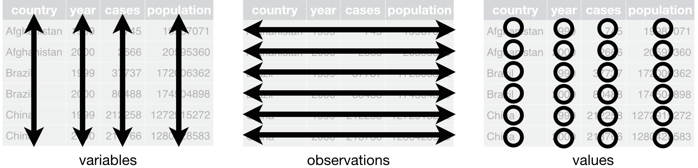{width=95% fig-align="center"}

Datos **ordenados** ("tidy"):

1. cada columna, una **variable**

2. cada fila, una **observación** (todas al mismo nivel)

3. cada celda, un **valor**

```{r}
load("data/retail_data.RData")
```

:::
::::

:::

- El 80% del tiempo del analista es [trabajo "sucio"](https://www.nytimes.com/2014/08/18/technology/for-big-data-scientists-hurdle-to-insights-is-janitor-work.html) de limpieza y preparación; `tidyverse` está pensado para trabajar con datos ordenados

:::: {.notes}

- 1: la fila Total mezcla niveles de agregación (¿qué pasa si filtramos o sumamos?)

- 2: la cabecera contiene el valor del mes: nombres de columna que son valores

- 3: "14.674 €" es carácter, no número: `sum()` falla o devuelve NA

- Esta tabla es perfectamente razonable para *mostrar* información: el problema es *analizarla*

- Estructuras similares en fuentes oficiales, p.e. [datos.gob.es](https://datos.gob.es/es/catalogo/conjuntos-datos?q=hombres-segun-si-tienen-hijos-o-no-situacion-sentimental-y-edad&sort=score+desc%2C+metadata_created+desc)

- RetailCorp recibe datos de ventas (POS), CRM de clientes, inventario, RRHH e informes Excel de gerentes: formatos inconsistentes, duplicados, ausentes, estructuras inadecuadas

- `tidyverse`: gramática de manipulación de datos, inspirada en consultas **SQL**

::::


# Transformación de datos (una tabla)

:::: {.notes}
* `dplyr` frente R `base`

* sencillez, rapidez con big data, estilo SQL etc.

1.  select()  =  data[, c("name") / pos] 
              =  subset()

2.  filter()  =  data[c("name") / pos / condicion, ] 
              =  subset()

3.  mutate()  = data$newvar <- 
              = with(data, newvar = y - x)

4.  arrange() = order()
              [sort() es para vectores]

5.  summarize() = aggregate(data,income, FUN=mean)

6. groub_by() |> summarize = aggregate(data,income~año, FUN=mean)
::::

## Funciones de transformación de datos

- La mayoría de operaciones pueden realizarse combinando 5 "verbos": 

  1. `select()`: selecciona columnas (variables)
  
  2. `filter()`: filtra (extraer) filas
  
  3. `mutate()`: crea nuevas columnas
  
  4. `arrange()`: ordena filas
  
  5. `summarize()`: crea resúmenes de la tabla
  
  - Más la tubería `%>%` o `|>`
  
  - y `group_by()`

- NOTA: las funciones auxiliares (elegir columnas por patrón, contar, recodificar, fechas, etc.) están en el [Anexo: chuleta de funciones auxiliares](Tema03anexo.html); se consulta cuando hace falta, no se estudia.

- Todos tienen como primer argumento un *data frame*, los siguientes describen qué hacer (con columnas o filas) y devuelven otro *data frame*


## 1. `select()`

- **Selecciona variables** por nombres o posiciones de columnas, separados por comas


{width=65% fig-align="center"}


- Ej., un analista solo necesita información básica de ventas

```{r}
select(ventas, id_venta, fecha, id_tienda, id_producto, total)

select(ventas, 1:2, 5, 4, 12)
```

::::{.notes}

- Aplicación Empresarial: el equipo de marketing solo necesita información de cliente y venta.
  Es el mismo `select()` de arriba con otras columnas, así que se comenta de palabra en vez de
  ocupar media transparencia (movido aquí el 28-sep-2026 al medir los 800 px)

```{r}
ventas_mkt <- select(ventas, 
                fecha, id_cliente, id_producto, total)
```

::::


## 2. `filter()`

- Conserva filas en las que una *condición lógica* (o varias separadas por comas) es verdadera

{width=52% fig-align="center"}


- **Caso de Uso:** Gerente quiere analizar ventas específicas con determinadas características

```{r}
ventas_top      <- filter(ventas, total > 1000)

ventas_ene_2024 <- filter(ventas, año == 2024, mes == 1)

ventas_mad_bcn  <- filter(ventas, id_tienda %in% c(1, 2))

ventas_premium  <- filter(ventas, 
                     total > 1000 & descuento_porcentaje == 0)
```


```{r}
#| echo: false
# Ventas con descuento
ventas_con_descuento <- ventas |>
  filter(descuento_porcentaje > 0)

# Combinando condiciones: ventas altas sin descuento
ventas_premium <- ventas |>
  filter(total > 1000, descuento_porcentaje == 0)

# Análisis de fin de semana vs días laborables
ventas_finde <- ventas |>
  filter(dia_semana %in% c("sábado", "domingo"))

# Campaña de verano 2023
ventas_verano_2023 <- ventas |>
  filter(año == 2023, mes %in% c(6, 7, 8))
```


## Encadenando operaciones con tuberías: `%>%` o `|>`

::: {style="font-size: 95%;"}

- Las operaciones encadenadas crean objetos intermedios o no son legibles

```{r}
ventas_top        <- filter(ventas, total > 1000)
ventas_top_markt  <- select(ventas_top, 
                       fecha, id_cliente, id_producto, total)

ventas_top_markt <- select(filter(ventas, total > 1000),
                      fecha, id_cliente, id_producto, total)
```

:::

. . .

::: {style="font-size: 95%;"}

- `datos %>% filter(condicion)` equivale a `filter(datos, condicion)`

- El anidamiento con tuberías sigue el flujo natural de lectura

  - Toma una tabla y pásala a un comando que acepta y produce un *data frame*
  - Toma la nueva tabla resultante y pásala a otro comando


```{r}
ventas_top_markt <- ventas |>                   
                     filter(total > 1000) |>     
                     select(fecha, id_cliente, id_producto, total)
```


:::

:::: {.notes}

- Los objetos intermedios son innecesarios

- Aplicable a cualquier función: `10 |> log()` es `log(10)`

- Legible, fácil anidar operaciones: siempre toman y devuelve un *data frame*

```{r}
#| echo: false

# estas dos son equivalentes
filter(ventas, total > 100)
ventas |> filter(total > 100)

# y estas
select(ventas_top, 
       fecha, id_cliente, id_producto, total)
ventas_top |> select(fecha, id_cliente, id_producto, total)

# sustituimos ventas_top
filter(ventas, total > 100) |> select(fecha, id_cliente, id_producto, total)

# y reemplazamos
ventas |> filter(total > 100) |> select(fecha, id_cliente, id_producto, total)
```


- `ggplot2` `+` en lugar de `%>%` (desarrollado antes)

- Atajo de teclado: `Cmd / Ctrl + Mays + M `

- También existe una tubería en R base: `|>`

::::


## 3. `mutate()`


:::: {.columns}

::: {.column width=55%}

- Crea o modifica variables mediante una *fórmula* a partir de otras columnas

:::

::: {.column width=45%}

{width=95% fig-align="center"}
::: 

::::

```{r}
ventas2 <- ventas |>
  mutate(
    precio_final_unitario = total / cantidad,
    es_inicio_mes         = day(fecha) <= 7
  )
```

- Funciones para operar con fechas (usando `lubridate`)

```{r}
ventas_tiempo <- ventas |>
  mutate(
    fecha_completa = as.Date(fecha),  # tipo de objeto "fecha"
    semana_año = week(fecha),
    nombre_mes = month(fecha, label = TRUE),
    dias_desde_venta = Sys.Date() - fecha
  )
```

:::: {.notes}
- `lubridate` es parte de `tidyverse`
::::


## 4. `arrange()`

:::: {.columns}

::: {.column width=55%}

- re-ordena las filas de un *data frame* (todas las columnas)

  - en orden ascendente (por defecto) o descendente con `desc()`

:::

::: {.column width=45%}
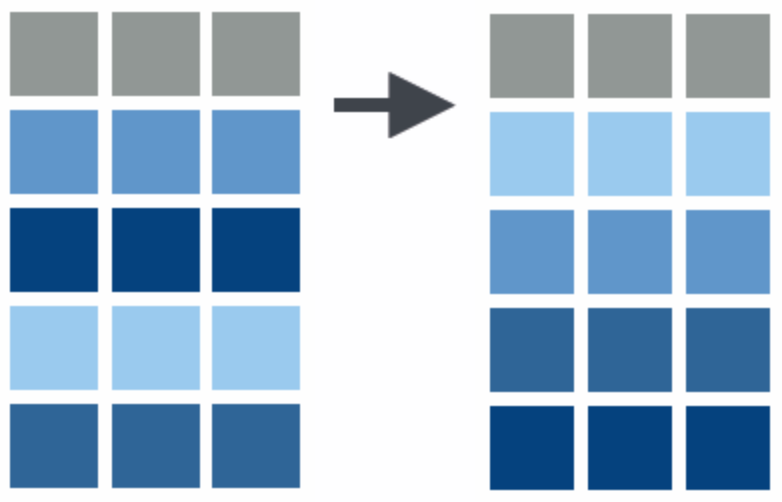{width=50% fig-align="center"}
::: 

::::

- *Caso de Uso:* Top 5 ventas más altas
```{r}
ventas |> 
  arrange(desc(total)) |> slice(5) |> 
  select(id_venta, fecha, total)  
```

- Ordenamientos **múltiples**: ordena por la primera variable y luego, en caso de empate, por la siguiente, etc.
```{r}
ventas |>
  arrange(id_tienda, desc(total)) |>
  select(id_tienda, id_venta, total)
```

:::: {.notes}
- similar a Excel
- sort() es para un vector
::::


## 5. `summarize()`


:::: {.columns}
::: {.column width=55%}
- Crea un nuevo conjunto de datos de **una sola fila**, con variables nuevas de un solo valor que resumen los datos completos
:::
::: {.column width=45%}
{width=80% fig-align="center"}
:::
::::

- *Caso de Uso:* KPIs para el dashboard ejecutivo

```{r}
KPIs <- ventas |>
  summarize(
    total_ventas       = n(),           # Volumen (núm. de filas)
    ingresos_totales   = sum(total),    # Ingresos
    ingresos_promedio  = mean(total),
    ingresos_mediano   = median(total),
    descuento_promedio = mean(descuento_porcentaje), # Descuentos
    descuento_total    = sum(descuento_aplicado),
    unidades_vendidas  = sum(cantidad),             # Productos
    clientes_unicos    = n_distinct(id_cliente)     # Clientes 
                         # (núm. de filas distintas)
  )
```


```{r}
#| echo: false
# **Métricas de Distribución:**
# Análisis de dispersión de ventas
dispersion_ventas <- ventas |>
  summarize(
    media = mean(total),
    desv_std = sd(total),
    minimo = min(total),
    q25 = quantile(total, 0.25),
    mediana = median(total),
    q75 = quantile(total, 0.75),
    maximo = max(total),
    rango_intercuartil = IQR(total)
  )

dispersion_ventas
```


## `group_by()`: Análisis por Grupos

::: {style="font-size: 95%;"}

- Cambia el alcance: *cada función* actúa dentro de grupos, no sobre toda la tabla

- Ejemplo: encontrar la fecha con la mayor venta por tienda

```{r}
ventas |> group_by(id_tienda) |>
  arrange(desc(total)) |>  
  slice(1) |>                     # Fila 1 (de cada grupo)
  select(id_tienda, fecha, total)
```

:::

::::{.notes}
- alternativa `slice_max()`
::::

. . .

::: {style="font-size: 95%;"}

- `group_by()` + `summarize()` = cambia el nivel de análisis, **agregando**, p.e., de transacciones a tiendas, productos, etc.
  
  - En Excel: *Tablas dinámicas*, *AGRUPARPOR()* (y *SUMAR.SI*/*SUMIF*) 

```{r}
ventas                             # tabla a nivel de transacción
ventas |>
  summarize(ingresos = sum(total)) # resumen global
ventas |>
  group_by(id_tienda) |>
  summarize(ingresos = sum(total)) # resumen por tienda
                                   # tabla a nivel de tienda
```

:::

:::: {.notes}

- `group_by()` similar a facet

-  Ver  `ventas |> group_by(id_tienda)`: tibble muestra que hay dos grupos

- datos de información/ventas por empleado a información por tienda

- DEBEN INCLUIRSE variables que se quieran mantener


- **Ejercicio**:

  1. Para cada *producto*, calcular
  
    - suma de valor de ventas (variable *total*)
    
    - media de valor de ventas (idem)
    
    - media de cantidad vendida (variable *cantidad*)
    
  2. En R y Excel 
  
  3. ¿Cuáles son los 5 productos con menor cantidad media vendida?
  
  
```{r}
ventas_prod <- ventas |>
  group_by(producto) |>
  summarize(
    sum_total = sum(total),
    med_total = mean(total),
    med_cant  = mean(cantidad)
  )

export(ventas, "ventas.xlsx")
# misma secuencia en Tablas Dinamicas de Excel

# igual que antes pero con este nueva tabla de datos a nivel producto
ventas_prod |>
  arrange(med_cantidad) |> 
  head(5) 
```

::::


##  `group_by()` (cont.)

- `group_by() + summarize()` reduce filas: nueva tabla agregada a nivel de los grupos

```{r}
tabla_sum <- ventas |> group_by(id_tienda) |>
  summarize(ingresos = sum(total))
```

- `group_by() + mutate()` mantiene filas: añade columnas calculadas por grupo a nivel de la tabla original

```{r}
tabla_mut <- ventas |> group_by(id_tienda) |>
  mutate(ingresos = sum(total))
```

. . .

- Ejemplo: Porcentaje de las ventas que representa cada transacción

```{r}
#| echo: false
ventas |> 
  group_by(id_tienda, mes) |>
  mutate(
    ventas_tienda_mes = sum(total),
    pct_de_ventas_mes = total / ventas_tienda_mes * 100
  ) |>
  slice_max(pct_de_ventas_mes) |> 
  select(id_tienda, mes, id_venta, total, pct_de_ventas_mes)
```

```{r}
ventas |> group_by(id_tienda) |>
  mutate(
    ventas_tienda = sum(total),
    pct_de_ventas = total / ventas_tienda * 100
  )
```

  

## `ungroup()`

::: {style="font-size: 92%;"}

- **IMPORTANTE:** No olvidar `ungroup()` o `.groups = "drop"` después de terminar operaciones agrupadas


- Cálculo de Porcentajes Globales: sin desagrupar, el segundo `sum(total)` suma *por tienda* → siempre da 100%


```{r}
ventas |>
  group_by(id_tienda) |>
  mutate(ventas_tienda = sum(total)) |>
  ungroup() |>
  mutate(porcentaje = ventas_tienda / sum(total) * 100)

# `.groups = "drop"` es de summarize(), NO de mutate()
ventas |>
  group_by(id_tienda) |>
  summarize(ventas_tienda = sum(total), .groups = "drop") |>
  mutate(porcentaje = ventas_tienda / sum(total) * 100)

```

:::

:::: {.notes}
- Después de group_by() + mutate():

  - Si tu siguiente operación debe ser GLOBAL → usa ungroup()

  - Si debe seguir POR GRUPO → no uses ungroup()

- Después de group_by() + summarize():

  - summarize() ya reduce un nivel de agrupación

  - Si tenías múltiples grupos, sigue agrupado por los anteriores

  - Usa .groups = "drop" o ungroup() para estar seguro

- NOTA DE ACTUALIZACIÓN (dplyr >= 1.1): existe `.by =` como argumento de `mutate()`,
  `summarize()`, `filter()` y `slice()`, y evita este problema de raíz:

  ```r
  ventas |> summarize(ingresos = sum(total), .by = id_tienda)
  ventas |> mutate(ventas_tienda = sum(total), .by = id_tienda)
  ```

  Tres diferencias con `group_by()`: (1) el resultado sale SIEMPRE desagrupado, así que
  desaparece el bug de "se me quedó agrupado"; (2) no reordena las filas (`group_by()` ordena
  por la clave); (3) hace menos copias, lo que se nota con millones de filas. Con varias claves
  hay que envolverlas: `.by = c(id_tienda, mes)`. Se enseña `group_by()` porque es lo que se
  encuentran en todo el código y en la documentación, pero conviene mencionar `.by`.

  El desarrollo completo, con los tres puntos y los ejemplos, está en un recuadro del ANEXO
  (`Tema03anexo.qmd`, sección "Resumir", slide "Agrupar sin `group_by()`"). Aquí se queda como nota
  a propósito (Pedro, 30-sep-2026): en la transparencia manda `group_by()`, y quien quiera la forma
  moderna la busca en el anexo.

::: {style="font-size: 92%;"}
- Filtrar Top Global: sin desagrupar, será top 5 de *cada* tienda

```{r}
ventas |>
  group_by(id_tienda) |>
  mutate(ventas_tienda = sum(total)) |>
  arrange(desc(ventas_tienda)) |>
  slice_head(n = 5)          # top 5 DE CADA TIENDA: sigue agrupado

ventas |>
  group_by(id_tienda) |>
  mutate(ventas_tienda = sum(total)) |>
  ungroup() |>
  arrange(desc(ventas_tienda)) |>
  slice_head(n = 5)          # top 5 GLOBAL
```


- Media Global después de agrupar: sin desagrupar, 1 fila por tienda (media mensual de cada tienda)

```{r}
# Ventas por tienda y mes
ventas_mes_por_tienda <- ventas |>
  group_by(id_tienda, mes) |>
  summarize(total_mes = sum(total))

ventas_mensuales_medias <- ventas_mes_por_tienda |>
  ungroup() |>
  summarize(media = mean(total_mes))
# Resultado: 1 fila (media de todos los meses de todas las tiendas)
```
:::

- Ranking de Productos

```{r}
ventas |>
  group_by(id_producto) |>
  summarize(
    unidades_vendidas = sum(cantidad),
    ingresos_totales = sum(total)
  ) |>
  ungroup() |>                     # posteriores NO por grupos 
  arrange(desc(ingresos_totales))
# ungroup() innecesario con summarize en este caso
```


**Aplicación: Segmentación de Clientes**

```{r}
# Calcular valor del cliente
valor_cliente <- ventas |>
  group_by(id_cliente) |>
  mutate(
    num_compras_cliente = n(),
    gasto_total_cliente = sum(total),
    ticket_promedio = mean(total),
    
    # Clasificación RFM simplificada
    recencia_dias = as.numeric(max(fecha) - min(fecha)),
    frecuencia = n(),
    monetario = sum(total)
  ) |>
  ungroup()
```


**Problema:** Análisis de ventas navideñas en Madrid

```{r}
# SIN pipe: difícil de leer, muchas variables intermedias
ventas_madrid <- filter(ventas, id_tienda == 1)
ventas_madrid_navidad <- filter(ventas_madrid, mes == 12)
ventas_resumen <- summarize(ventas_madrid_navidad, 
                            total = sum(total),
                            n = n())

# CON pipe: flujo natural de lectura
analisis_navidad_madrid <- ventas |>
  filter(id_tienda == 1) |>
  filter(mes == 12) |>
  summarize(
    ingresos_totales = sum(total),
    num_transacciones = n(),
    ticket_promedio = mean(total)
  )

analisis_navidad_madrid
```

**Análisis Completo Paso a Paso**

**Objetivo:** Análisis de campaña de descuentos del Q4 2023

```{r}
analisis_campana_q4 <- ventas |>
  # 1. Filtrar período relevante
  filter(año == 2023, trimestre == 4) |>
  
  # 2. Agregar categoría de descuento
  mutate(
    tipo_descuento = case_when(
      descuento_porcentaje == 0 ~ "Sin descuento",
      descuento_porcentaje <= 10 ~ "Descuento bajo",
      descuento_porcentaje <= 20 ~ "Descuento medio",
      TRUE ~ "Descuento alto"
    )
  ) |>
  
  # 3. Agrupar por tipo de descuento
  group_by(tipo_descuento) |>
  
  # 4. Calcular métricas
  summarize(
    num_ventas = n(),
    ingresos_totales = sum(total),
    ticket_promedio = mean(total),
    unidades_vendidas = sum(cantidad),
    .groups = "drop"
  ) |>
  
  # 5. Ordenar por ingresos
  arrange(desc(ingresos_totales)) |>
  
  # 6. Calcular porcentajes
  mutate(
    pct_ventas = round(num_ventas / sum(num_ventas) * 100, 1),
    pct_ingresos = round(ingresos_totales / sum(ingresos_totales) * 100, 1)
  )

analisis_campana_q4
```

::::


## PRÁCTICA en clase (1): porcentajes que siempre dan 100

- Con la tabla `ventas` y **solo con lo visto hasta aquí**:

  a) Calcula los ingresos de 2023 de **cada tienda** y el **porcentaje** que representan sobre los ingresos totales de la cadena en 2023

  b) ¿Qué tienda tiene el porcentaje mayor? ¿Cuánto es?

  c) Un compañero propone este código para (a). Ejecútalo: ¿qué devuelve? ¿por qué?

```{r}
ventas |>
  filter(año == 2023) |>
  group_by(id_tienda) |>
  mutate(pct = total / sum(total) * 100) |>
  summarize(pct_tienda = sum(pct))
```

<!-- INTERNO

a) y b)

```
ventas |>
  filter(año == 2023) |>
  group_by(id_tienda) |>
  summarize(ingresos = sum(total)) |>
  ungroup() |>
  mutate(pct = ingresos / sum(ingresos) * 100) |>
  arrange(desc(pct))
# tienda 4: 121476.6 euros, 10.10% del total de la cadena
# le siguen la 2 (9.31%) y la 9 (8.99%)
```

c) devuelve 100 para TODAS las tiendas. Dentro de `group_by(id_tienda)`,
   `sum(total)` es el total DE ESA TIENDA, no el de la cadena: cada fila se
   divide por el total de su propio grupo y los porcentajes de cada tienda
   suman 100. El error es silencioso: no hay aviso, solo un número que parece
   razonable. La corrección es `ungroup()` antes de calcular el porcentaje
   (o agregar primero con `summarize()`, como en a).

-->


## Operaciones adicionales de limpieza

- El informe de un gerente trae dos variables pegadas en una columna: `separate()` divide, `unite()` combina

```{r}
informe <- tibble(tienda_region = c("Madrid Centro/Centro",
                                    "Alicante Playa/Levante"),
                  ventas        = c(14674, 9310))

informe |>
  separate(tienda_region, into = c("tienda", "region"), sep = "/")

informe |>
  separate(tienda_region, into = c("tienda", "region"), sep = "/") |>
  unite(etiqueta, region, tienda, sep = " - ")
```

. . .

- Nombres de columna con espacios o símbolos: acento invertido (mejor, renombrarlos)

```{r}
datos_problema |>
  rename(nombre_producto = `Nombre Producto`,
         precio_euros    = `Precio (€)`)
```

:::: {.notes}

- `separate()`: tabla, columna a dividir, nombres de las nuevas variables y carácter (expresión regular) donde separar

  - Si se pasa a `sep` un vector de enteros, son posiciones en las que dividir
  - la longitud de `sep` debe ser uno menos que la de `into`
  - con `convert = TRUE` intenta convertir el tipo (no dejarlo en carácter)

- `unite()`: tabla, nombre de la nueva variable, columnas a combinar y separador (por defecto, subrayado)

- NOTA DE ACTUALIZACIÓN (tidyr >= 1.3): `separate()` está *superseded*, es decir, sigue funcionando
  y no va a desaparecer, pero ya no se desarrolla. La familia que lo sustituye dice en el nombre
  qué hace, y avisa cuando una fila no encaja en vez de rellenar con `NA` en silencio:

  ```r
  informe |> separate_wider_delim(tienda_region, delim = "/",
                                  names = c("tienda", "region"))
  ```

  Las otras dos son `separate_wider_position()` (por posiciones, el `sep` numérico de antes) y
  `separate_longer_delim()` (cuando de una celda salen varias FILAS, no varias columnas).
  `unite()` no está superseded: se sigue usando tal cual. Se enseña `separate()` porque es lo que
  aparece en todo el código y en la documentación que van a encontrar.

::::


# Transformación de Datos: Pivotar

:::: {.notes}

** Cuatro representaciones de los mismos datos

```{r}
library(tidyverse)
table1     # datos ordenados
table2     # varios valores por celda
```


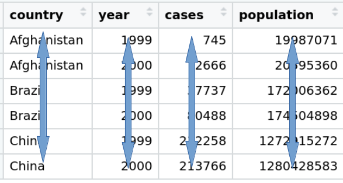{width=60% fig-align="center"}

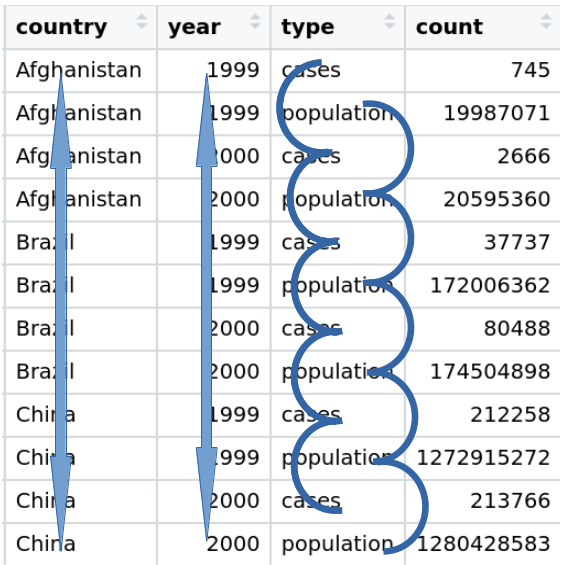{width=60% fig-align="center"}


```{r}
table3     # más de una variable en una columna
table4a 
table4b
```

* `table4a` y `table4b` ofrecen información útil para presentación
pero
- variables tanto en filas como columnas
- las cabeceras de columna son valores, no nombres de variables.

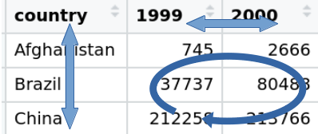{width=60% fig-align="center"}


**Mismos datos, dos formatos: ancho o largo**

:::: {.columns}

::: {.column width=50%}

* La utilidad de almacenar los datos en un rectángulo ancho ("wide") o en uno largo ("long")  depende de qué queramos hacer

  * P.e., Excel prefiere el formato largo para tablas dinámicas, fórmulas de agregación (*SUMAR.SI*) y algunos gráficos


:::

::: {.column width=50%}

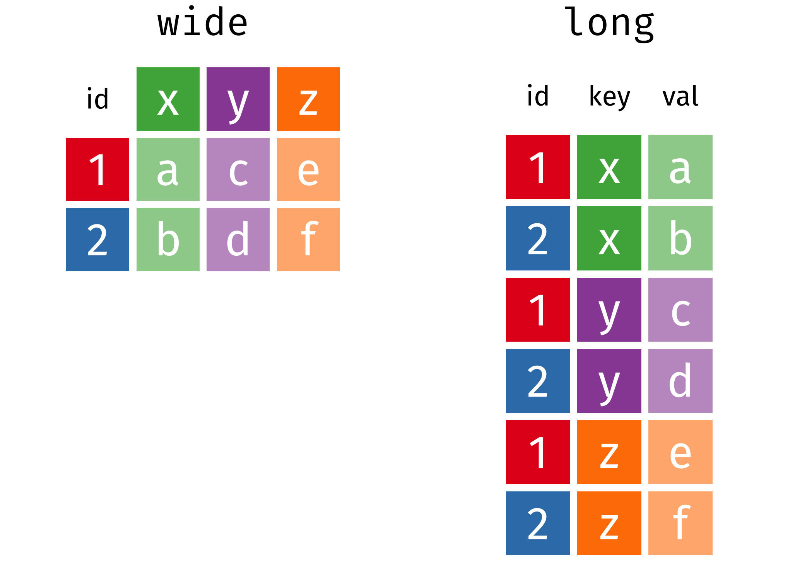{width=100%}
:::

::::

- El cambio de forma  entre formatos es una tarea habitual del analista de datos. 

- Cambiar entre representación larga y ancha se conoce como **pivotar (o girar)**

```{r}
table4a        # formato ancho
table1         # formato largo
```


- En general, el formato largo es más útil para el análisis 

- El cambio de forma =  "reshaping"

- DISTINTO de trasponer filas y columnas en Excel

- Existe una función para pivotar en Excel

**Cambiar la forma de una tabla (pivotar / girar)**

* Las celdas en un formato se reordenan en el otro

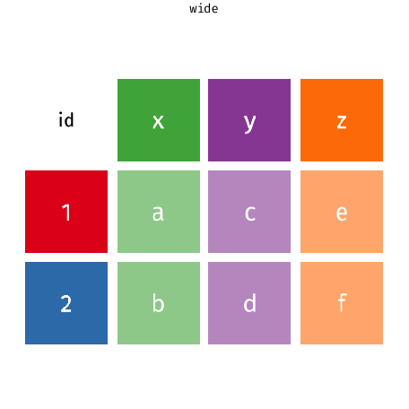{width=45% fig-align="center"}

* Los metadatos que no se reordenan son extendidos/reducidos para no perder información. 

https://tidyr.tidyverse.org/ 

* reshape en R base:  https://jozef.io/r001-reshape/

https://www.r-bloggers.com/2019/07/how-to-reshape-a-dataframe-from-wide-to-long-or-long-to-wide-format/


<https://www.r-bloggers.com/how-to-reshape-data-in-r-tidyr-vs-reshape2/>

<https://www.r-bloggers.com/pivoting-tidily/>


**Verbos principales en `tidyr`**

* `pivot_longer()`: cambia la forma de "anchos" a "largos" (+filas/-cols)

    + **ordena** datos originales para facilitar el análisis.

* `pivot_wider()` cambia la forma de "largos" a "anchos" (+cols/-filas)

    + útil para crear tablas de resumen o un formato para otras herramientas.

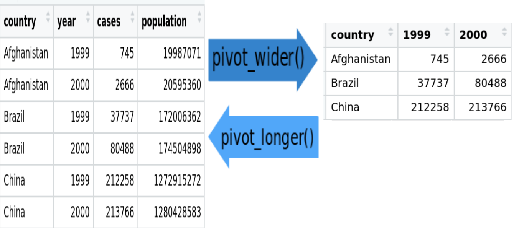{width=75% fig-align="center"}

 La longitud es un término relativo, y sólo se puede decir (por ejemplo) que el conjunto de datos A es más largo que el conjunto de datos B.

::::

## ¿Qué es una fila aquí? (otra vez)

::: {style="font-size: 95%;"}

:::: {.columns}
::: {.column width="47%"}

**Formato ANCHO** (informe de los gestores)

| tienda | Q1 | Q2 | Q3 | Q4 |
|--------|----:|----:|----:|----:|
| Madrid | 145 | 158 | 151 | 169 |
| Barcelona | 152 | 164 | 156 | 175 |
| Valencia | 138 | 151 | 149 | 162 |

```{r}
ventas_ancho
```

:::

::: {.column width="47%"}

**Formato LARGO** (los mismos datos)

| tienda | trimestre | ventas |
|--------|-----------|-------:|
| Madrid | Q1 | 145 |
| Madrid | Q2 | 158 |
| Madrid | Q3 | 151 |
| Madrid | Q4 | 169 |
| Barcelona | Q1 | 152 |
| ... | ... | ... |

:::
::::

**En parejas, 3 minutos:**

1. ¿Qué es **una fila** en la tabla ancha? ¿y en la larga? ¿Cuántas filas tiene cada una?

2. En la ancha, `Q1` ¿es una variable o un valor? ¿Dónde está el trimestre en cada tabla?

3. ¿Con cuál se puede responder "¿qué trimestres superan 160 en ventas?" con un `filter()`?

:::

::::{.notes}

- Ancho: una fila = una tienda (3 filas). Largo: una fila = una tienda-trimestre (12 filas)

- En la ancha el trimestre está en la CABECERA (es un valor haciendo de nombre); en la larga es una columna con valores

- Solo la larga: `ventas_largo |> filter(ventas > 160)`. En la ancha habría que mirar cuatro columnas a mano

- Los dos formatos son útiles: el ancho para *presentar*, el largo para *analizar*

- Cambiar entre ellos se llama **pivotar** (o girar); NO es trasponer filas y columnas de Excel

- Excel también tiene una función de pivotar

::::

## `pivot_longer()`: girar de ancho a largo

::: {style="font-size: 90%;"}

:::: {.columns}

::: {.column width="50%"}

- Girar para analizar los datos

```{r}
ventas_largo <- ventas_ancho |>
  pivot_longer(
    cols = Q1:Q4,              
    names_to = "trimestre",    
    values_to = "ventas"       
  )
```


:::

::: {.column width="50%"}

1. tabla a cambiar de forma

2. nombres o índices de las columnas a girar (representan valores) 

3. nombre para la nueva variable que tendrá, como valores, las columnas a girar

4. nombre para la nueva variable que tendrá como valores las antiguas celdas

::::{.notes}
1. tabla a cambiar de forma

2. nombres o índices (numéricos) de las columnas a girar: representan valores, no variables 

3. nombre para la nueva variable que tendrá, como valores, esas antiguas columnas a girar

4. nombre para la nueva variable que tendrá como valores las antiguas celdas

::::

:::

::::

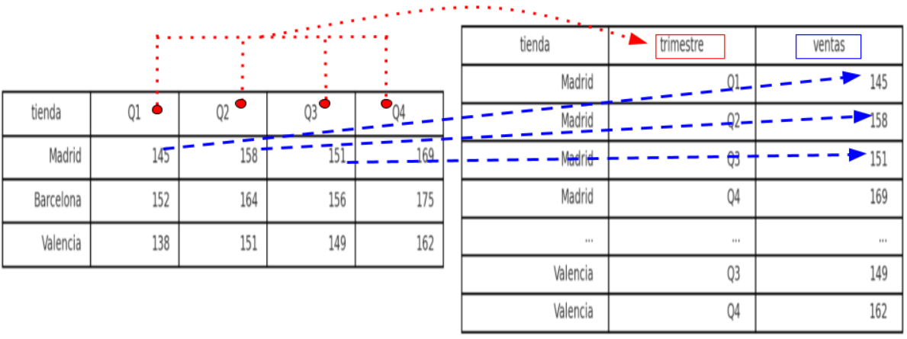{width=52% fig-align="center"}


:::

:::: {.notes}

- Recordad que existen formas equivalentes de hacer lo mismo
```{r}
#| echo: false
pivot_longer(table4a, 2:3, names_to = "year", values_to = "cases")       
table4a |> pivot_longer(c(`1999`, `2000`), values_to = "cases", names_to = "year")
table4a |> pivot_longer(names_to = "year", values_to = "cases", -country)
table4a |> pivot_longer(names_to = "year", values_to = "cases", `1999`:`2000`)
```

```{r}
table4a |> pivot_longer(cols = `1999`:`2000`, 
                         values_to = "cases", names_to = "year")
```

- Notar que los nombres de columna son caracteres y cuando son números van entre \` (evita confusión con índice de posición)

```{r}
#| echo: false
table4a |> pivot_longer(c(1999, 2000), values_to = "cases", names_to = "year")
table1 |> mutate(`tasa por 1000 mil habitantes` = cases/population*1000,
                  tasa =cases/population*1000)
```

- Deberíamos cambiar el tipo de las nuevas variables 

::::


## `pivot_wider()`: girar de largo a ancho

::: {style="font-size: 90%;"}

:::: {.columns}

::: {.column width="50%"}

- Girar para crear tabla de presentación

```{r}
ventas_largo |>             
  pivot_wider(
    names_from = trimestre, 
    values_from = ventas    
  )
```

:::

::: {.column width="50%"}

1. tabla a cambiar de forma

2. nombre de la variable cuyos valores dan nombre a las nuevas columnas

3. nombre de la variable de cuyas celdas toman los valores las nuevas columnas


:::

::::

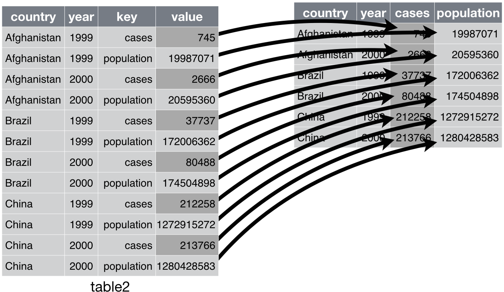{width=58% fig-align="center"}

:::

## PRÁCTICA en clase (2): girar para poder responder

- Partimos de `ventas_ancho` (3 tiendas, columnas `Q1` a `Q4`):

  a) ¿En qué trimestre vendió más **la cadena entera**? ¿Cuánto?

  b) Prepara la **tabla de presentación** para el informe: una fila por tienda, los trimestres en columnas y una última columna `Total` con la venta anual de cada tienda

  c) ¿Con qué formato has hecho (a)? ¿Y (b)? ¿Por qué no al revés?

<!-- INTERNO

a) hay que girar a LARGO para poder agrupar por trimestre

```
ventas_largo <- ventas_ancho |>
  pivot_longer(Q1:Q4, names_to = "trimestre", values_to = "ventas")

ventas_largo |>
  group_by(trimestre) |>
  summarize(total = sum(ventas)) |>
  ungroup() |>
  arrange(desc(total))
# Q4: 506 (luego Q2: 473, Q3: 456, Q1: 435)
```

b) hay que girar a ANCHO (o quedarse con la tabla original)

```
ventas_largo |>
  pivot_wider(names_from = trimestre, values_from = ventas) |>
  mutate(Total = Q1 + Q2 + Q3 + Q4)
# Madrid 623, Barcelona 647, Valencia 600
```

c) (a) en largo: agrupar por trimestre exige que el trimestre sea una VARIABLE,
   no cuatro nombres de columna. (b) en ancho: una tabla de presentación se lee
   mejor con los trimestres como columnas. Analizar en largo, presentar en ancho.

-->


# Datos Relacionales

## Por Qué Múltiples Tablas

- Analizar datos suele implicar múltiples tablas

  - diferentes orígenes: ej., dptos. de empresa (personal, ventas, almacén)

  - almacenamiento más eficiente: elementos “similares” dentro de una tabla y diferentes entre ellas

- Para poder combinar información los datos deben ser relacionales: cada par de tablas están relacionadas mediante identificadores comunes llamados **claves**

  - Primaria (o interna): identifican de forma única cada observación en una tabla. Puede ser una sola variable o múltiples

  - Secundaria (o externa): señala a la clave primaria de otra tabla

::::{.notes}
* Es conveniente verificar que las claves primarias realmente identifican de manera única cada observación. 

```{r}
planes |> count(tailnum) |> filter(n > 1)
#table(planes$tailnum)
```

* La clave externa asegura la integridad referencial. 


- Subrogada = número de fila, si la tabla carece de identificación única


* Tabla sin clave de identificación única: se crea con `mutate()` y `row_number()`. 

```{r}
flights |> 
  count(year, month, day, flight) |> 
  filter(n > 1)
```

::::

- Una clave primaria y su externa asociada en otra tabla forman una relación: de uno-a-muchos, de uno-a-uno, de muchos-a-muchos, de muchos-a-uno

- Antes de unir hay que saber **qué es una fila** en cada tabla: es lo que decide si la unión añade información o inventa filas

## Tres tablas a tres niveles distintos

::: {style="font-size: 90%;"}

- La dirección pregunta: **¿cuánto facturó cada tienda en 2023, a los precios vigentes en cada fecha, y cómo va frente a su objetivo mensual?**

| tabla | una fila es... | filas | clave primaria |
|-------|----------------|------:|----------------|
| `ventas` | una venta | 5.000 | `id_venta` |
| `precios` | un producto en un **periodo de vigencia** | 276 | `id_producto` + `desde` |
| `objetivos` | una tienda en un **mes** de 2023 | 144 | `id_tienda` + `año` + `mes` |

```{r}
precios     # histórico de precios: productos solo guarda el precio de HOY
objetivos   # objetivo de facturación de cada tienda en cada mes de 2023
```

- Ninguna de las dos se empareja con `ventas` una fila con una fila. Lo que dice si la unión está bien no es el nombre de la función: es el **número de filas** antes y después

:::

::::{.notes}

- Insistir: los tres niveles son distintos y ninguno es el "correcto"; el nivel lo fija la pregunta

- Diagrama del sistema completo (UML, https://www.plantuml.com, fichero Tema02relat.puml)

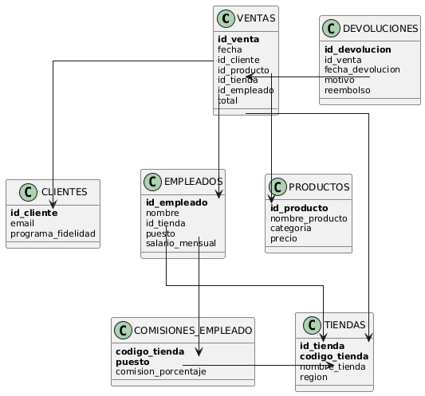{width=60% fig-align="center"}

```
library(plantuml)
# Guarda el código en un archivo "diagrama.puml"
plantuml("diagrama.puml")
```

**Operaciones con dos tablas**

* **Uniones de transformación** ("Mutating joins"): añade nuevas variables a una tabla desde filas coincidentes en otra.  

* **Uniones de filtro** ("Filtering joins"): filtra las observaciones de una tabla basándose en si coinciden o no con una observación de la otra tabla. 

* **Operaciones de conjunto** ("Set operations"): combinan las observaciones en los conjuntos de datos como si fueran elementos de un conjunto.    

* Esta discusión asume que tenemos datos ordenados (*tidy*):
    + las filas son observaciones 
    + las columnas son variables

::::


## Uniones de transformación

::: {style="font-size: 92%;"}

- Añaden **nuevas variables** a una tabla desde *filas coincidentes* en otra.  

::::{.columns}

:::{.column width=40%}

- Tenemos estos [datos](https://raw.githubusercontent.com/albarran/00datos/main/DosTablas.xlsx). 

- ¿Cómo conseguimos unirlos adecuadamente en R y en Excel?


:::

:::{.column width=60%}

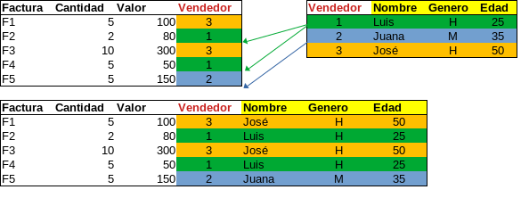{width=66% fig-align="center"}

:::

::::


- Con `cbind()` o `bind_columns()` o copiando y pegando en Excel: nuevas columnas para filas en el mismo orden

. . .

```{r}
tabla1 <- import("data/DosTablas.xlsx", sheet = 1)
tabla2 <- import("data/DosTablas.xlsx", sheet = 2)
union  <- inner_join(tabla1, tabla2, by = "Vendedor")
```

- Aquí cada vendedor aparece **una vez** en cada tabla: una fila casa con una fila y salen las filas esperadas. Casi nunca es así

:::

::::{.notes}

como mutate = mutating joins

clave = fila Y ademán en el mismo orden

- en Excel, las uniones se hacen con VLOOKUP o HLOOKUP o XLOOKUP (BUSQUEDAH, BUSQUEDAV, BUSQUEDAX)

::::

## ¿Qué unión necesito aquí?

::: {style="font-size: 84%;"}

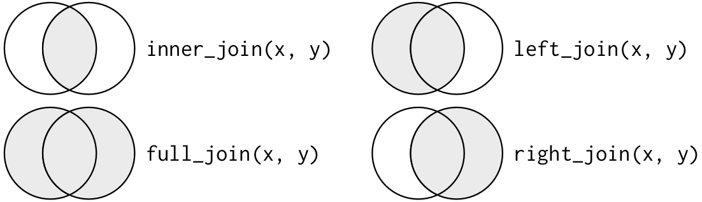{width=42% fig-align="center"}

- La zona sombreada son las **filas que quedan**. En las uniones externas, las filas sin pareja se rellenan con `NA`

::: {.panel-tabset}

### `left_join`

**Quiero la región de cada venta y no perder ni una venta** (hay tiendas sin ventas, me da igual)

```{r}
# 5000 filas: las mismas que ventas
ventas |> left_join(tiendas, by = "id_tienda")
```

### `inner_join`

**Quiero solo las ventas atendidas por un empleado** (las ventas online no tienen `id_empleado`)

```{r}
# 4850 filas: se van 150 ventas online
ventas |> inner_join(empleados, by = "id_empleado")
```

### `right_join`

**Quiero el margen medio de TODAS las categorías del catálogo**, aunque alguna no tenga productos

```{r}
productos |>
  mutate(margen = precio - costo) |>
  right_join(categorias, by = c("id_categoria" = "categoria"))
```

### `full_join`

**Quiero cuadrar el listado de RRHH con el de bonos** sin perder a nadie de ninguna de las dos listas

```{r}
empleados |>
  full_join(promociones_empleado,
            by = c("id_tienda"    = "cod_tienda",
                   "cod_empleado" = "cod_empleado"))
```

:::

- Antes de unir, **decidir** qué filas deben quedar y contarlas después: si el número cambia sin querer, la unión está mal

:::

::::{.notes}

- Preguntar caso por caso ANTES de enseñar el nombre: "¿quiero perder las ventas sin empleado?"

- left: 5000 -> 5000. inner: 5000 -> 4850 (150 ventas online sin empleado). El que elige mal pierde 150 ventas y no se entera

- right con `categorias`: si una categoría no tiene productos, sigue apareciendo (con `NA` en margen)

- `left_join(x, y)` mantiene todo `x`; `right_join(x, y)` mantiene todo `y`; `full_join()` mantiene ambos

- unión interna, ej.: dos series temporales con periodos distintos, [PIB](https://fred.stlouisfed.org/series/GDPC1) y [consumo](https://fred.stlouisfed.org/series/MEHOINUSA672N)

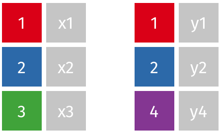{width=60% fig-align="center"}

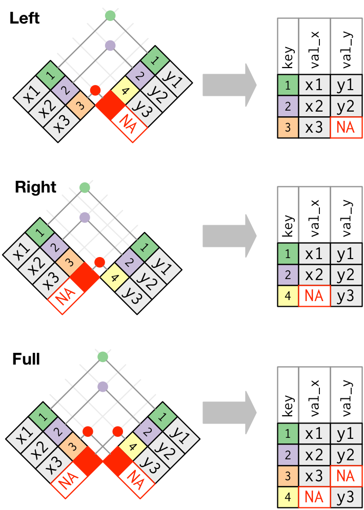{width=60% fig-align="center"}

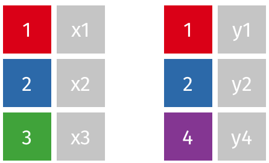{width=60% fig-align="center"}

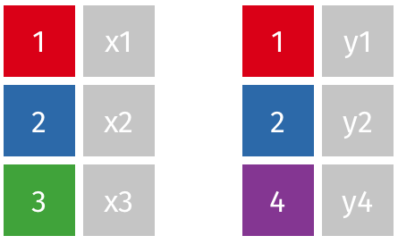{width=60% fig-align="center"}

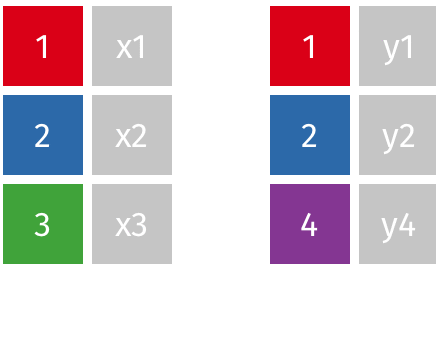{width=60% fig-align="center"}

::::

## El precio no vive en la venta

::: {style="font-size: 90%;"}

- `ventas` registra unidades; `precio_unitario` es el precio **de hoy** del catálogo. El del producto 7 subió el 1-sep-2023

| id_producto | precio | desde | hasta |
|------------:|-------:|------------|------------|
| 7 | 174,58 | 2020-01-01 | 2021-12-31 |
| 7 | 188,55 | 2022-01-01 | 2023-08-31 |
| 7 | 211,18 | 2023-09-01 | 2024-12-31 |

- Unimos por la clave, `id_producto`, y **contamos las filas antes y después**

```{r}
ventas_2023 <- ventas |> filter(año == 2023)
nrow(ventas_2023)                                               # 2000

ventas_2023 |> left_join(precios, by = "id_producto") |> nrow()  # 3714
```

- 1.714 filas que no existieron nunca: cada venta se ha copiado tantas veces como periodos de precio tiene su producto

:::

::::{.notes}

- Preguntar ANTES de ejecutar: "¿cuántas filas debería tener el resultado?" La respuesta es 2000

- `left_join()` da un aviso de *many-to-many*, pero calcula el resultado igual y el aviso se pierde entre la salida de la consola: la comprobación que no falla nunca es contar

- Si alguien suma ahí: 2.219.322 euros de facturación frente a 1.251.667 reales, un 77% más

::::


## El precio no vive en la venta (cont.)

::: {style="font-size: 88%;"}

- Una venta del 19-ago-2023 casa con los **tres** periodos; solo uno estaba vigente

```{r}
ventas_2023 |> filter(id_venta == 3662) |>
  select(id_venta, fecha, id_producto, cantidad) |>
  left_join(precios, by = "id_producto")   # 3 filas: 174,58 / 188,55 / 211,18
```

- La condición que faltaba es la fecha: la clave es `id_producto` **y** el periodo

```{r}
ventas_2023_precio <- ventas_2023 |>
  left_join(precios, by = "id_producto") |>
  filter(fecha >= desde, fecha <= hasta)

nrow(ventas_2023_precio)                # 2000: una fila por venta, otra vez
sum(is.na(ventas_2023_precio$precio))   # 0: ninguna venta sin precio vigente
```

- Red de seguridad: `relationship` **detiene** la unión en vez de duplicar

```{r}
ventas_2023 |> left_join(precios, by = "id_producto",
                         relationship = "many-to-one")
# Error: Each row in `x` must match at most 1 row in `y`
```

:::

::::{.notes}

- Los dos números (2000 y 0) son la verificación completa: ni se han duplicado ventas ni se ha quedado ninguna sin precio

- Si saliera menos de 2000, habría ventas fuera de todos los periodos: hueco en el histórico de precios

- `relationship = "many-to-one"` declara la relación esperada; si no se cumple, error en vez de número raro

- NOTA DE ACTUALIZACIÓN (dplyr >= 1.1): `unir y luego filtrar` se puede hacer en un solo paso con
  `join_by()`, que admite condiciones de DESIGUALDAD y es la forma moderna de resolver justo este
  caso, el de las vigencias:

  ```r
  ventas_2023 |> left_join(precios,
                           join_by(id_producto, fecha >= desde, fecha <= hasta))
  ```

  Ventaja: nunca se crean las 1.714 filas intermedias, así que no hay ocasión de olvidarse del
  filtro. Se explica primero `unir + filtrar` porque enseña POR QUÉ aparecen las filas de más;
  `join_by()` es el atajo una vez entendido. `join_by(id == codigo)` es también la forma moderna
  de `by = c("id" = "codigo")`.

- Regla de la casa (chuleta `000notes/0datos/01-R-tidyverse.md`): todo join lleva `relationship =`,
  y `unmatched = "error"` aborta si se iban a PERDER filas por no casar (`full_join` no lo admite)

- Con `join_by()` se puede poner la condición de fecha dentro de la unión; no lo necesitamos aquí

::::


## ¿Cuánto facturó cada tienda en 2023?

::: {style="font-size: 90%;"}

```{r}
facturacion_tienda <- ventas_2023_precio |>
  group_by(id_tienda) |>
  summarize(facturacion = sum(cantidad * precio), .groups = "drop") |>
  arrange(desc(facturacion))
```

:::: {.columns}
::: {.column width=45%}

| id_tienda | facturación (€) |
|----------:|----------------:|
| 4 | 126.255,61 |
| 2 | 114.491,31 |
| 9 | 113.042,98 |
| ... | ... |
| 11 | 90.444,44 |

:::
::: {.column width=55%}

- Total de la cadena: **1.251.667 €**

- Con el precio del catálogo habrían salido 1.268.551 €

- La diferencia, **16.884 €**, es un 1,3%: poco como porcentaje, bastante en la cuenta de resultados

:::
::::

:::

::::{.notes}

- El 1,3% sale pequeño porque solo 50 de los 150 productos cambiaron de precio dentro de 2023; con inflación alta o catálogo más volátil, el error crece

- Tras unir y agregar se puede seguir analizando, p.e. la evolución mensual

```{r}
#| echo: false
ventas_2023_precio |>
  group_by(id_tienda, mes) |>
  summarize(facturacion = sum(cantidad * precio), .groups = "drop") |>
  ggplot() +
  geom_line(aes(x = mes, y = facturacion, color = factor(id_tienda)))
```

::::

##  Sobre el argumento `by`

-  Las claves, es decir, las variables que relacionan ambas tablas, se indican con 

    - `by = "varX"`, cuando la clave es una variable
  
    - `by = c("varX", "varY")`, cuando son varias variables: deben coincidir **todas**

- Si los nombre son distintos en cada tabla, se empareja `x1` en la primera con `y1` en la segunda con `by = c("x1" = "y1", "x2" = "y2")`

- `objetivos` no se identifica con una sola variable: hace falta tienda **y** mes

```{r}
# 12 filas: no vale como clave
objetivos |> count(id_tienda) |> filter(n > 1)
# 0 filas: esta SI es la clave
objetivos |> count(id_tienda, año, mes) |> filter(n > 1)
```

::::{.notes}
* Si se omite el argumento `by`, se usan todas las variables en común. <!-- de ambas tablas. --> Esto no siempre es deseable: ej., año no es lo mismo en `flights` y `planes`

* Columnas con el mismo nombre (ej., año) se desambigúan con un sufijo
::::

. . .

- Ej., calcular el bono medio de los Vendedores

```{r}
empleados |> filter(puesto == "Vendedor") |>
  left_join(promociones_empleado, 
            by = c("id_tienda" = "cod_tienda", 
                   "cod_empleado") ) |> 
  pull(monto_bono) |> mean(na.rm = T)   # 501,79 euros
```


## Dos columnas, una sola clave

::: {style="font-size: 90%;"}

- `promociones_empleado` no guarda el identificador global del empleado: guarda su número
  **dentro de su tienda**, que es como numeran las cadenas de verdad. El 3 de Madrid y el 3 de
  Valencia son dos personas distintas

```{r}
# 9 codigos repetidos: por si solo no identifica a nadie
promociones_empleado |> count(cod_empleado) |> filter(n > 1)
# 0 filas: la clave son LAS DOS columnas
promociones_empleado |> count(cod_tienda, cod_empleado) |> filter(n > 1)
```

. . .

- Unir por una sola de las dos no da error: da filas de más

```{r}
plantilla <- empleados |> filter(!is.na(id_tienda))
nrow(plantilla)                    # 85 empleados con tienda

# une con los bonos de otras tiendas
plantilla |>
  left_join(promociones_empleado, by = "cod_empleado") |>
  nrow()                           # 387

# la clave son las dos columnas
plantilla |>
  left_join(promociones_empleado,
            by = c("id_tienda" = "cod_tienda", "cod_empleado")) |>
  nrow()                           # 85
```

:::

::::{.notes}

- Preguntar ANTES de ejecutar: "¿cuántas filas debería tener?" La respuesta es 85, y es la
  comprobación que caza el error

- Aquí dplyr sí avisa (*many-to-many*), pero el resultado se calcula igual y el aviso se pierde:
  de los 85 empleados salen 387 filas, y cualquier media de bonos calculada ahí está mal

- Con `relationship = "many-to-one"` la unión mal hecha se convierte en un error, que es lo que
  interesa

- Mismo patrón que `precios` (`id_producto` + `desde`) y que `objetivos` (`id_tienda` + `año` +
  `mes`): la clave es la combinación que deja `count()` sin repeticiones

::::


## El objetivo tampoco vive en la venta

::: {style="font-size: 90%;"}

- Tentación: unir `objetivos` a las ventas y sumar

```{r}
ventas_2023_precio |>
  left_join(objetivos, by = c("id_tienda", "año", "mes")) |>
  group_by(id_tienda) |>
  summarize(objetivo_anual = sum(objetivo))   # tienda 1: 1.188.300 €
```

- El objetivo anual de la tienda 1 son **92.900 €**, no 1.188.300 €

```{r}
objetivos |> group_by(id_tienda) |> summarize(objetivo_anual = sum(objetivo))
```

- Y sin embargo la unión **no ha duplicado ni una fila**: 2.000 antes, 2.000 después

- El objetivo de cada mes se ha copiado en todas las ventas de ese mes y `sum()` lo cuenta una vez por venta: la tienda 1 hizo 141 ventas en 2023, así que su objetivo sale casi 13 veces mayor

:::

::::{.notes}

- Aquí no hay aviso de ningún tipo: la unión es legítima (uno-a-muchos) y el conteo de filas no cambia. Lo que está mal es **sumar** una variable que está al nivel tienda-mes sobre filas que están al nivel venta

- Diagnóstico rápido: cualquier variable que venga de una tabla a nivel más agregado NO se puede sumar sin agregar antes

::::


## Agregar primero, unir después

::: {style="font-size: 88%;"}

- Para comparar con el objetivo hay que llevar las ventas **a su mismo nivel**: tienda-mes

```{r}
facturacion_mes <- ventas_2023_precio |>
  group_by(id_tienda, año, mes) |>
  summarize(facturacion = sum(cantidad * precio), .groups = "drop")

nrow(facturacion_mes)    # 144 = 12 tiendas x 12 meses, el nivel de objetivos

cumplimiento <- facturacion_mes |>
  left_join(objetivos, by = c("id_tienda", "año", "mes")) |>
  mutate(cumplimiento = round(facturacion / objetivo * 100, 1))
```

| id_tienda | mes | facturación | objetivo | cumplimiento |
|----------:|----:|------------:|---------:|-------------:|
| 1 | 1 | 15.336,91 | 15.600 | 98,3 |
| 1 | 2 | 7.806,36 | 8.500 | 91,8 |
| 1 | 3 | 6.366,60 | 5.700 | 111,7 |

- En el año, 7 de las 12 tiendas cumplen: la 5 es la mejor (105,0%) y la 10 la peor (96,4%)

- **La regla**: agregar hasta el nivel de la otra tabla y unir después. Al revés no da error, da un número sin sentido

:::

::::{.notes}

- Las dos uniones del caso son distintas: `precios` necesitaba clave Y fecha; `objetivos` necesitaba **cambiar antes el nivel** de la tabla de la izquierda

- Repetir la pregunta de siempre antes de cada unión: ¿qué es una fila aquí, y qué es una fila allí?

::::


##  Claves duplicadas

::: {style="font-size: 92%;"}

- Si una coincidencia no es única, se generan todas las combinaciones posibles (producto cartesiano) de las observaciones coincidentes

- `id_producto` **no** es clave primaria de `precios`: 97 de los 150 productos tienen más de un periodo de precio

```{r}
precios |> count(id_producto) |> filter(n > 1)           # 97 filas

precios |> count(id_producto, desde) |> filter(n > 1)    # 0 filas: clave doble
```

- Comprobar la clave de la tabla que se une cuesta una línea; explicar después por qué la facturación salía un 77% mayor (2.219.322 € en vez de 1.251.667 €) cuesta bastante más

- NOTA: sólo unir cuando sea necesario y siempre usar solo filas y variables estrictamente necesarias

:::

:::: {.notes}

- Este es el mismo error que el de la tienda repetida de la PRÁCTICA en clase (4), pero aquí no hay ningún error de carga: la tabla `precios` es correcta, lo que falta es la mitad de la clave

- Un uso habitual de las uniones: los nombres completos de categorías se ponen en una tabla aparte y solo se une cuando se necesitan

```{r}
# margen medio por categoría de producto
productos |>
  mutate(margen = precio - costo) |>
  select(id_categoria, margen) |>
  right_join(categorias,                 # ¿por qué right?
             by = c("id_categoria" = "categoria")) |>
    group_by(nombre_categoria) |>
  summarize(margen_medio = mean(margen))
```


* En **una tabla**: añade información adicional en una relación de uno a muchos.

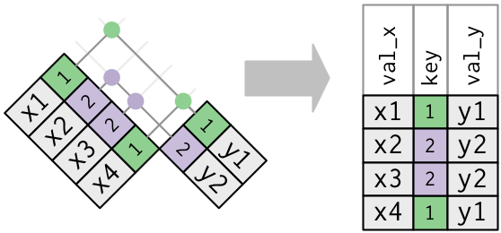{width=95% fig-align="center"}


```{r echo=FALSE}
df1dup <- tibble(clave = c(1, 2, 2, 1), val_x = c("x1", "x2", "x3", "x4"))
df2dup <- tibble(clave = c(1, 2), val_y = c("y1", "y2"))
df1dup |> left_join(df2dup)
```

- En **ambas tablas**: igualmente, todas las combinaciones posibles


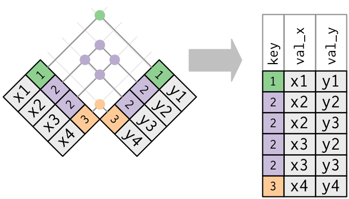{width=85% fig-align="center"}

  + posible error: NO hay clave primaria única (que identifica una observación)
  
```{r}
df1dup2 <- tibble(clave = c(1, 2, 2, 3), val_x = c("x1", "x2", "x3", "x4"))
df2dup2 <- tibble(clave = c(1, 2, 2, 3), val_y = c("y1", "y2", "y3", "y4"))
df1dup2 |> left_join(df2dup2)
```


- `base::merge()`  realizar los cuatro tipos de unión de transformación (usando las opciones `all.x = ` y `all.y = `, ver ayuda). 

- los verbos específicos de `dplyr` es que expresan más claramente la intención del código: la diferencia entre las uniones es realmente importante pero está oculta en los argumentos de `merge()`. Las uniones de dplyr son considerablemente más rápidas y no alteran el orden de las filas.


melt et al. <http://had.co.nz/reshape/>

::::


## PRÁCTICA en clase (3): diciembre contra el objetivo

::: {style="font-size: 92%;"}

- Con `ventas`, `precios` y `objetivos`:

  a) ¿Cuántas filas tiene `precios` y cuántos productos tienen más de un periodo de precio? ¿Cuál es su clave primaria? Compruébalo con `count()`

  b) Facturación real de **diciembre de 2023** de cada tienda, a los precios vigentes, junto a su objetivo de diciembre y el porcentaje de cumplimiento, de mayor a menor. ¿Cuántas tiendas cumplieron?

  c) Un compañero hace (b) uniendo `objetivos` **antes** de agregar. Ejecútalo: ¿por qué la tienda 1 cumple el 7,0% de su objetivo?

```{r}
# el código del compañero, para el apartado c)
ventas |> filter(año == 2023, mes == 12) |>
  left_join(precios, by = "id_producto") |>
  filter(fecha >= desde, fecha <= hasta) |>
  left_join(objetivos, by = c("id_tienda", "año", "mes")) |>
  group_by(id_tienda) |>
  summarize(facturacion = sum(cantidad * precio),
            objetivo    = sum(objetivo)) |>
  mutate(cumplimiento = round(facturacion / objetivo * 100, 1))
```

:::

<!-- INTERNO

a)

```
nrow(precios)                                   # 276 filas
precios |> count(id_producto) |> filter(n > 1)  # 97 de los 150 productos
precios |> count(id_producto, desde) |> filter(n > 1)   # 0 filas
```

La clave primaria es doble: `id_producto` + `desde`. Con `id_producto` sola,
97 productos aparecen repetidos y cualquier unión por esa clave duplica filas.

b)

```
ventas |>
  filter(año == 2023, mes == 12) |>
  left_join(precios, by = "id_producto") |>
  filter(fecha >= desde, fecha <= hasta) |>
  group_by(id_tienda) |>
  summarize(facturacion = sum(cantidad * precio), .groups = "drop") |>
  left_join(objetivos |> filter(mes == 12) |> select(id_tienda, objetivo),
            by = "id_tienda") |>
  mutate(cumplimiento = round(facturacion / objetivo * 100, 1)) |>
  arrange(desc(cumplimiento))
```

187 ventas en diciembre, 12 filas de resultado. Cumplen 4 tiendas:
9 (10.990,66 / 10.600 = 103,7%), 4 (5.456,87 / 5.300 = 103,0%),
12 (4.755,18 / 4.700 = 101,2%) y 10 (11.699,97 / 11.700 = 100,0%).
Las peores: 6 (91,5%) y 1 (7.035,80 / 7.700 = 91,4%).

Conviene que comprueben el número de filas tras el `left_join(precios)`
(356) y tras el filtro de fechas (187).

c) La facturación es correcta (7.035,80 € en la tienda 1, la misma que en (b));
   lo que está mal es el objetivo. La tienda 1 hizo 13 ventas en diciembre, y
   al unir antes de agregar su objetivo de 7.700 € aparece en las 13 filas:
   `sum(objetivo)` da 7.700 x 13 = 100.100 €. De ahí el 7,0%. Ningún aviso,
   ninguna fila de más (187 antes y 187 después): el error está en sumar una
   variable que vive al nivel tienda-mes sobre filas que viven al nivel venta.
   Se arregla agregando primero, como en (b).

-->


## Uniones de Filtrado

- Filtran las **observaciones** de la tabla de la izquierda basándose en si coinciden o no con una observación de la otra tabla


- Se tiene un subconjunto de las filas de la tabla de la izquierda

::::{.columns}
::: {.column width=50%}

* `semi_join(x, y)` mantiene las observaciones en `x` que están en `y`

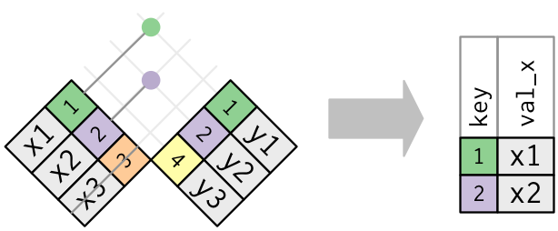{width=95%}

```{r}
#| echo: false
df1 |> semi_join(df2, 
          by = "clave")
```

:::

::: {.column width=50%}

* `anti_join(x, y)` elimina <!--todas--> las observaciones en `x` que están <!--coinciden--> en `y`

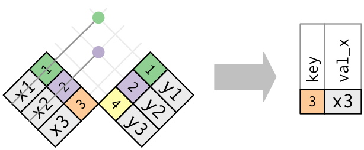{width=95%}

```{r}
#| echo: false
df1 |> anti_join(df2, 
          by = "clave")
```
::: 

::::

- Nota: se puede conseguir lo mismo con `inner_join()`, `full_join()`, etc. pero es ineficiente

::::{.notes}

- no afectan a las variables

- **Claves duplicadas**: en uniones de filtro sólo importa la existencia de una coincidencia, NO qué observación coincida $\Rightarrow$ NUNCA duplica filas

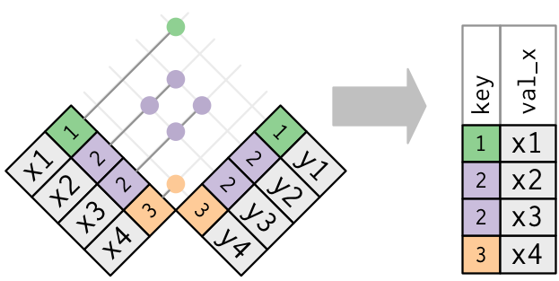{width=35% fig-align="center"}

```{r echo=FALSE}
df1dup2 |> semi_join(df2dup2)
```

::::

## Uniones de Filtrado (cont.)

- Útiles para diagnosticar desajustes de uniones (qué observaciones serán emparejadas). Importante antes de unir tablas MUY grandes

```{r}
# empleados sin información de ventas
empleados |> anti_join(ventas, 
                       by = c("id_empleado", "id_tienda")) |> 
  count(id_empleado, id_tienda)  
```


::::{.notes}

- Utiles porque solo eliminan y nunca duplican observaciones

```{r}
#| echo: false
flights |> anti_join(planes, by = "tailnum") |>   # vuelos sin información del avión
              count(tailnum, sort = TRUE)

flights |> count(tailnum, sort = TRUE)
```

::::


- Pueden ser una alternativa simple a usar `filter()` con filtrados complejos (que involucran varias variables), creando previamente tablas resumidas

  -Ej., venta promedio de los 10 productos con más cantidad vendida

::::{.notes}
Unión, PERO NO con tabla ya existente

Creamos una tabla para nuestro objetivo de unión de filtrado 

- Algunas  uniones de filtrado pueden ser equivalentes a usar `filter()`, con tablas previamente resumidas, pero permiten filtrados complejos (que involucran varias variables) fácilmente


```{r}
#| echo: false
top_dest <- flights |> count(dest, sort = TRUE) |> head(10)   # destinos populares
flights |> filter(dest %in% top_dest$dest)
flights |> semi_join(top_dest)
```

```{r}
#| echo: false
flights |> count(dest, sort = TRUE) |> head(10) 
flights |> group_by(dest) |> summarize(n=n()) |> arrange(desc(n)) |> head(10)
```

```{r}
#| echo: false
#| eval: false
flights |> count(dest)
table(flights$dest)

flights |> count(dest, sort = TRUE)

#flights |> filter(dest =="ORD" | dest == "ATL" | ...) 

top_dest$dest
flights |> filter(dest %in% top_dest$dest) |> summarize(media=mean(arr_delay))
flights |> semi_join(top_dest)     
```

- ej., los diez días con más vuelos (o con los atrasos promedio más altos, necesita un filtro con varias variables (`year`, `month`, `day`)

```{r}
#| echo: false
top_dias <- flights |> count(year, month, day, sort = TRUE) |> head(3)
flights |> semi_join(top_dias)
```

```{r}
#| echo: false
flights |> filter(day %in% top_dias$day, month %in% top_dias$month) |> distinct(day, month)
flights |> semi_join(top_dias) |> distinct(day, month)
```

::::

. . .

- Aplicación: ¿cuántos clientes tenemos y cuántos sí han comprado?

```{r}
clientes |> distinct(id_cliente) |> count()
clientes |> semi_join(ventas) |> distinct(id_cliente) |> count()
```

-  Aplicación: ¿qué productos NO han sido devueltos?

```{r}
#| echo: false
# Productos que NO han sido devueltos
productos_devueltos <- ventas |> 
  semi_join(devoluciones, by = "id_venta") |> 
  distinct(id_producto)

productos |> anti_join(productos_devueltos)
```


## PRÁCTICA en clase (4): unir sin perder (ni inventar) filas

- Con `ventas`, `tiendas` y `clientes`:

  a) Ingresos de 2023 por **región**, con el número de ventas de cada una, ordenados de mayor a menor

  b) ¿Cuántos clientes de la tabla `clientes` **no** han comprado nunca? ¿Y cuántos sí?

  c) En (a) has unido `ventas` con `tiendas`. Si por un error de carga la tienda 1 apareciera **dos veces** en `tiendas`, ¿qué le pasaría a tu respuesta? Compruébalo

::: {style="font-size: 90%;"}

```{r}
# bind_rows() apila las filas de dos tablas: aquí, tiendas con la 1 repetida
tiendas_mal <- bind_rows(tiendas, tiendas |> filter(id_tienda == 1))
```

:::

<!-- INTERNO

a)

```
ventas |>
  filter(año == 2023) |>
  left_join(tiendas, by = "id_tienda") |>
  group_by(region) |>
  summarize(ingresos = sum(total), n_ventas = n()) |>
  ungroup() |>
  arrange(desc(ingresos))
# Levante 305742 (512), Norte 290698 (486), Sur 212902 (343),
# Centro 181694 (302), Nordeste 112059 (174), Noroeste 99923 (183)
```

b)

```
clientes |> anti_join(ventas, by = "id_cliente") |> summarize(sin_compras = n())
clientes |> semi_join(ventas, by = "id_cliente") |> summarize(con_compras = n())
# 341 sin compras y 2159 con compras (2500 clientes en total)
```

c) La clave duplicada multiplica filas: las 141 ventas de la tienda 1 en 2023 se
   duplican, las 2000 ventas de 2023 pasan a 2141 y los ingresos de Centro
   suben de 181694 a 272490 (302 son las ventas de TODA la region Centro). El total de la region se infla sin que falte
   ni sobre ningun dato original. dplyr avisa ("many-to-many"), pero el
   resultado se calcula igual: hay que comprobar SIEMPRE que la clave de la
   tabla que se une identifica una sola fila.

-->


## Operaciones de conjunto

* Trabajan con filas completas, comparando valores de cada variable.

* Esperan que `x` e `y` tengan las **mismas variables**, y tratan las observaciones (filas) como elementos de un conjunto.

* Útil cuando se quiere dividir un filtro complejo en piezas más simples.

::::{.notes}

* Combinan las observaciones en los conjuntos de datos como si fueran elementos de un conjunto.   

::::

```{r}
df1 <- tibble(x = 1:2, y = c(1, 1))
df2 <- tibble(x = c(1,1), y = 1:2)

intersect(df1, df2)     # solo filas tanto en df1 como en df2
union(df1, df2)         # filas únicas en ambas tablas
union_all(df1, df2)     # todas las filas, con duplicados
setdiff(df1, df2)       # filas en df1, pero no en df2
setdiff(df2, df1)   
```


```{r}
#| echo: false
intersect(df1, df2)   # inner_join(df1,df2)
union(df1, df2)       # full_join(df1,df2)   # Notad que tenemos 3 filas, no 4
setdiff(df1, df2)     # anti_join(df1,df2)
setdiff(df2, df1)     # anti_join(df2, df1)
```


::::{.notes}
**Equivalencia con bases de datos SQL**

https://www.cs.utexas.edu/~mitra/csFall2006/cs329/lectures/sql.html

```{r}
#| echo: false
#| eval: false
#| results: asis
library(kableExtra)
#library(knitr)
tabla <- tribble(
     ~dplyr           ,     ~SQL                                                               ,
  "inner_join()"      ,	"SELECT * FROM x JOIN y ON x.a = y.a"                                  ,
  "left_join()"       ,	"SELECT * FROM x LEFT JOIN y ON x.a = y.a"                             ,
  "right_join()"      ,	"SELECT * FROM x RIGHT JOIN y ON x.a = y.a"                            ,
  "full_join()"       ,	"SELECT * FROM x FULL JOIN y ON x.a = y.a"                             ,
  "semi_join()"       ,	"SELECT * FROM x WHERE EXISTS (SELECT 1 FROM y WHERE x.a = y.a)"       ,
  "anti_join()"       ,	"SELECT * FROM x WHERE NOT EXISTS (SELECT 1 FROM y WHERE x.a = y.a)"   ,
  "intersect(x, y)"   ,	"SELECT * FROM x INTERSECT SELECT * FROM y"                            ,
  "union(x, y)"       ,	"SELECT * FROM x UNION SELECT * FROM y"                                ,
  "setdiff(x, y)"     , "SELECT * FROM x EXCEPT SELECT * FROM y"                              
)
tabla |>
  kbl()  |>
  kable_paper("hover", full_width = F, font_size = 22)
# tabla
```


* SQL soporta más tipos de unión y puede trabajar con más de dos tablas.


Como sugiere esta sintaxis,  más tipos de unión porque se pueden conectar las tablas usando restricciones diferentes a la igualdad (algunas veces llamadas no-equijoins).

`x` and `y` no tienen que ser tablas en la misma base de datos. Si especifica `copy = TRUE`, `dplyr` copiará la tabla `y` en el mismo lugar que `x`. 


Revisar las reglas de coerción. P. e., los factores se conservan sólo si los niveles coinciden exactamente; si no, se "coaccionan" (se fuerza su conversión) a tipo de carácter.

::::


# Conclusión. Buenas prácticas

## Buenas Prácticas

- Datos Ordenados

- Código Legible y reproducible

  1. Scripts ordenados y comentados
  
  2. Encadenar operación con  `|>` en un paso por línea
  
  3. Inspeccionar resultados intermedios

  4. Documentar decisiones de limpieza
  
  5. Nombres descriptivos de variables
  
  6. Guardar datos procesados


- Errores comunes

  1. No verificar claves en uniones (¿qué variables? (¿hay claves dupolicadas?))

  2. Orden de operaciones incorrecto: ej., filtrar después de `summarize()` por una variable que ya no existe

```{r}
#| echo: false

# PROBLEMA: claves duplicadas pueden multiplicar filas
df1 <- tibble(id = c(1, 1, 2), valor = c("A", "B", "C"))
df2 <- tibble(id = c(1, 2), info = c("X", "Y"))

resultado <- left_join(df1, df2, by = "id")
nrow(resultado)  # Esperamos 3, tenemos 3 (pero revisar lógica)

# VERIFICAR antes de hacer join
df1 |> count(id) |> filter(n > 1)  # ids duplicados
df2 |> count(id) |> filter(n > 1)  # ids duplicados

# SOLUCIÓN: decidir qué hacer con duplicados
df1_unico <- df1 |> distinct(id, .keep_all = TRUE)
```


```{r}
#| echo: false
# PROBLEMA: filtrar después de summarize
ventas |>
  group_by(id_tienda) |>
  summarize(total = sum(total)) |>
  filter(cantidad > 3)  # ERROR: cantidad ya no existe

# SOLUCIÓN: filtrar antes de summarize
ventas |>
  filter(cantidad > 3) |>
  group_by(id_tienda) |>
  summarize(total = sum(total))
```


## Buenas Prácticas (cont.)

### Eficiencia:


1. Realizar transformaciones (seleccionar, filtrar, crear columnas) temprano, unir tarde

```{r}
ventas_2023_prod <- ventas |>
  filter(año == 2023) |>    # reduce tamaño
  left_join(productos, by = "id_producto")

ventas_2023_prod_lento <- ventas |>
  left_join(productos, by = "id_producto") |>
  filter(año == 2023)
```

2. Seleccionar solo columnas necesarias

```{r}
#| echo: false
productos_minimo <- productos |>
  select(id_producto, nombre_producto, precio)

ventas_join <- ventas |>
  left_join(productos_minimo, by = "id_producto")
```


:::: {.notes}
**Recursos Adicionales**

- **Documentación:** `?dplyr`, `?tidyr`
- **Cheat Sheets:** https://posit.co/resources/cheatsheets/
- **Libros:** 
  - "R for Data Science" (Wickham & Grolemund)
  - "Advanced R" (Wickham)
- **Comunidad:** Stack Overflow, Posit Community

::::
