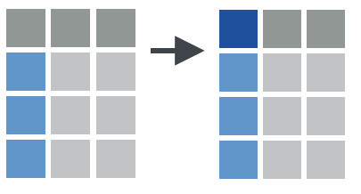

```{r}
#| label: setup
#| include: false
#| eval: true
# se evalua pero no incluye output (mensajes, etc.)

# Elimino todo del Entorno (del documento)
rm(list = ls())

# Cargo todas las bibliotecas necesarias
library(tidyverse)
library(rio)
library(kableExtra)
```

```{r}
#| label: generar-datos
#| echo: false
#| eval: true

source("Tema03datos.R")

```

# Cómo usar este anexo

## Esto NO es una clase

- Este anexo es una **chuleta**: no hay que estudiarlo ni memorizarlo

- Está ordenado por **para qué sirve** cada función, no por orden de dificultad

- Se consulta cuando en un ejercicio hace falta hacer algo concreto y no sabemos con qué función

  - Ej.: "quiero quedarme con todas las columnas que empiezan por `id_`" $\rightarrow$ *Elegir columnas*

- Todo lo que aquí aparece se explica en clase **cuando surge** en un ejercicio

- Chuletas oficiales, más completas: <https://posit.co/resources/cheatsheets/>


# Elegir columnas

## Auxiliares de `select()`

```{r}
# Por rango de columnas
ventas |> select(id_venta:id_tienda)

# Excluir columnas
ventas |> select(-descuento_porcentaje, -descuento_aplicado)

# Por patrón de nombre
ventas |> select(starts_with("id_"))
ventas |> select(ends_with("_porcentaje"))
ventas |> select(contains("descuento"))

# Por tipo de dato
ventas |> select(where(is.numeric))
ventas |> select(where(is.character))
```

- `pull()`: extrae una única columna, como **vector** (no como tabla)

```{r}
ventas |> pull(cantidad) |> mean()
```

:::: {.notes}

- `num_range("x", 1:3)`: para x1, x2 y x3.

- `matches()`: nombres que coinciden con una [expresión regular](https://es.wikipedia.org/wiki/Expresi%C3%B3n_regular)

- `matches("(.)\\1")`: variables que contengan caracteres repetidos

```{r}
select(flights, -(year:day))    # todas menos "year, month, day"
```

::::

## Cambiar nombre y orden de columnas

- `rename()`: cambiar el nombre de una columna

```{r}
ventas_renamed <- ventas |>
  rename(fecha_venta = fecha,
         monto_total = total)
```

- `relocate()`: cambiar el orden de las columnas

```{r}
ventas |>
  relocate(total, .after = fecha) |>
  relocate(starts_with("id_"), .before = everything())
```

- `everything()`: "todas las demás", útil para poner unas pocas delante

```{r}
ventas |> select(id_venta, fecha, total, everything())
```

:::: {.notes}
  {width=70% fig-align="center"}

- `transmute()`: como `mutate()` pero solo mantiene las variables creadas
::::


# Elegir filas

## Auxiliares para extraer filas

- Extraer filas pero NO por condición: por posición (`slice()`, `slice_head()`), aleatoriamente (`slice_sample()`), por valor (`slice_max()`), etc.

```{r}
ventas |> slice_max(total, n = 5) # Top 5 ventas
ventas |> slice_sample(n = 100)   # sub-muestra aleatoria
```

* `distinct()`: extrae sólo las filas únicas (de una o varias variables)

```{r}
ventas |> distinct(id_producto)
ventas |> distinct(id_producto, .keep_all = TRUE) # conserva el resto de columnas
```

:::: {.notes}
- `slice_head()`, `slice_tail()`, `slice_min()`, `slice_max()`
::::

## Filas con valores ausentes (`NA`)

* `drop_na()` y `replace_na()`: elimina/reemplaza filas con valores ausentes

```{r}
ventas_completas <- ventas |> drop_na()        # NA en cualquier variable

ventas_con_empleado <- ventas |>               # solo si falta el empleado
  drop_na(id_empleado)                         # (venta online)
```

- Eliminar `NA`, PERO:

    - en *alguna variable*: `na.rm = TRUE` o `filter(!is.na(x))` o `drop_na(x)`
    - en *todo* el conjunto de datos: `drop_na()`

- Reemplazar por un valor, PERO ¿cuál?

    - `NA` por no presentarse a un examen es cero
    - `NA` por no contestar a la pregunta de renta, ¿es cero?

```{r}
datos <- tibble(x1 = c(1:4, NA, 6, 7, NA))

datos |> mutate(x1 = if_else(is.na(x1), 0, x1))
datos |> mutate(x1 = replace_na(x1, 0))
```

:::: {.notes}

```{r}
#| echo: false
data <- tibble(x1 = c(1:4, NA, 6.0, 7, NA), x2 = c(NA, 12:14, NA, 16.0, 17:18) )

data |> summarize(num = n(), meanNA = mean(x1), mean = mean(x1, na.rm = TRUE))

data |> filter(!is.na(x1)) |>
  summarize(num = n(), meanNA = mean(x1), mean   = mean(x1, na.rm = TRUE))

data |> drop_na(x1) |> summarize(num = n(), mean = mean(x1))   # drop_na(x2)?
data |> drop_na()   |> summarize(num = n(), mean = mean(x1))
```

- `na.omit()` vs. `drop_na()`: el primero es de base (stats), el otro de `tidyr`

- en `cor()`, `use = "complete.obs"`

::::


# Crear y transformar variables

## Condicionales y discretización

- `if_else()` y `case_when()` para ejecución condicional (`ifelse()` en R base)

```{r}
ventas |>
  mutate(
    tipo_venta = if_else(total > 1000, "Alta", "Baja"), # condición simple
    categoria_cliente = case_when(              # múltiples condiciones
      total < 300  ~ "Económico",
      total < 1000 ~ "Estándar",
      TRUE         ~ "Premium"               # OJO: convertir a factor
    )
  )
```

* Discretizar variables<!--numéricas a categóricas-->: `cut_interval()`, `cut_number()`, `cut_width()`

```{r}
ventas |> mutate(tramo = cut_width(total, 250))   # tramo es factor
```

## Aplicar la misma transformación a varias columnas

- `across()`: aplica la misma transformación a múltiples columnas

```{r}
ventas |> mutate(across(c(cantidad, subtotal:total), ~ log(.x)))
ventas |> mutate(across(where(is.character), ~ parse_factor(.x)))
```

- Muchas funciones son equivalentes a otras de R base:

    - `parse_number()`, `parse_factor()`, etc. por `as.numeric()`, `as.factor()`, etc.
    - `bind_cols()` y `bind_rows()` por `cbind()` y `rbind()`

- Operadores aritméticos (`+`, `-`, `*`, `/`, `^`, `%/%`, `%%`) y lógicos (`<`, `<=`, `>`, `>=`, `!=`)

## Funciones útiles dentro de `mutate()`

- Funciones como `log()`, `lag()`, `lead()`, `cumsum()`, `row_number()`

```{r}
ventas |> group_by(id_tienda) |> arrange(fecha) |>
  mutate(venta_anterior = lag(total),                 # fila anterior
         acumulado      = cumsum(total),              # suma acumulada
         orden          = row_number()) |> ungroup()  # 1, 2, 3, ...
```

- Combinadas con funciones de "agregación": `x - mean(x)`, `y / sum(y)`

:::: {.notes}

- Ordenamiento: `min_rank()`, `row_number()` y otras de `dplyr::ranking`

- `percent_rank()`, `cume_dist()`

```{r}
#| echo: false
y <- c (10, 2, 2, NA, 30, 4)
min_rank(y)
min_rank(desc(y))
row_number(y)
```

- Agregados acumulativos y móviles: ver ayuda de `cumsum()`  y `cummean()`

```{r}
#| echo: false
cumsum(1:10)
cumprod(1:10)
cummin(1:10)
cummax(1:10)
cummean(1:10)
```

::::

## Fechas (`lubridate`)

- Funciones para extraer partes de una fecha: `year()`, `month()`, `day()`, `quarter()`, `week()`, `wday()`

```{r}
ventas |>
  mutate(
    año        = year(fecha),
    mes        = month(fecha),
    trimestre  = quarter(fecha),
    mes_nombre = month(fecha, label = TRUE, abbr = FALSE),
    dia_semana = wday(fecha, label = TRUE, abbr = FALSE),
    es_finde   = wday(fecha) %in% c(1, 7)
  )
```

- Diferencias entre fechas

```{r}
ventas |> mutate(dias_desde_hoy = as.numeric(Sys.Date() - fecha))
```

:::: {.notes}
- `lubridate` es parte de `tidyverse`
::::


# Resumir

## Contar

- `count()`: cuenta los valores únicos de una o más variables

```{r}
ventas |> count(id_tienda)
# equivale a: ventas |> group_by(id_tienda) |> summarize(n = n())
ventas |> count(id_tienda, sort = TRUE)     # ordenado de mayor a menor
ventas |> count(id_tienda, mes, name = "num_ventas")  # dos variables
```

- `add_count()`: añade la columna de conteo SIN reducir filas

```{r}
ventas |>
  add_count(id_producto, name = "veces_vendido") |>
  filter(veces_vendido > 50)
```

- Conteos dentro de `summarize()`:

  - `n()`: observaciones totales (tamaño del grupo)
  - `n_distinct(x)`: número de valores distintos de `x`

:::: {.notes}
- `sum(!is.na(x))`: observaciones no ausentes
- `n_distinct()` es más rápido que `unique()`
::::

## Funciones de resumen dentro de `summarize()`

* Centralidad y dispersión: `mean(x)`, `median(x)`, `sd(x)`, `IQR(x)` <!--, `mad(x)` -->

* Rango: `min(x)`, `quantile(x, 0.25)`, `max(x)`

* Posición: `first(x)`, `nth(x, 2)`, `last(x)`

* Sumas y productos: `sum(x)`, `prod(x)`

* Conteos: `n()`, `n_distinct(x)`

```{r}
ventas |>
  summarize(
    media    = mean(total),  desv_std = sd(total),
    minimo   = min(total),   q25      = quantile(total, 0.25),
    mediana  = median(total), q75     = quantile(total, 0.75),
    maximo   = max(total),   rango_ic = IQR(total)
  )
```

:::: {.notes}
- `first(x)`, `nth(x, 2)`, `last(x)` son similares a `x[1]`, `x[2]` y `x[length(x)]`
::::


## Agrupar sin `group_by()`: el argumento `.by =`

::: {.callout-note}
## Forma moderna (`dplyr` 1.1 o posterior)

`mutate()`, `summarize()`, `filter()` y `slice()` aceptan `.by =`, que agrupa **solo para esa
operación**. Hace lo mismo que `group_by()` y evita de raíz el problema de quedarse agrupado.

```{r}
ventas |> summarize(ingresos = sum(total), .by = id_tienda)
ventas |> mutate(ventas_tienda = sum(total), .by = id_tienda)
```

Tres diferencias con `group_by()`:

1. El resultado sale **siempre desagrupado**, así que desaparece el fallo de "se me quedó agrupado"
   y no hace falta `ungroup()` ni `.groups = "drop"`.
2. **No reordena las filas**. `group_by()` ordena por la clave; `.by =` deja el orden original.
3. Hace menos copias, lo que se nota con millones de filas.

Con varias claves hay que envolverlas: `.by = c(id_tienda, mes)`.

**En el curso se enseña `group_by()`**, porque es lo que vais a encontrar en la documentación, en
los ejemplos de internet y en el código de otros. `.by =` es el atajo una vez entendido lo que hace
la agrupación.
:::

# Ancho o largo: qué tareas se complican

## Con formato ancho, algunas tareas son imposibles

::: {style="font-size: 90%;"}

- Según nuestros objetivos, podemos preferir formato ancho o largo

- Problemas prácticos del formato ancho para **analizar datos**:

1. Algunas tareas son imposibles. P.e., ¿qué trimestres superan 160 en ventas?

```{r}
ventas_largo |>
  filter(ventas > 160)
```

2. Código repetitivo y propenso a errores. P.e., calcular el crecimiento

```{r}
ventas_ancho |>
  mutate(
    crec_Q2 = (Q2 - Q1) / Q1 * 100,
    crec_Q3 = (Q3 - Q2) / Q2 * 100,
    crec_Q4 = (Q4 - Q3) / Q3 * 100
  )

ventas_largo |>
  group_by(tienda) |>
  mutate(crecimiento = (ventas - lag(ventas)) / lag(ventas) * 100)
```

:::

:::: {.notes}

- Total por trimestre: en formato ancho, posible pero repetitivo

```{r}
#| echo: false
# Formato ANCHO: posible pero repetitivo
tibble(
  trimestre = c("Q1", "Q2", "Q3", "Q4"),
  total = c(sum(ventas_ancho$Q1), sum(ventas_ancho$Q2),
            sum(ventas_ancho$Q3), sum(ventas_ancho$Q4))
)

# Formato LARGO: una sola operación
ventas_largo |> group_by(trimestre) |> summarize(total = sum(ventas))
```

- Filtrar trimestres específicos

```{r}
#| echo: false
# Formato ANCHO: difícil, solo puedo seleccionar columnas, no filtrar
ventas_ancho |> select(tienda, Q2, Q3)

# Formato LARGO: trivial
ventas_largo |> filter(trimestre %in% c("Q2", "Q3"))
```

::::

## Con formato ancho, algunas tareas son imposibles (cont.)

::: {style="font-size: 90%;"}

3. No escalable. P.e., gráfico temporal por grupos

```{r}
ggplot(ventas_ancho) +
  geom_line(aes(x = 1:4, y = c(Q1[1], Q2[1], Q3[1], Q4[1])), color = "red") +
  geom_line(aes(x = 1:4, y = c(Q1[2], Q2[2], Q3[2], Q4[2])), color = "blue") +
  geom_line(aes(x = 1:4, y = c(Q1[3], Q2[3], Q3[3], Q4[3])), color = "green")

ggplot(ventas_largo, aes(x = trimestre, y = ventas,
                         color = tienda, group = tienda)) +
  geom_line() + geom_point()
```

:::

. . .

::: {style="font-size: 90%;"}

- Formato ancho solo para tablas de presentación final

```{r}
tabla_presentacion <- ventas_largo |>
  pivot_wider(names_from = trimestre, values_from = ventas) |>
  mutate(Total = Q1 + Q2 + Q3 + Q4)
```

:::
